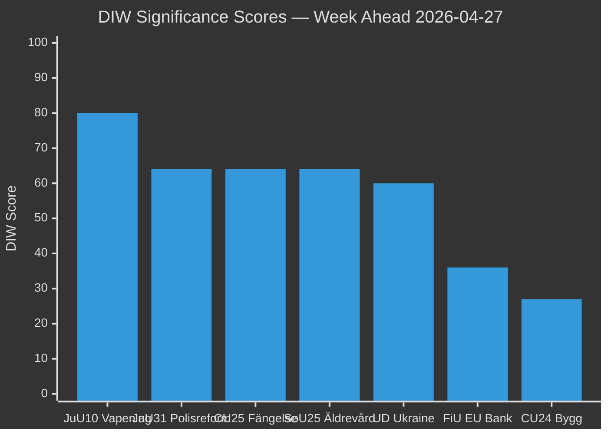

# Significance Scoring — Week Ahead 2026-04-27 to 2026-05-03

**Author**: James Pether Sörling | **Date**: 2026-04-26

## Scoring Methodology

Documents scored on DIW (Directness–Impact–Width) scale L1–L3. Each dimension: 1–5. Total = D×I×W / 25, normalised to 0–100.

## Ranked Significance Table

| Rank | dok_id | Title | D | I | W | DIW Score | Tier |
|------|--------|-------|---|---|---|-----------|------|
| 1 | HD01JuU10 | Ny vapenlag | 5 | 5 | 4 | 80 | L2+ |
| 2 | HD01JuU31 | Polisreformen 2015 Riksrevisionen | 5 | 4 | 4 | 64 | L2+ |
| 3 | HD03231 | Sverige + tribunal Ukraina | 4 | 5 | 3 | 60 | L2 |
| 4 | HD03232 | Sverige + reparationskommission Ukraina | 4 | 5 | 3 | 60 | L2 |
| 5 | HD01CU25 | Kriminalvård ny kapacitet | 4 | 4 | 4 | 64 | L2 |
| 6 | HD01SoU25 | Stärkta insatser äldrevård | 4 | 4 | 4 | 64 | L2 |
| 7 | HD03252 | Socialförsäkring fångvård | 3 | 4 | 3 | 36 | L2 |
| 8 | HD03253 | EU:s bankpaket | 3 | 4 | 3 | 36 | L2 |
| 9 | HD01CU24 | Effektiv och säker byggprocess | 3 | 3 | 3 | 27 | L1 |
| 10 | HD10448 | Interpellation vindkraft (SD) | 2 | 2 | 3 | 12 | L1 |

## Detailed Scores

### 1. HD01JuU10 — Ny vapenlag [Score: 80, L2+]
- **Directness (5)**: Konkret lagstiftning, träder ikraft 1 juni 2026. JuU föreslår bifall till prop.
- **Impact (5)**: Påverkar ~350 000 vapeninnehavare; ny reglering av halvautomatiska gevär för jakt; EU-harmonisering. Källa: HD01JuU10, riksdagen.se
- **Width (4)**: Berör alla 21 regioner, jakt- och skytteorganisationer, Polismyndigheten, handlare. Källa: riksdagen.se/HD01JuU10

### 2. HD01JuU31 — Polisreformen 2015 [Score: 64, L2+]
- **Directness (5)**: Riksrevisionen granskar direkt, JuU behandlar skrivelse HD01JuU31 på riksdagen.se
- **Impact (4)**: Kritisk rapport om att Polismyndigheten inte nått reformens mål; inga nya direktiv föreslagna
- **Width (4)**: Berör all polisverksamhet, 21 regioner, medborgarsäkerhet. Källa: riksdagen.se/HD01JuU31

### 3–4. HD03231 + HD03232 — Ukraine Accountability [Score: 60, L2]
- **Directness (4)**: Propositioner från Utrikesdepartementet, riksdagen förväntas bifalla
- **Impact (5)**: Folkrättsligt prejudikat, stärker Sveriges post-NATO-profil. Källa: data.riksdagen.se/dokument/HD03231
- **Width (3)**: International, begränsad inhemsk administrativ konsekvens

### 5. HD01CU25 — Kriminalvård [Score: 64, L2]
- **Directness (4)**: CU föreslår bifall; lag börjar gälla 1 juli 2026. Källa: riksdagen.se/HD01CU25
- **Impact (4)**: Löser strukturell brist på häktes- och fängelseplatser; möjliggör kommande straffskärpningar
- **Width (4)**: Berör hela kriminalvårdskedjan, plan- och bygglagen, kommuner

## Sensitivity Analysis

If JuU10 is delayed by opposition motions → significance jumps to 90 (escalation scenario).
If JuU31 triggers new government directive → Ukraine propositions drop as news agenda item.
Score variance: ±8 points on top-5 items. [B2]

style JuU10 fill:#ff006e
