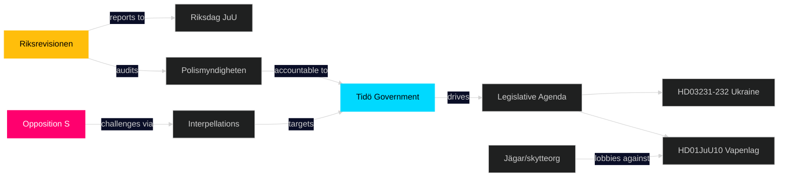

# Stakeholder Perspectives — Week Ahead 2026-04-27 to 2026-05-03

**Author**: James Pether Sörling | **Date**: 2026-04-26 | **Confidence**: MEDIUM [B2]

## 6-Lens Stakeholder Matrix

### Government (Tidö Coalition — M+SD+KD+L)

**Moderate**: Ulf Kristersson (M), Gunnar Strömmer (M/Justice), Niklas Wykman (M/Finance), Ebba Busch (KD/Energy), Maria Malmer Stenergard (M/Foreign), Andreas Carlson (KD/Infrastructure)

**Position**: Drive HD01JuU10 to adoption, manage HD01JuU31 polisreform without new mandate, pass Ukraine propositions, demonstrate pre-election competence.
**Interest**: Consolidate "law and order" + "international credibility" narrative before September 2026 election.
**Influence**: Very high (majority with SD support on key votes). Source: riksdagen.se SD parliamentary support.
**Risk**: SD energy dissent (HD10448) and S broadband interpellations testing communications. [B2]

### Opposition (S, V, MP, C)

**Named actors**: Magdalena Andersson (S, partiledare), Patrik Lundqvist (S, interpellant HD10447), Jonathan Svensson (S, HD10444), Markus Kallifatides (S, HD10445+HD10442), Peder Björk (S, HD10443), Åsa Eriksson (S, HD10446)

**Position**: Mount sustained pre-election pressure campaign on social welfare, housing, labour market, and governance credibility.
**Interest**: Establish S as credible alternative government; weaken Tidö government's economic competence narrative.
**Influence**: High on narrative; limited on legislative votes (in minority). Source: HD10447–HD10446 riksdagen.se [A2]

### Riksrevisionen

**Named actor**: Riksrevisionen (independent audit body)

**Position**: Formal assessment completed — Polismyndigheten has not met Polisreform 2015 intentions (HD01JuU31).
**Interest**: Independence, credibility, impact of audit findings.
**Influence**: Moderate — findings are not legally binding but politically significant. Source: HD01JuU31 riksdagen.se [A1]

### Police (Polismyndigheten)

**Position**: Defensive; will need to respond to Riksrevisionen findings.
**Interest**: Protect operational autonomy; avoid new parliamentary directives.
**Influence**: Administrative, not legislative. [B3]

### Hunters' Associations / Sports Shooters

**Position**: Mixed — hunting sector opposes semi-auto rifle ban in HD01JuU10; sport shooters benefit from EU flexibilisation.
**Interest**: Operational continuity, legal certainty.
**Influence**: Lobby pressure on C and SD members. Source: HD01JuU10 [B2]

### Ukraine Accountability Stakeholders

**Named actors**: International community, Ukrainian diaspora in Sweden (~50,000 persons), Utrikesdepartementet

**Position**: Supportive of HD03231+HD03232 accession.
**Interest**: War accountability, reparations framework, rule of law.
**Influence**: Symbolic but important for Sweden's post-NATO image. Source: HD03231, HD03232 riksdagen.se [A2]

## Influence Network

## Stakeholder Alignment Score (Week Ahead)

| Stakeholder | Alignment with Tidö | Influence (1-5) |
|-------------|--------------------|--------------------|
| M/KD/SD/L (Tidö) | 1.0 | 5 |
| S (opposition) | 0.1 | 3 |
| Riksrevisionen | 0.3 | 3 |
| Polismyndigheten | 0.6 | 3 |
| EU institutions | 0.8 | 2 |
| Ukraine int'l bodies | 0.9 | 2 |
| Hunters/shooters | 0.4 | 2 |
