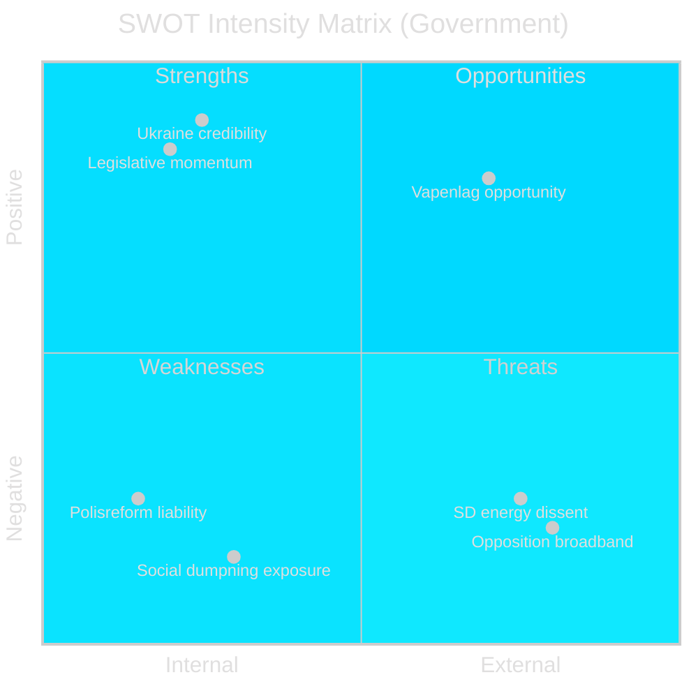

# SWOT Analysis — Week Ahead 2026-04-27 to 2026-05-03

**Author**: James Pether Sörling | **Date**: 2026-04-26 | **Confidence**: HIGH [B2]

## Government (Tidö Coalition) SWOT

### Strengths

- Legislative momentum: JuU10 (ny vapenlag, HD01JuU10), CU25 (kriminalvård, HD01CU25), SoU25 (äldrevård, HD01SoU25) all advancing simultaneously — demonstrates governing capacity ahead of election. Source: riksdagen.se HD01JuU10, HD01CU25
- Ukraine credibility: Dual accession (HD03231 + HD03232) to Ukraine war accountability bodies positions Sweden as rule-of-law leader in EU — premium in current geopolitical environment. Source: data.riksdagen.se/dokument/HD03231
- EU compliance: EU bankpaket (HD03253) and EU firearms directive implementation in JuU10 demonstrate orderly EU membership management. Source: riksdagen.se HD03253

### Weaknesses

- Police reform liability (HD01JuU31): Riksrevisionen's assessment that Polismyndigheten has **not worked sufficiently effectively** is a direct reputational challenge. JuU's decision to archive without new mandate exposes government to "accountability deficit" narrative. Source: HD01JuU31 riksdagen.se
- Sjuklönekostnader gap (HD10447): S interpellation exposing the removal of high sick-pay cost subsidies targeting SMEs creates a business-constituency wedge. Source: HD10447 riksdagen.se
- Social dumpning (HD10443): Municipalities moving vulnerable populations (social dumpning) without consent — structural welfare system failure exposed by S. Source: HD10443 riksdagen.se

### Opportunities

- Vapenlag consolidation: New weapons law if implemented smoothly eliminates a perennial regulatory friction with EU and improves law enforcement clarity. Source: HD01JuU10
- Pre-election security narrative: HD01JuU10 + HD01CU25 + HD03237 (paid police education) combine as a coherent "strengthening the rule of law" narrative entering election year.
- Ukraine peace dividend: As war accountability institutions form, Sweden is positioned for a post-war European diplomatic role — NATO credibility enhancer.

### Threats

- SD dissent on energy: HD10448 interpellation from SD's Josef Fransson challenging Energy Minister Ebba Busch (KD) on wind-power disinformation signals potential intra-coalition friction. Source: HD10448 riksdagen.se
- Opposition broadband attack: Five S interpellations in one week (HD10447, HD10444–HD10446, HD10443) across five different ministries saturates the news agenda and forces daily reactive communications. Source: HD10447–HD10446 riksdagen.se
- Felaktiga dödförklaringar (HD10446): Systemic error in death certificates (~30/year per Finansminister Svantesson's own admission) — an embarrassing credibility vulnerability. Source: HD10446 riksdagen.se

## TOWS Matrix

| | Opportunities | Threats |
|---|---|---|
| **Strengths** | SO: Use Ukraine credibility to frame EU compliance agenda; leverage security narrative for autumn campaign launch | ST: Deploy vapenlag as counter-narrative against SD energy interpellation; demonstrate governance coherence |
| **Weaknesses** | WO: Turn polisreform liability into forward-looking "next stage" narrative | WT: Risk of narrative fragmentation if opposition broadband attack lands simultaneously with polisreform headlines |

style Vapenlag fill:#00d9ff
style Ukraine fill:#00d9ff
