# Synthesis Summary — Week Ahead 2026-04-27 to 2026-05-03

**Author**: James Pether Sörling | **Date**: 2026-04-26 | **Confidence**: HIGH [B2]

## Lead Story: Justice Reform and Security State Consolidation

The week of 27 April–3 May 2026 represents the most legislatively intensive justice week of riksmöte 2025/26. Three simultaneous threads converge: (1) the finalisation of the new weapons law (HD01JuU10) cementing a 15-year policy shift in Swedish firearms regulation; (2) parliament's processing of Riksrevisionen's damning assessment of Polisreformen 2015 (HD01JuU31) without triggering new government action; and (3) continued prison capacity expansion through emergency building legislation (HD01CU25). Together, these represent the Tidö coalition's "hard on crime, strong on security" pre-election narrative operating at full legislative velocity. [A2]

## DIW-Weighted Intelligence Ranking

| Rank | Document | Type | DIW | Significance |
|------|----------|------|-----|--------------|
| 1 | HD01JuU10 — Ny vapenlag | Betänkande JuU | L2+ | New law banning semi-auto hunting rifles; effective 1 Jun 2026 |
| 2 | HD01JuU31 — Polisreformen 2015 | Betänkande JuU | L2+ | Riksrevisionen verdict: inadequate effectiveness |
| 3 | HD03231 — Ukraine tribunal | Proposition UD | L2 | Sweden joins special tribunal for aggression |
| 4 | HD03232 — Ukraine reparations | Proposition UD | L2 | Sweden joins reparations commission |
| 5 | HD01CU25 — Prison capacity | Betänkande CU | L2 | Emergency building permits for prisons |
| 6 | HD01SoU25 — Elderly care | Betänkande SoU | L2 | Strengthened elderly support measures |
| 7 | HD10448 — Vindkraft disinformation (SD) | Interpellation | L1 | SD-KD energy narrative contestation |

## Integrated Intelligence Picture

**Thread 1: Justice Reform Acceleration (HIGH confidence [B2])**
The Tidö coalition's justice reforms are entering their implementation phase. The new vapenlag (HD01JuU10) is the most concrete output — JuU proposes yes, with the new rules taking effect 1 June 2026. Key provisions: semi-automatic rifle ban for hunting, tightened ownership criteria, and EU-aligned rules for cross-border sports shooters. The concurrent processing of the Riksrevisionen polisreform report (HD01JuU31) without new government action reveals a political calculation: acknowledge the reform's shortcomings while avoiding accountability assignment. [A2] for JuU10; [B2] for JuU31 assessment.

**Thread 2: Ukraine War Accountability Architecture (MEDIUM confidence [B2])**
Sweden's dual accession — to the Special Tribunal for the Crime of Aggression against Ukraine (HD03231) and the International Reparations Commission (HD03232) — advances the post-NATO Swedish foreign policy doctrine of rule-of-law leadership. Both propositions are routed through Utrikesdepartementet under Maria Malmer Stenergard. Passage is expected without significant opposition, though V (Left Party) may abstain on grounds of insufficient reparations scope. [B2]

**Thread 3: Pre-Election Opposition Pressure (HIGH confidence [A2])**
The Social Democratic party deployed five interpellations in a single week (HD10447 employer sick pay costs; HD10444 payroll tax exploitation; HD10445 municipal pre-emption rights; HD10443 social dumping; HD10446 erroneous death certificates). This coordinated attack wave — all S-authored, targeting different ministers (Busch, Svantesson, Carlson, Slottner) — signals a deliberate broadband pressure strategy. The statistical clustering of five interpellations in three days is anomalous and indicates pre-election tactical coordination within S. [A2]

**Thread 4: Social Infrastructure Stress (MEDIUM confidence [B2])**
HD01SoU25 (elderly care) and HD01CU25 (prison construction) together reveal the structural tension in the Tidö programme: expanding carceral capacity while simultaneously enhancing eldercare represents conflicting demands on local government administrative capacity. Statskontoret: no directly relevant source found for this specific week.

## 📌 Key Intelligence Picture Summary

The week of 27 April–3 May constitutes a **pre-election legislative consolidation sprint** for the Tidö government. The justice-security theme dominates (vapenlag, polisreform, fängelsekapacitet) in ways designed to reinforce the government's core electoral narrative. The Ukraine propositions add a foreign policy dividend. The opposition S campaign through interpellations is broad-spectrum but individually low-impact — its significance is structural (volume, coordination) rather than substantive.

```mermaid
%%{init: {'theme': 'dark', 'themeVariables': {'primaryColor': '#00d9ff', 'edgeLabelBackground': '#0a0e27', 'tertiaryColor': '#1a1e3d'}}}%%
flowchart TD
    A[Week 2026-04-27 to 05-03] --> B[Justice Reform Thread]
    A --> C[Ukraine Accountability Thread]
    A --> D[Opposition Pressure Thread]
    A --> E[Social Infrastructure Thread]
    B --> B1[HD01JuU10 Ny vapenlag]
    B --> B2[HD01JuU31 Polisreform 2015]
    B --> B3[HD01CU25 Fängelsekapacitet]
    C --> C1[HD03231 Tribunal aggression]
    C --> C2[HD03232 Reparations commission]
    D --> D1[5 S-interpellationer]
    D --> D2[Pre-election narrative war]
    E --> E1[HD01SoU25 Äldrevård]
    E --> E2[HD03252 Socialförsäkring fängelse]
    style B fill:#ff006e,stroke:#ff006e,color:#fff
    style C fill:#00d9ff,stroke:#00d9ff,color:#000
    style D fill:#ffbe0b,stroke:#ffbe0b,color:#000
    style E fill:#7b2ff7,stroke:#7b2ff7,color:#fff
    style B1 fill:#1a1e3d,stroke:#ff006e
    style B2 fill:#1a1e3d,stroke:#ff006e
    style B3 fill:#1a1e3d,stroke:#ff006e
    style C1 fill:#1a1e3d,stroke:#00d9ff
    style C2 fill:#1a1e3d,stroke:#00d9ff
    style D1 fill:#1a1e3d,stroke:#ffbe0b
    style D2 fill:#1a1e3d,stroke:#ffbe0b
    style E1 fill:#1a1e3d,stroke:#7b2ff7
    style E2 fill:#1a1e3d,stroke:#7b2ff7
```

