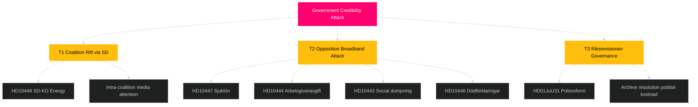

# Threat Analysis — Week Ahead 2026-04-27 to 2026-05-03

**Author**: James Pether Sörling | **Date**: 2026-04-26

## Political Threat Taxonomy

### T1 — Legislative Coherence Threat (Coalition)

**Threat Actor**: SD (Sverigedemokraterna)
**Target**: KD (Kristdemokraterna)/Ebba Busch
**Vector**: Interpellation HD10448 (Josef Fransson SD → Energiminister Busch) on wind power disinformation
**Mechanism**: SD challenges KD's energy policy narrative, exploiting a WindEurope report on disinformation. This is an **intra-coalition rivalry threat**: SD positioning itself as the skeptical partner on renewable energy ahead of election year.
**TTP**: Political interpellation as ideological signalling; use of media (Sveriges Radio mentioned in HD10448) as amplification.
**Kill Chain Stage**: Mobilise → Pressure → Expose Coalition Rift
**Source**: HD10448 riksdagen.se [A2]

### T2 — Opposition Attack Wave (Multi-Vector)

**Threat Actor**: Socialdemokraterna (S)
**Targets**: Multiple ministers (Busch/KD, Svantesson/M, Carlson/KD, Slottner/KD)
**Vectors**: HD10447 (sjuklönekostnader), HD10444 (arbetsgivaravgifter), HD10445 (bostadspolitik), HD10443 (socialpolitik), HD10446 (statlig förvaltning)
**Mechanism**: Coordinated interpellation wave targeting labour market, housing, social welfare and public administration simultaneously — forces reactive communications across five ministries.
**TTP**: Broadband interpellation saturation; each question individually weak but collectively overwhelming communications bandwidth.
**Kill Chain Stage**: Reconnaissance complete → Exploitation phase
**Source**: HD10447–HD10446 riksdagen.se [A2]

### T3 — Governance Credibility Threat

**Threat Actor**: Riksrevisionen (institutional)
**Target**: Tidö government, Justice Minister Strömmer
**Vector**: HD01JuU31 — finding that Polismyndigheten has "not worked sufficiently effectively" to achieve reform intentions
**Mechanism**: An independent audit body's formal assessment of policy failure. JuU proposes archiving without new mandate — this resolves the parliamentary process but does not eliminate the reputational damage.
**TTP**: Audit verdict as political weapon; opposition may cite Riksrevisionen in election campaign.
**Kill Chain Stage**: Intelligence (Riksrevisionen findings) → Information Operations (opposition citing)
**Source**: HD01JuU31 riksdagen.se [A1]

## Attack Tree

## MITRE-Style TTP Mapping (Political)

| Tactic | Technique | Procedure |
|--------|-----------|-----------|
| Disruption | Interpellation saturation | S files 5 interpellations in 3 days targeting 4 ministers |
| Credibility erosion | Independent audit citation | Riksrevisionen JuU31 findings used as accountability weapon |
| Coalition exploitation | Intra-party friction amplification | SD uses interpellation to signal energy policy distance from KD |
| Narrative anchoring | Media-first question framing | HD10448 references Sveriges Radio report as authority |

## Threat Level Summary

Overall political threat level: **ELEVATED** (3/5). No existential coalition threat. Primary threat vector: S interpellation saturation combined with Riksrevisionen credibility challenge. [B2]
