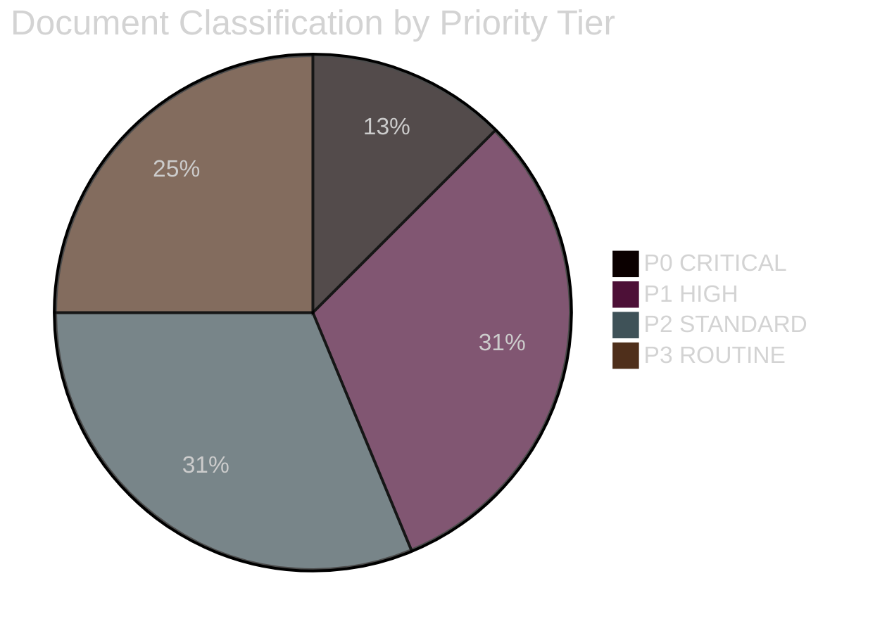

# Classification Results — Weekly Review 2026-04-26

**Author**: James Pether Sörling | **Framework**: 7-Dimension Political Classification

---

## Classification Summary

| dok_id | Policy Domain | Ideological Dimension | Party Alignment | Urgency | Controversy | EU Relevance | Security |
|--------|--------------|----------------------|-----------------|---------|-------------|-------------|----------|
| HC03205 | National security / Civil defence | Centre-right | M+L+KD+SD | HIGH | LOW | HIGH (NATO Art 3) | CRITICAL |
| HC03206 | National security / Accountability | Governance | Cross-party (audit) | HIGH | LOW | HIGH | CRITICAL |
| HC03203 | Energy / Environment | Right | M+SD (for); V+MP+S (against) | MEDIUM | VERY HIGH | HIGH (EU directives) | MEDIUM |
| HC01FiU20 | Fiscal policy | Centre-right | Government majority | HIGH | MEDIUM | HIGH | LOW |
| HC01FiU24 | Monetary policy | Technical | FiU consensus | MEDIUM | LOW | HIGH (ECB peer) | LOW |
| HC10744-HC10746 | Labour market | Left-opposition | S (proposer); L (respondent) | HIGH | HIGH | MEDIUM | LOW |
| HC03208 | Criminal law / IP | Centre-right | Government majority | MEDIUM | LOW | HIGH (EU directive) | LOW |
| HC01FiU33 | Supply chain security | Cross-party | Government majority | HIGH | LOW | HIGH | MEDIUM |
| HC01SoU29 | Social welfare / Children | Social policy | Government majority | MEDIUM | LOW | LOW | LOW |
| HC03202 | Criminal law | Right | Government majority | MEDIUM | MEDIUM | MEDIUM | LOW |
| HC03201 | Commercial law | Centre-right | Government majority | MEDIUM | LOW | MEDIUM | LOW |
| HC01CU18 | Procedural law | Technical | Cross-party | LOW | LOW | MEDIUM | LOW |
| HC01TU15 | Maritime / Environment | Environment | Cross-party | LOW | LOW | HIGH (EU maritime) | LOW |
| HC10743 | Tax enforcement | Fiscal | S+V (challenge) | MEDIUM | MEDIUM | HIGH (VAT EU) | LOW |

## Priority Tiers

### Tier P0 — IMMEDIATE ACTION REQUIRED
- HC03205 + HC03206: Civil defence — first parliamentary cycle under new MfcF mandate; Riksrevisionen audit triggers committee follow-up

### Tier P1 — HIGH PRIORITY (7–30 day horizon)
- HC10744–HC10746: Unemployment interpellations — minister must respond in Riksdag; ministerial answers become public record
- HC03203: Uranium ban — legal challenge window opens; Nordic diplomatic contacts begin
- HC01FiU20: Economic guidelines — cabinet must implement spring policy decisions

### Tier P2 — STANDARD MONITORING (30–90 day horizon)
- HC01FiU24: Riksbanken response to FiU evaluation recommendations
- HC03208, HC03202, HC03201: Criminal justice legislative implementation planning
- HC01FiU33: APL acquisition finalisation

### Tier P3 — ROUTINE
- HC01SoU29, HC01CU18, HC01TU15, HC10743

## Data Retention and Access

**GDPR Art 9(2)(e)(g) lawful basis**: All data used is publicly made political opinion and public-interest accountability.
**Access classification**: PUBLIC — unrestricted republication with source attribution.
**Retention**: 3 years (riksmöte lifecycle + 1).

style "P0 CRITICAL" fill:#ff006e,stroke:#00d9ff
