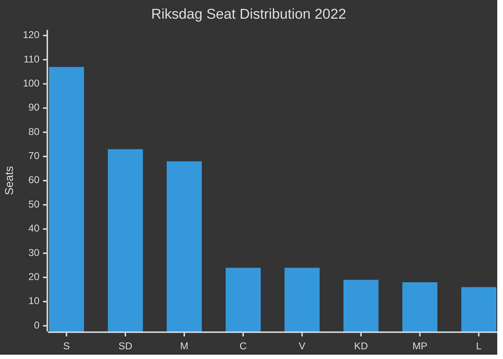

# Coalition Mathematics — Weekly Review 2026-04-26

**Author**: James Pether Sörling | **Framework**: Riksdag seat arithmetic + coalition viability

---

## Current Riksdag Seat Distribution (2022 Election Result)

| Party | Seats | Bloc | Note |
|-------|-------|------|------|
| Socialdemokraterna (S) | 107 | Opposition | Largest party |
| Sverigedemokraterna (SD) | 73 | Governing | Supports Tidö |
| Moderaterna (M) | 68 | Governing | PM's party |
| Centerpartiet (C) | 24 | Opposition-adjacent | Informal opposition |
| Vänsterpartiet (V) | 24 | Opposition | Hard left |
| Kristdemokraterna (KD) | 19 | Governing | Tidö coalition |
| Miljöpartiet (MP) | 18 | Opposition | Green |
| Liberalerna (L) | 16 | Governing | Tidö coalition |
| **Total** | **349** | | Majority: 175 |

---

## Current Government Arithmetic

**Tidö coalition (M+KD+L)**: 68+19+16 = **103 seats** (minority government)
**SD supporting**: 73 seats
**Governing bloc total**: 103+73 = **176 seats** (50.4% — bare majority of 1)

**Opposition bloc (S+V+MP)**: 107+24+18 = **149 seats**
**C opposition-adjacent**: 24 seats
**Total: Opposition + C**: 173 seats

---

## Confidence Motion Arithmetic

For a successful confidence vote against the government, the opposition needs **≥ 175 seats** voting against.

| Scenario | Votes against | Result |
|----------|--------------|--------|
| S+V+MP alone | 149 | Fails (26 short) |
| S+V+MP+C | 173 | Fails (2 short) |
| S+V+MP+C + 2 Tidö defectors | 175 | Passes (barely) |
| S+V+MP+C+SD | 246 | Passes (SD switches sides) |

**Key finding**: The opposition cannot defeat the government without either SD or defectors from within Tidö. This creates SD's pivotal role — SD defection = change of government.

---

## Coalition Viability Matrix (Post-Election Scenarios)

### Scenario A: Tidö Re-election (176–180 seats)
**Coalition options**:
- M+KD+L+SD (same as current): Viable if seats ≥175
- M+KD+L+C (exclude SD): Requires C reversal; possible if C leader position changes
**Key condition**: M+KD+L+SD ≥ 175

### Scenario B: S-led Government (175–181 seats for opposition)
**Coalition options**:
- S+MP+V: Viable if ≥175 (currently 149 — need +26 seats)
- S+MP+V+C: Most likely path if C reverses; viable if ≥175
- S+MP+V+L: Viable if L exits Tidö and joins S-bloc (historically not possible but not ruled out)
**Key condition**: S+V+MP+C ≥ 175

### Scenario C: Hung Parliament
**Probability**: ~15% (Scenario 3 from scenario-analysis.md)
**Resolution**: Riksdag Speaker nominates candidate; if rejected 4 times, automatic dissolution and snap election.

---

## Policy Concession Space

| Coalition variation | Civil defence | Unemployment | Uranium | Criminal justice |
|--------------------|--------------|--------------|---------|-----------------|
| M+KD+L+SD (current) | Aggressive | Activation-first | Lift ban | Law-and-order |
| S+V+MP+C | Defensive realism | Labour market invest. | Restore ban | Rehabilitative |
| M+KD+L+C (no SD) | Moderate | Liberal market | Conditional | Moderate |

---

## SD Pivotal Actor Analysis

SD's 73 seats give it decisive power:
- **Support current government**: SD maintains access to PM Ulf Kristersson; SD policy on immigration/gang crime implemented
- **Withdraw support**: Risk of snap election or S-led government; SD loses policy leverage; risk of losing seats in snap election
- **Support S-led government**: Historically unprecedented; politically toxic for SD base

**Conclusion**: SD has minimal incentive to trigger a change of government at this stage. The only credible SD defection scenario is Scenario 3 (coalition fracture on budget), probability 15%.

---

style S fill:#ff006e,stroke:#00d9ff
style SD fill:#ffbe0b,stroke:#0a0e27
style M fill:#00d9ff,stroke:#ff006e
