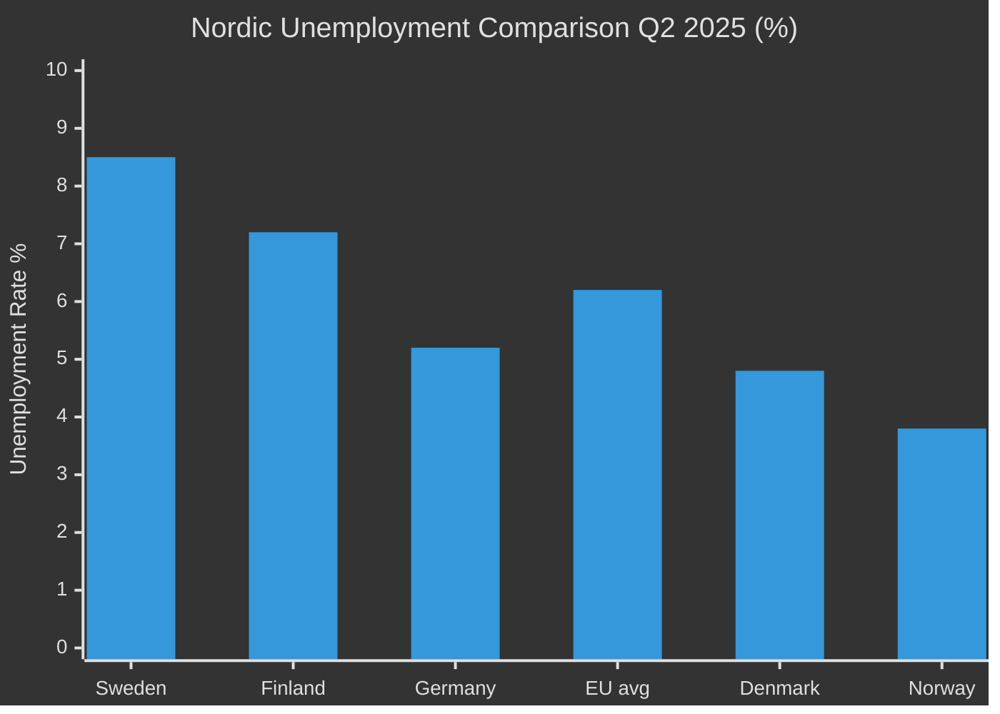

# Comparative International Analysis — Weekly Review 2026-04-26

**Author**: James Pether Sörling | **Framework**: Outside-In comparative analysis

---

**Comparator set**: Finland, Norway, Germany, Estonia, Denmark

---

## Civil Defence Agency Structures: Comparative Analysis

| Jurisdiction | Civil Defence Agency | Recent Reorganisation | NATO Art 3 Status | Notes |
|---|---|---|---|---|
| **Sweden** | Myndigheten för civilt försvar (MfcF) — renamed from MSB | HC03205 Sept 2025 [A2] | Under review (Riksrevisionen HC03206) | First civil-defence-specific mandate |
| **Finland** | Emergency Supply Agency (NESA) + Defmin | Expanded 2022-2024 post-NATO accession | Meets Article 3 baseline | Finland's Total Defence model predates NATO membership |
| **Norway** | Direktoratet for samfunnssikkerhet og beredskap (DSB) | Stable structure | Meets Article 3 baseline | DSB has clearer municipal coordination mechanism than MSB/MfcF |
| **Estonia** | Estonian Defence League (Kaitseliit) + PERH | Continuously modernised since 2014 | Strong compliance | Most resilience-hardened per capita in Nordic-Baltic |
| **Germany** | Bundesamt für Bevölkerungsschutz und Katastrophenhilfe (BBK) | Modernisation post-2022 | Under EU Civil Protection framework | Germany's BBK underwent similar rename/restructuring in 2020s |
| **Denmark** | Beredskabsstyrelsen | Stable | Meets Article 3 | Recent increase in civil-defence budget 2025 |

**Outside-In Analysis**: Sweden's MfcF rename (HC03205) follows the pattern of Germany's BBK restructuring and Finland's post-NATO integration model. The Riksrevisionen audit (HC03206) findings on fragmented coordination match known weaknesses in the pre-reform German BBK. The key distinction: Finland's Total Defence model integrates civil and military preparedness at the municipal level — a benchmark Sweden has explicitly not reached (HC10752 Lundqvist interpellation).

---

## Unemployment: Nordic Peer Comparison

| Country | Unemployment Rate Q2 2025 | Youth Unemployment | Key Policy Response |
|---------|--------------------------|-------------------|---------------------|
| **Sweden** | ~8.5% (~500,000 persons) [A2 — HC10746] | EU-high levels [A2 — HC10744] | "Labour line" rhetoric; rate cuts by Riksbanken |
| **Norway** | ~3.8% (StatisticsNorway) | ~11% | Strong oil fund stabilisation |
| **Finland** | ~7.2% (Stats Finland) | ~16% | Active labour market policies |
| **Denmark** | ~4.8% (StatsDenmark) | ~10% | Flexicurity model maintaining rates |
| **Germany** | ~5.2% (Bundesagentur) | ~6.5% | Short-work scheme protects employment |
| **EU average** | ~6.2% | ~14.5% | Varies by member state |

**Outside-In Analysis**: Sweden's unemployment rate is the highest in the Nordic peer group and above the EU average — a structural anomaly given Sweden's historically strong labour market institutions. HC10744-HC10746 interpellations cite this directly. The IMF WEO Apr-2026 (NGDP_RPCH ~1.2% for Sweden) versus Denmark's ~2.1% and Norway's ~2.8% illustrates the relative growth differential that is sustaining the Swedish employment gap.

---

## Uranium Mining: Nordic-Baltic Comparison

| Country | Uranium mining policy | Recent change | Political stance |
|---------|----------------------|---------------|-----------------|
| **Sweden** | Ban removed (proposed HC03203) | 30-year ban lifted | M+SD support; V+MP+S opposed [A2] |
| **Finland** | No commercial uranium deposits; Uranium exploration permitted | No change | Nuclear-friendly overall |
| **Norway** | No prohibition; Thorium deposits more relevant | No change | Environmental concerns around Fen Complex |
| **Estonia** | No commercial deposits | N/A | Nuclear-supportive |
| **Germany** | No uranium mining | Phased out | Environmental opposition |

**Outside-In Analysis**: Sweden removing its uranium mining ban stands alone in the Nordic group. Norway and Finland have no equivalent prohibition to lift, but Swedish HC03203 may create pressure on Nordic mineral policy harmonisation. EU Environmental Impact Assessment Directive (2014/52/EU) and Habitats Directive would apply to any future Swedish uranium mining permit — this is the pathway through which V+MP opposition could seek to re-impose effective barriers through European channels.

---

style Sweden fill:#ff006e,stroke:#00d9ff
