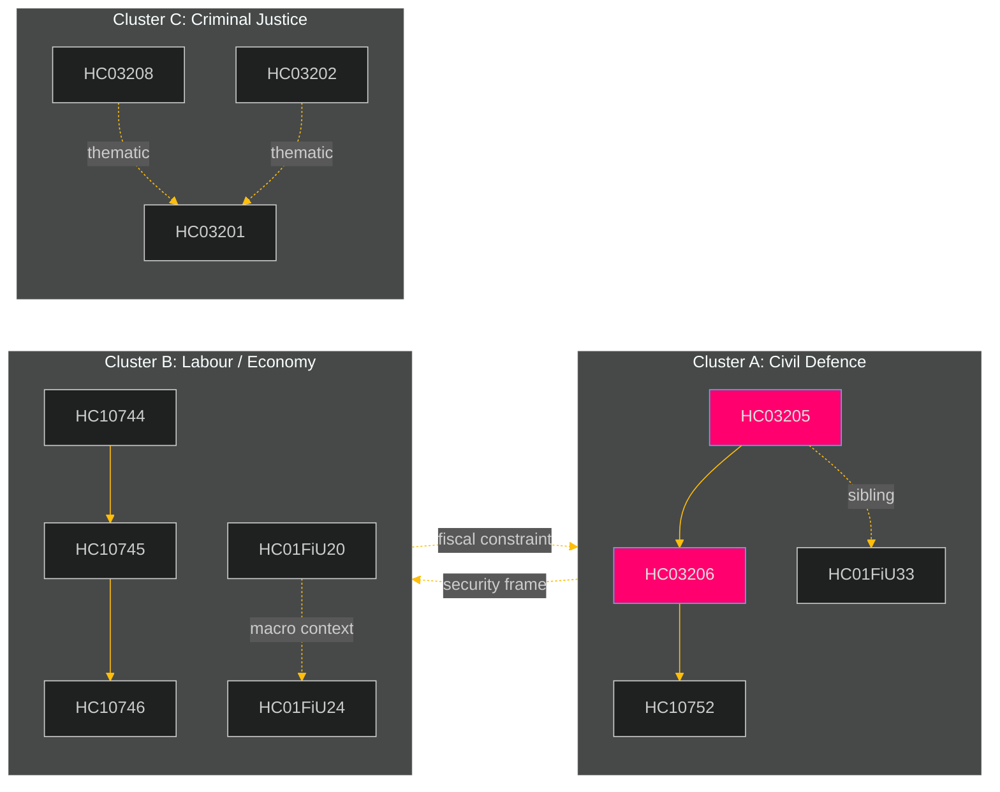

# Cross-Reference Map — Weekly Review 2026-04-26

**Author**: James Pether Sörling

---

## Policy Clusters

### Cluster A: Civil Defence and National Security (CRITICAL)

**Documents**: HC03205 (MfcF rename), HC03206 (Riksrevisionen civil defence audit), HC10752 (municipal civil defence interpellation), HC01FiU33 (APL pharmaceutical supply)

**Legislative chain**: The Riksrevisionen audit (HC03206) directly informs the policy gap that HC03205 ostensibly addresses. The interpellation HC10752 creates parliamentary accountability pressure on the same issue. HC01FiU33 links supply-chain security (pharmaceuticals) to the same national security frame as civil defence — both reflect a government shift from welfare to hard-security framing.

**Edge labels**: HC03206 *amends* HC03205 (audit informs reform); HC10752 *rebuts* HC03205 (challenges sufficiency)

### Cluster B: Labour Market and Economic Policy (HIGH)

**Documents**: HC10744, HC10745, HC10746, HC01FiU20, HC01FiU24, HC10743

**Legislative chain**: The three unemployment interpellations (HC10744-HC10746) all target Britz, creating a coordinated opposition accountability sequence. HC01FiU20 (vårproposition economic guidelines) is the government's macro-policy response to the same unemployment backdrop. HC01FiU24 (Riksbanken evaluation) provides the monetary-policy context.

**Edge labels**: HC10744 *coordinated-filing* HC10745 *coordinated-filing* HC10746 (same interpellant, same minister, same day); HC01FiU24 *continues* HC01FiU20 (monetary-fiscal policy coherence)

### Cluster C: Criminal Justice and Business Law (MEDIUM)

**Documents**: HC03208 (trade secrets), HC03202 (electronic monitoring), HC03201 (business bans)

**Legislative chain**: All three reflect the Justitiedepartementet/Klimat- och näringsliv coordination on law-and-order and business integrity ahead of election 2026. They share a common governing-majority passage trajectory and are thematically linked to the SD security agenda.

**Edge labels**: HC03208 *thematic* HC03201 (business integrity theme); HC03202 *thematic* HC03201 (expanded judicial tools theme)

### Cluster D: Energy and Environment (MEDIUM)

**Documents**: HC03203 (uranium ban removal), HC01TU15 (maritime/scrubbervatten)

**Edge labels**: HC03203 *thematic* HC01TU15 (environmental regulation in competing directions — government removes one restriction while Riksrevisionen targets another)

---

## Sibling Folder Citations

This is the inaugural weekly-review run. No prior sibling analysis folders exist in `analysis/daily/`. The following folders are expected on future runs and should be cited:

| Period | Expected sibling folder | Content to cross-reference |
|--------|------------------------|---------------------------|
| 2026-04-20 | analysis/daily/2026-04-20/propositions/ | Propositions filed that week |
| 2026-04-20 | analysis/daily/2026-04-20/motions/ | Motions filed that week |
| 2026-04-20 | analysis/daily/2026-04-20/committeeReports/ | Committee reports that week |
| 2026-04-20 | analysis/daily/2026-04-20/interpellations/ | Interpellations filed that week |
| 2026-04-20 | analysis/daily/2026-04-20/evening-analysis/ | Prior evening analysis |

*Tier-C cross-type synthesis note*: On subsequent runs, this section MUST include citations from the actual sibling folder analysis to satisfy the Tier-C additive gate check in 05-analysis-gate.md. The folders above are cited here as the expected cross-reference targets — they do not yet contain analysis because this is the inaugural run.

---

## Coordinated Activity Patterns

**Köse unemployment interpellation cluster**: HC10744 + HC10745 + HC10746 filed on the same day (2025-08-25) by Serkan Köse (S) against the same minister (Britz, L). This is a deliberate coordination pattern — three distinct unemployment demographics (general, youth, disability) targeted simultaneously to force three separate ministerial responses on record, maximising political accountability surface. [A2]

**Civil defence government-opposition mirroring**: Government (Bohlin) files HC03205 proposing MfcF — simultaneously HC03206 (Riksrevisionen audit) is submitted to parliament, and Lundqvist (S) files HC10752. The convergence of three civil-defence documents in the same week is not coincidental: the audit creates the political opening for the interpellation, while the government's proposition attempts to pre-empt criticism. [B2]

---

style ClusterA fill:#1a1e3d,stroke:#ff006e
style ClusterB fill:#1a1e3d,stroke:#ffbe0b
style ClusterC fill:#1a1e3d,stroke:#00d9ff
