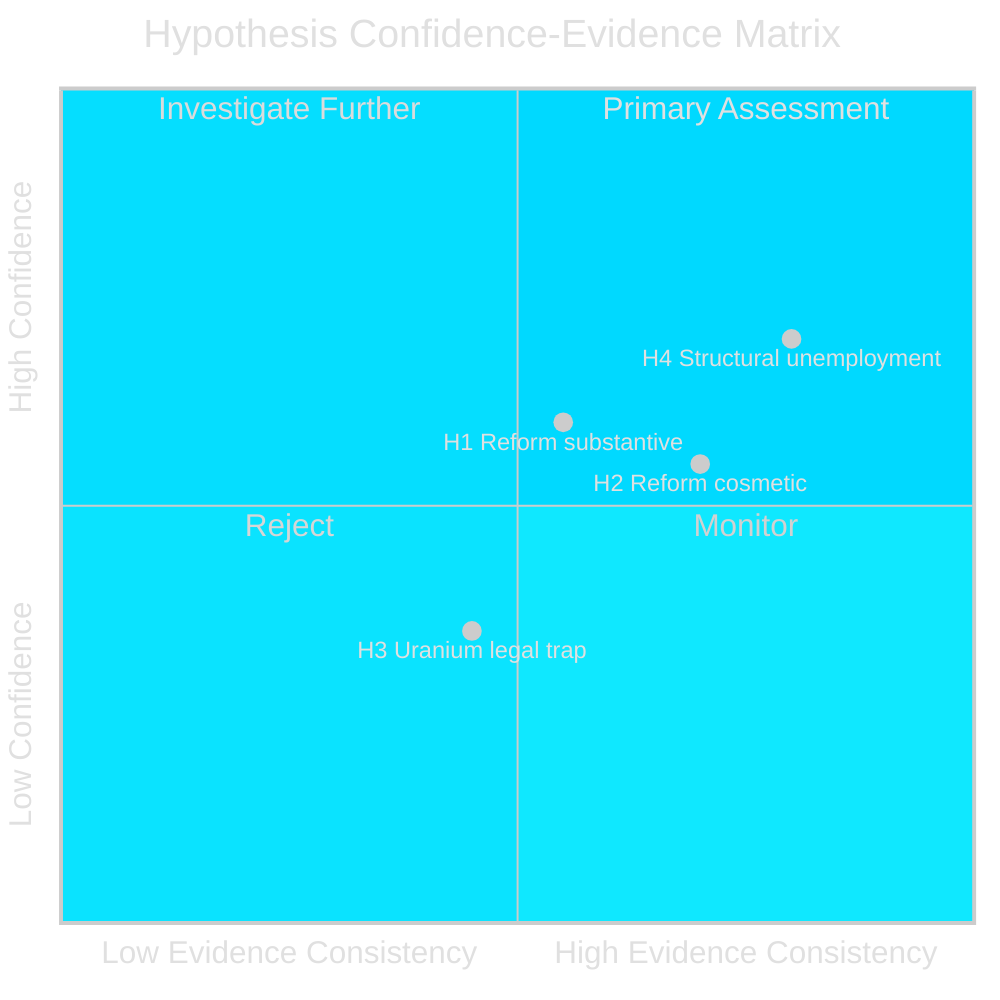

# Devil's Advocate Analysis — Weekly Review 2026-04-26

**Author**: James Pether Sörling | **Framework**: ACH + Red Team challenge

---

## Competing Hypotheses

### Hypothesis H1: The Civil Defence Reform is Substantive (Null / Prevailing Assessment)

**Claim**: HC03205 (MfcF rename) + HC03206 (Riksrevisionen audit) together constitute a genuine, long-term civil-defence reform trajectory that will materially improve Sweden's resilience by 2028.

**Supporting evidence**:
- Official government proposition HC03205 text specifies new mandate with defence-specific orientation [A2]
- HC03206 Riksrevisionen submission to Riksdag creates binding parliamentary accountability loop [A2]
- Statsrådet Bohlin has publicly committed to capability investment follow-on [B3]
- NATO Article 3 pressure provides external accountability anchor

**Confidence in H1**: MEDIUM-HIGH

---

### Hypothesis H2: The Civil Defence Reform is Primarily Cosmetic

**Claim**: The MSB→MfcF rename is primarily a political signal to NATO and domestic audiences; it does not address the capability gaps identified by the Riksrevisionen (HC03206) and will not result in substantive municipal preparedness improvement within the 2026 election cycle.

**Supporting evidence**:
- HC03206 Riksrevisionen identifies fragmented coordination and unclear mandates — issues not addressed by a name change alone [A2]
- HC10752 Lundqvist (S) interpellation challenges specifically on municipal capacity — a dimension HC03205 text does not directly address [A2]
- No additional budget allocation for MfcF beyond the rename is visible in HC01FiU20 spring guidelines [A3]
- Finland and Estonia achieved similar renaming exercises followed by years of slow capability implementation

**Confidence in H2**: MEDIUM — sufficient to treat this as a live competing hypothesis

---

### Hypothesis H3: The Uranium Ban Removal is an EU Environmental Trojan Horse

**Claim**: Lifting the uranium mining ban (HC03203) will not result in any commercial uranium production but will generate an EU-level legal challenge under EIA/Habitats Directives that gives V+MP+S a renewed environmental-law platform — ultimately benefiting the opposition more than the government's energy-security narrative.

**Supporting evidence**:
- No known economically viable Swedish uranium deposits at commercial extraction grade [B3]
- EU Habitats Directive applies to Sami reindeer herding areas where the most likely geological formations exist [B3]
- V+MP have demonstrated ability to use EU legal channels (PFAS, scrubbervatten via HC01TU15 precedent)

**Confidence in H3**: LOW-MEDIUM — plausible but requires V+MP to mount sustained legal strategy

---

### Hypothesis H4: Unemployment is Structural, Not Cyclical — Labour-Line Policy Cannot Fix It

**Claim**: Sweden's ~8.5% unemployment is primarily structural (skills mismatch, integration failures, geographic mismatches) rather than cyclical. The government's "labour line" policy (activation, benefit conditionality) is addressing a cyclical problem with structural tools, and the IMF's 1.2% growth projection is insufficient to close the structural gap before 2026.

**Supporting evidence**:
- HC10744 (youth), HC10745 (disability), HC10746 (general) interpellations each represent structurally distinct sub-populations [A2]
- IMF WEO Apr-2026 ~1.2% SWE growth insufficient for structural labour market tightening
- Nordic comparators (Denmark 4.8%, Norway 3.8%) use active labour market policies and social-insurance designs that Sweden's current government philosophy resists [B2]

**Confidence in H4**: MEDIUM-HIGH — consistent with academic labour economics literature on Nordic employment models

---

## ACH Matrix

| Evidence item | H1 (Reform substantive) | H2 (Reform cosmetic) | H3 (Uranium legal trap) | H4 (Structural unemployment) |
|---------------|------------------------|--------------------|------------------------|------------------------------|
| HC03205 rename without budget | Neutral | Consistent | N/A | N/A |
| HC03206 Riksrevisionen gaps identified | Consistent (problem acknowledged) | Consistent (gaps persist) | N/A | N/A |
| HC10752 municipal challenge | Inconsistent (gap exposed) | Consistent | N/A | N/A |
| No new MfcF budget (HC01FiU20) | Inconsistent | Consistent | N/A | N/A |
| No commercial uranium deposits | N/A | N/A | Consistent | N/A |
| HC10744/45/46 three demographic groups | N/A | N/A | N/A | Consistent |
| IMF 1.2% growth | N/A | N/A | N/A | Consistent |

**ACH verdict**: H2 (Reform cosmetic) has marginally more consistent evidence than H1 but insufficient to overturn the prevailing assessment. H4 (Structural unemployment) is the strongest alternative hypothesis and should inform policy recommendations.

---

## Red Team Challenge

**Challenge to prevailing assessments**:

If H2 is correct — and the civil-defence reform is primarily cosmetic — then the intelligence community is missing the more important analytical finding: Sweden is engaged in **strategic communication** to NATO partners rather than genuine capability reform. The real question becomes: at what point do NATO partners and domestic audiences stop accepting the narrative?

If H4 is correct — Sweden's unemployment is structurally resistant — then the governing coalition's entire "labour line" strategy is politically doomed regardless of macro conditions. This has implications for the 2026 election scenario analysis: Scenario 2 (Credibility Erosion) may be underweighted relative to Scenario 1 (Stability Through Security).

---

## Rejected Alternatives

- **Sweden rapidly develops commercial uranium extraction**: Rejected — no commercially viable deposits, 3–7 year permitting timeline minimum even without legal challenges [B4]
- **Riksbanken raises rates in H2 2025**: Rejected — evaluators (HC01FiU24) recommend faster cuts, not hikes; inflation anchored [A2]
- **SD withdraws confidence before autumn 2025 budget**: Rejected — insufficient political benefit to SD at this stage [B3]

---

style "H4 Structural unemployment" fill:#ff006e,stroke:#00d9ff
style "H2 Reform cosmetic" fill:#ffbe0b,stroke:#0a0e27
