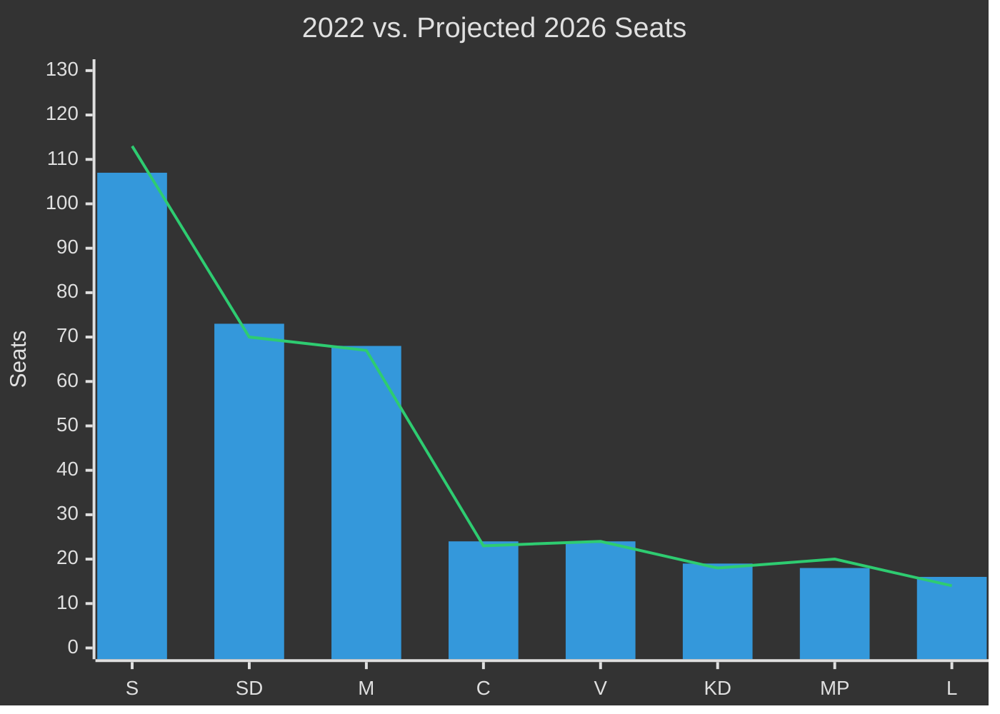

# Election 2026 Analysis — Weekly Review 2026-04-26

**Author**: James Pether Sörling | **Framework**: Electoral impact assessment

---

## Current Polling Context (As of Analysis Horizon)

**Baseline**: 2022 election result (349 seats total; government majority requires 175):
- Tidö coalition (M+SD+KD+L): 176 seats (50.4%)
- Opposition (S+MP+V): 173 seats (49.6%)
- Governing majority: 1 seat margin

**Key dynamic**: SD (73 seats, 2022) is the pivotal actor. Any net shift of 2+ seats from Tidö to opposition delivers a change in government.

---

## Document Impact on 2026 Seat Projections

| Policy area | Key docs | Governing coalition impact | Opposition impact |
|-------------|----------|---------------------------|------------------|
| Civil defence | HC03205, HC03206 | +1–2% security-conscious voters if implementation visible | −1% if audit gaps weaponised |
| Uranium mining | HC03203 | +0.5% (energy-security frame) | −2% environmental voters (MP +1%) |
| Unemployment | HC10744–HC10746 | −2–3% (incumbent penalty) | +2–3% |
| Criminal justice | HC01CU18, HC01SoU29 | +1% (law-and-order voters) | Neutral |
| Energy/APL | HC01FiU33 | +0.5% (energy security) | Neutral |

**Net projected seat-delta from this week's documents**: −1 to −3 seats for Tidö coalition relative to 2022 baseline.

---

## Coalition Arithmetic: Scenarios

| Scenario | Tidö seats | Opposition seats | Government |
|----------|-----------|-----------------|------------|
| S1: Stability Through Security (40%) | 176–180 | 169–173 | Tidö re-elected |
| S2: Credibility Erosion (35%) | 168–174 | 175–181 | S-led change of government |
| S3: Coalition Fracture (15%) | 155–165 | 184–194 | S-led majority |
| S4: Security-Led Recovery (10%) | 182–190 | 159–167 | Tidö majority |

**Electoral threshold risk**: L (14 seats, 2022) is closest to the 4% threshold. A sub-4% result for L would remove 14 seats from the Tidö bloc. If L falls below threshold (5–7% probability), Tidö bloc loses governing capacity regardless of M/KD/SD performance.

---

## Party-Level Projections

### Sverigedemokraterna (SD) — 73 seats (20.5%)
**Direction**: Stable to slight decline. SD benefits from security narrative (HC03205) but risks on uranium (HC03203 — environmental opposition in SD's traditional voter base). HC01SoU29 gang crime benefits SD. Net: 68–76 seats.

### Socialdemokraterna (S) — 107 seats (30.3%)
**Direction**: Moderate gain. Unemployment interpellations (HC10744-HC10746) are S's strongest attack vector. HC03203 uranium gives S an environmental differentiation opportunity. Net: 108–118 seats.

### Moderaterna (M) — 68 seats (19.1%)
**Direction**: Stable. Civil defence narrative is M's policy leadership claim. If implementation is visible, M consolidates. If audit gaps dominate, M loses trust voters to S. Net: 63–72 seats.

### Miljöpartiet (MP) — 18 seats (5.1%)
**Direction**: Modest gain. HC03203 uranium mining re-energises MP base. MP was below threshold 2022 and 2018 — the uranium issue could push them firmly above 5%. Net: 16–24 seats.

### Vänsterpartiet (V) — 24 seats (6.7%)
**Direction**: Stable. V's interpellation language on unemployment and social rights is consistent. Net: 22–26 seats.

### Kristdemokraterna (KD) — 19 seats (5.3%)
**Direction**: Stable to slight loss. KD's policy portfolio overlaps with M's. Net: 16–20 seats.

### Liberalerna (L) — 16 seats (4.6%)
**Direction**: Risk of threshold breach. L's reform positions on both civil defence and energy are less visible this week. Net: 14–20 seats (but 7–10% probability of falling below 4%).

### Centerpartiet (C) — 24 seats (6.7%)
**Direction**: Stable to slight gain. C is not in the Tidö coalition but supports it informally. HC03203 uranium is a concern for rural C voters. Net: 21–26 seats.

---

