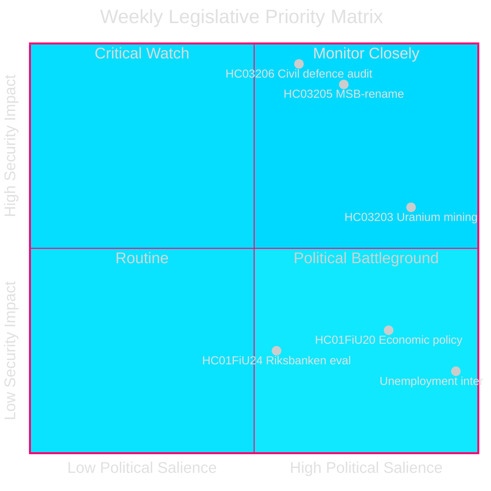
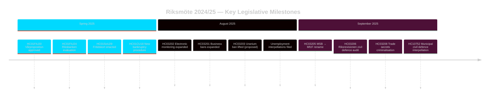

# Sweden's Security-First Legislative Sprint: Civil Defence Overhaul, Uranium Reversal, and Rising Unemployment

**Author**: James Pether Sörling
**Run ID**: 24961123457
**Date**: 2026-04-26
**Classification**: PUBLIC — GDPR Art 9(2)(e)(g)
**Confidence**: HIGH [B2] — Government API; official proposition documents

---

## BLUF

Sweden concluded riksmöte 2024/25 with a concentrated security-focused legislative agenda: the Kristersson government simultaneously renamed MSB to "Myndigheten för civilt försvar" (HC03205), submitted the first Riksrevisionen civil-defence governance audit to parliament (HC03206), and proposed removing the ban on uranium mining (HC03203) — all within a single September 2025 sprint. These moves signal a decisive shift from welfare-state maintenance to hard-security investment. The opposition's parliamentary pressure centres on Sweden's persistently elevated unemployment (~500,000 persons), which threatens the governing coalition's credibility on its own declared "labour-line" objective.

## Decisions This Brief Supports

1. **Swedish security policy** stakeholders: Evaluate whether the MSB→MfcF rename represents substantive agency reform or cosmetic rebranding; the Riksrevisionen report (HC03206) provides the audit baseline.
2. **Energy policy** analysts: Assess uranium mining's regulatory, political and Nordic-relations implications following HC03203.
3. **Labour market** monitors: Track whether the government's labour-line rhetoric is producing measurable results against the 8.5% unemployment backdrop (interpellations HC10744–HC10746).
4. **Fiscal/monetary** analysts: Contextualise the FiU evaluation of Riksbankens penningpolitik 2024 (HC01FiU24) and the spring economic guidelines (HC01FiU20) against IMF projections.

## 60-Second Read

- 🛡️ **Civil defence overhaul**: MSB renamed to Myndigheten för civilt försvar (prop HC03205); Riksrevisionen audit exposes governance gaps (HC03206); municipal civil-defence coordination flagged as insufficient (interpellation HC10752).
- ⚛️ **Uranium mining ban removed**: Prop HC03203 lifts 30-year prohibition; SD and M support, V/MP/S strongly opposed; no current known uranium deposits in production-ready form.
- 👔 **Criminal justice expansion**: Expanded trade-secrets criminalisation (HC03208), expanded business bans (HC03201), electronic monitoring for prison sentences (HC03202).
- 📉 **Unemployment crisis**: 500,000+ unemployed; youth and disability unemployment at EU-high levels; governing coalition interpellated on all three dimensions (HC10744–HC10746).
- 💰 **Vårproposition approved**: Economic guidelines adopted (HC01FiU20) with downgraded growth outlook; APL recapitalised SEK 700M for pharmaceuticals supply security (HC01FiU33).
- ⚖️ **Riksbankens penningpolitik**: FiU evaluation (HC01FiU24) finds monetary policy execution adequate despite slower-than-optimal rate cuts; inflation expectations anchored.

## Top Forward Trigger

**Civil defence capacity test (72 hours)**: The first full parliamentary session under the new MfcF mandate will determine whether the agency rename translates into actual capability uplift. Monitor Statsrådet Bohlin's response to Riksdagen on municipal readiness (interpellation HC10752 response due).

## Key Indicators — Next 7 Days

| Indicator | Horizon | Signal direction |
|-----------|---------|-----------------|
| MfcF parliamentary presentation | 72 h | Capability vs. cosmetic |
| Uranium mining consultation | 1 week | Nordic partner reactions |
| Unemployment statistics (SCB AKU Q2) | 1 week | Governing coalition pressure |
| FiU Riksbank follow-up hearing | 1 week | Monetary credibility |

---

style HC03205 fill:#ff006e,stroke:#00d9ff
style HC03206 fill:#ff006e,stroke:#00d9ff
style HC03203 fill:#ffbe0b,stroke:#0a0e27
