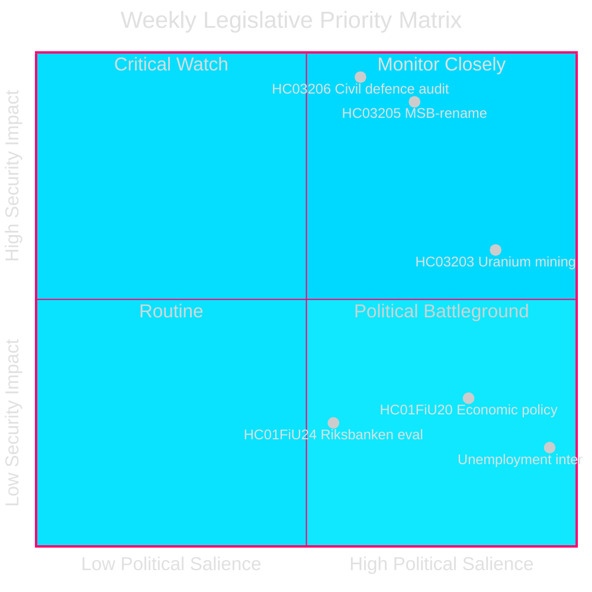
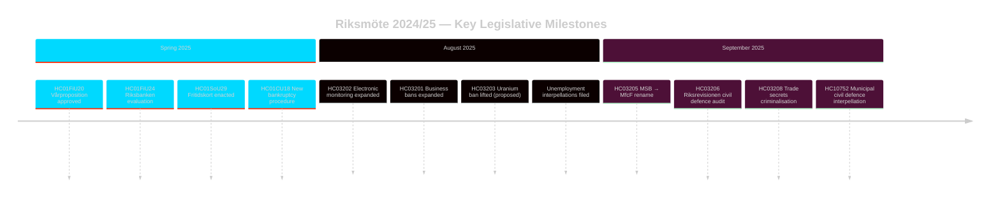

<!-- dir: rtl -->
---
title: "سويدن سبرينت تشريعي أمني: إعادة هيكلة الدفاع المدني، تعدين اليورانيوم وارتفاع البطالة"
author: James Pether Sörling
date: 2026-04-26
classification: PUBLIC
confidence: HIGH [B2]
---

# سويدن سبرينت تشريعي أمني: إعادة هيكلة الدفاع المدني، تعدين اليورانيوم وارتفاع البطالة

**المؤلف**: James Pether Sörling
**رقم التشغيل**: 24961123457
**التاريخ**: 2026-04-26
**التصنيف**: PUBLIC — اللائحة الأوروبية للبيانات (GDPR) المادة 9(2)(ه)(و)
**الثقة**: HIGH [B2] — واجهة برمجة السلطة؛ وثائق الاقتراح الرسمية

---

## الملخص التنفيذي

اختتمت السويد دورة Riksmöte 2024/25 ببرنامج تشريعي مكثف يركز على الأمن: أعادت حكومة Kristersson تسمية MSB إلى «Myndigheten för civilt försvar» (HC03205)، وقدمت إلى البرلمان (Riksdag) أول تدقيق لحوكمة الدفاع المدني من قِبل Riksrevision (HC03206)، واقترحت رفع الحظر على التعدين المعدني لليورانيوم (HC03203) — كل هذا خلال سبرينت واحد في سبتمبر 2025. تشير هذه الإجراءات إلى تحول حاسم من الحفاظ على دولة الرفاهية إلى الاستثمار في الأمن الصلب. يتمحور الضغط البرلماني للمعارضة حول معدل البطالة المرتفع باستمرار في السويد (~500,000 شخص)، مما يهدد مصداقية التحالف الحاكم في ما يتعلق بهدفه المُعلن المتمثل في «خط العمل».

## القرارات التي تدعمها هذه الاستخبارات

1. **أصحاب المصلحة في السياسة الأمنية السويدية**: تقييم ما إذا كانت إعادة التسمية MSB→MfcF تمثل إصلاحاً جوهرياً للوكالة أم مجرد إعادة تسمية شكلية؛ يوفر تقرير Riksrevision (HC03206) أساس التدقيق.
2. **محللو السياسة الطاقوية**: تقييم الانعكاسات التنظيمية والسياسية والعلاقات الشمالية لتعدين اليورانيوم بعد HC03203.
3. **رصد سوق العمل**: متابعة ما إذا كانت خطابات حكومة خط العمل تُنتج نتائج قابلة للقياس في مواجهة نسبة بطالة تبلغ 8.5% (الاستجوابات HC10744–HC10746).
4. **محللو المالية/السياسة النقدية**: وضع تقييم FiU لسياسة Riksbank النقدية لعام 2024 (HC01FiU24) والتوجيهات الاقتصادية الربيعية (HC01FiU20) في سياق توقعات صندوق النقد الدولي.

## قراءة 60 ثانية

- 🛡️ **إعادة هيكلة الدفاع المدني**: أُعيدت تسمية MSB إلى Myndigheten för civilt försvar (المقترح HC03205)؛ كشف تدقيق Riksrevision عن ثغرات في الحوكمة (HC03206)؛ رُصد التنسيق البلدي للدفاع المدني بوصفه غير كافٍ (الاستجواب HC10752).
- ⚛️ **رفع حظر تعدين اليورانيوم**: يرفع المقترح HC03203 الحظر الذي دام 30 عاماً؛ يدعمه SD وM، يعارضه V/MP/S بشدة؛ لا توجد رواسب معروفة للإنتاج.
- 👔 **التوسع الجنائي**: تجريم موسّع لأسرار التجارة (HC03208)، حظر موسّع على الأعمال (HC03201)، مراقبة إلكترونية لأحكام السجن (HC03202).
- 📉 **أزمة البطالة**: أكثر من 500,000 عاطل؛ بطالة الشباب وذوي الإعاقة عند أعلى مستوياتها في الاتحاد الأوروبي؛ التحالف الحاكم يواجه استجوابات على الأبعاد الثلاثة (HC10744–HC10746).
- 💰 **اعتماد Vårproposition**: تم اعتماد التوجيهات الاقتصادية (HC01FiU20) مع توقعات نمو منخفضة؛ إعادة رسملة APL بمقدار 700 مليون كرونة سويدية لتأمين الإمدادات الدوائية (HC01FiU33).
- ⚖️ **السياسة النقدية لـ Riksbank**: يُقيّم تقرير FiU (HC01FiU24) تنفيذ السياسة النقدية بأنه كافٍ رغم تخفيضات أسعار الفائدة الأبطأ من المثلى؛ توقعات التضخم راسخة.

## المحفز الرئيسي للمستقبل

**اختبار قدرة الدفاع المدني (72 ساعة)**: ستُحدد الجلسة البرلمانية الكاملة الأولى في إطار تفويض MfcF الجديد ما إذا كانت إعادة تسمية الوكالة تُفضي إلى بناء قدرات فعلية. تابع رد وزير الدولة Bohlin على البرلمان (Riksdag) بشأن الاستعداد البلدي (انتهاء مهلة الرد على الاستجواب HC10752).

## المؤشرات الرئيسية — الأيام السبعة القادمة

| المؤشر | الأفق الزمني | اتجاه الإشارة |
|-----------|---------|-----------------|
| العرض البرلماني لـ MfcF | 72 ساعة | القدرة مقابل الشكليات |
| استشارة تعدين اليورانيوم | أسبوع | ردود الشركاء الشماليين |
| إحصاءات البطالة (SCB AKU Q2) | أسبوع | ضغط على التحالف الحاكم |
| جلسة استماع متابعة FiU لـ Riksbank | أسبوع | المصداقية النقدية |

---

style HC03205 fill:#ff006e,stroke:#00d9ff
style HC03206 fill:#ff006e,stroke:#00d9ff
style HC03203 fill:#ffbe0b,stroke:#0a0e27

<!-- source-sha: e799f2cf3c9c7f3ec4f6e9c9b91e6ad40f91af79 -->
