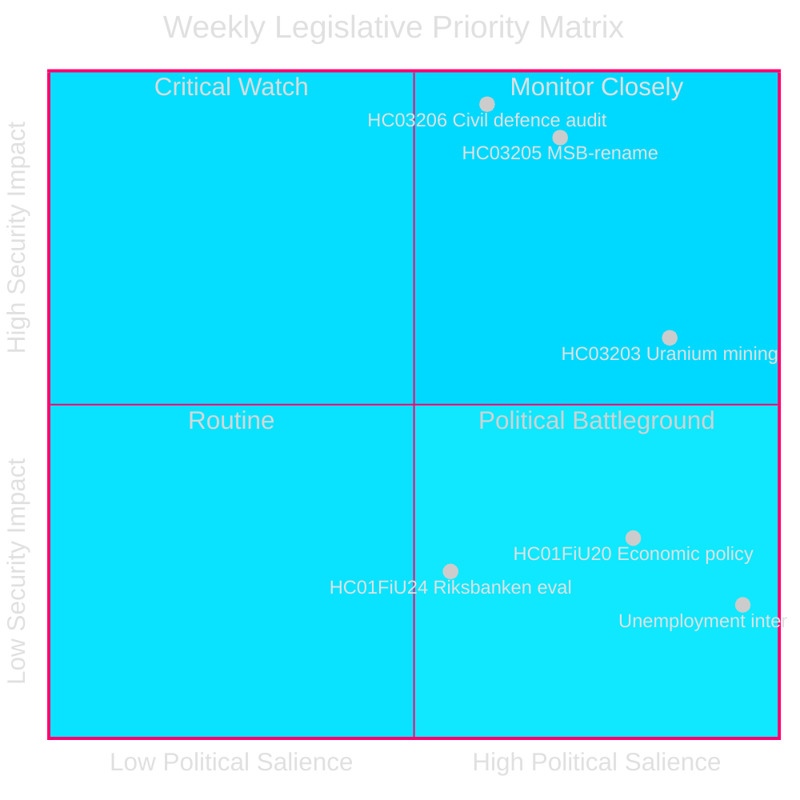
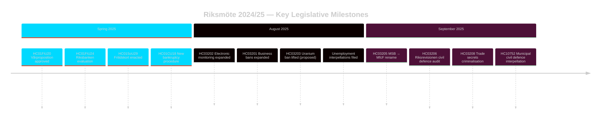

# Sveriges Sikkerhedsfokuserede Lovgivningssprint: Civil Forsvarsomlægning, Uranminedrift og Stigende Arbejdsløshed

**Forfatter**: James Pether Sörling
**Løbenummer**: 24961123457
**Dato**: 2026-04-26
**Klassifikation**: PUBLIC — GDPR Art 9(2)(e)(g)
**Konfidens**: HIGH [B2] — Myndigheds-API; officielle propositionsdokumenter

---

## BLUF

Sverige afsluttede riksmöte 2024/25 med en koncentreret sikkerhedsfokuseret lovgivningsdagsorden: Kristersson-regeringen omdøbte MSB til "Myndigheten för civilt försvar" (HC03205), forelagde den første Riksrevisionens civile forsvarsrevision til Riksdagen (HC03206) og foreslog at ophæve forbuddet mod uranminedrift (HC03203) — alt inden for en enkelt september 2025-sprint. Disse skridt signalerer et afgørende skifte fra opretholdelse af velfærdsstaten til investeringer i hård sikkerhed. Oppositionens parlamentariske pres centrerer sig om Sveriges vedvarende høje arbejdsløshed (~500.000 personer), som truer den styrende koalitions troværdighed i forhold til sit eget erklærede "arbejdslinjes"-mål.

## Beslutninger Dette Underlag Understøtter

1. **Svenske sikkerhedspolitiske** interessenter: Vurder om MSB→MfcF-omdøbningen repræsenterer substantiel myndighedsreform eller kosmetisk ommærkning; Riksrevisionens rapport (HC03206) udgør revisionsbasisen.
2. **Energipolitiske** analytikere: Vurder uranminedriftens regulatoriske, politiske og nordiske relationsimplikationer efter HC03203.
3. **Arbejdsmarkedsovervågere**: Følg om regeringens arbejdslinjeretorlik giver målbare resultater mod en baggrund af 8,5 % arbejdsløshed (forespørgslerne HC10744–HC10746).
4. **Finans-/pengepolitiske** analytikere: Kontekstualisér FiU's evaluering af Riksbankens pengepolitik 2024 (HC01FiU24) og forårets økonomiske retningslinjer (HC01FiU20) i forhold til IMF-projektioner.

## 60-Sekunders Læsning

- 🛡️ **Civil forsvarsomlægning**: MSB omdøbt til Myndigheten för civilt försvar (prop HC03205); Riksrevisionens revision afslører styringsgab (HC03206); kommunal civilt forsvarskoordinering markeret som utilstrækkelig (forespørgsel HC10752).
- ⚛️ **Uranminedriftforbud ophævet**: Prop HC03203 ophæver 30-årsforbuddet; SD og M støtter, V/MP/S kraftigt imod; ingen kendte uranforekomster i produktionsklar form.
- 👔 **Strafferetlig ekspansion**: Udvidet kriminalisering af forretningshemmeligheder (HC03208), udvidede erhvervsforbud (HC03201), elektronisk overvågning for fængselsstraffe (HC03202).
- 📉 **Arbejdsløshedskrise**: 500.000+ arbejdsløse; ungdoms- og handicaparbejdsløshed på EU-høje niveauer; den styrende koalition forespørges på alle tre dimensioner (HC10744–HC10746).
- 💰 **Forårsproposition godkendt**: Økonomiske retningslinjer vedtaget (HC01FiU20) med nedjusteret vækstperspektiv; APL rekapitaliseret SEK 700M til lægemiddelforsyningssikkerhed (HC01FiU33).
- ⚖️ **Riksbankens pengepolitik**: FiU-evaluering (HC01FiU24) finder pengepolitikkens gennemførelse tilstrækkelig trods langsommere-end-optimale rentenedsættelser; inflationsforventninger forankrede.

## Vigtigste Fremtidstrigger

**Civil forsvar kapacitetstest (72 timer)**: Den første fulde parlamentssession under det nye MfcF-mandat vil afgøre, om omdøbningen af agenturen medfører reel kapacitetsopbygning. Følg statsråd Bohlins svar til Riksdagen om kommunal beredskab (svar på forespørgsel HC10752 forfalder).

## Nøgleindikatorer — Næste 7 Dage

| Indikator | Horisont | Signalretning |
|-----------|---------|-----------------|
| MfcF parlamentspræsentation | 72 t | Kapacitet vs. kosmetik |
| Uranminedrift konsultation | 1 uge | Nordiske partnerreaktioner |
| Arbejdsløshedsstatistik (SCB AKU Q2) | 1 uge | Styrende koalitionspres |
| FiU Riksbankens opfølgningshøring | 1 uge | Monetær troværdighed |

---

style HC03205 fill:#ff006e,stroke:#00d9ff
style HC03206 fill:#ff006e,stroke:#00d9ff
style HC03203 fill:#ffbe0b,stroke:#0a0e27

<!-- source-sha: e799f2cf3c9c7f3ec4f6e9c9b91e6ad40f91af79 -->
