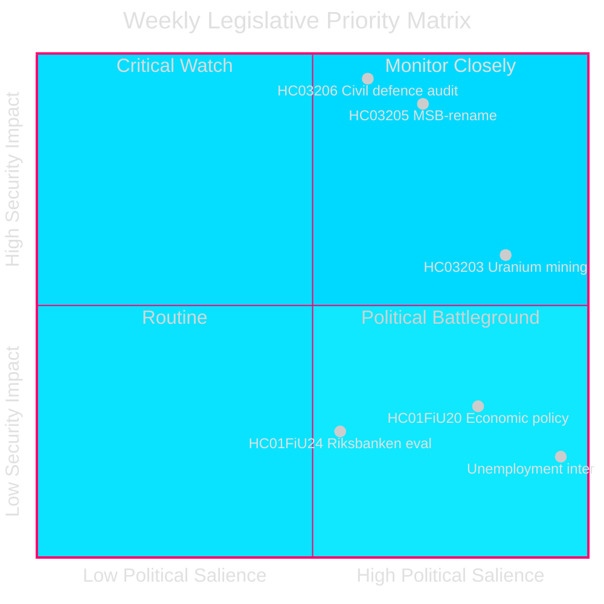
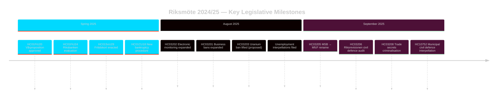

# Schwedens Sicherheitsorientierter Gesetzgebungssprint: Umbau des Zivilschutzes, Uranabbau und Steigende Arbeitslosigkeit

**Autor**: James Pether Sörling
**Lauf-ID**: 24961123457
**Datum**: 2026-04-26
**Klassifikation**: PUBLIC — DSGVO Art 9(2)(e)(g)
**Vertrauen**: HIGH [B2] — Behörden-API; offizielle Propositionsdokumente

---

## BLUF

Schweden beendete die Riksmöte 2024/25 mit einem konzentrierten sicherheitsorientierten Gesetzgebungsprogramm: Die Regierung Kristersson benannte MSB in „Myndigheten för civilt försvar" um (HC03205), legte dem Riksdag den ersten Riksrevisionsbericht zur Zivilschutzgovernance vor (HC03206) und schlug die Aufhebung des Uranabbauverbots vor (HC03203) — alles innerhalb eines einzigen Sprints im September 2025. Diese Maßnahmen signalisieren eine entscheidende Verschiebung von der Wohlfahrtsstaatspflege zu harten Sicherheitsinvestitionen. Der parlamentarische Druck der Opposition konzentriert sich auf Schwedens anhaltend hohe Arbeitslosigkeit (~500.000 Personen), die die Glaubwürdigkeit der Regierungskoalition im Hinblick auf ihr erklärtes „Arbeitslinie"-Ziel gefährdet.

## Entscheidungen, die dieser Erkenntnisstand Unterstützt

1. **Schwedische Sicherheitspolitik**-Akteure: Beurteilen Sie, ob die MSB→MfcF-Umbenennung eine substanzielle Behördenreform oder kosmetisches Rebranding darstellt; der Riksrevisionsbericht (HC03206) liefert die Revisionsbasis.
2. **Energiepolitische** Analysten: Bewerten Sie die regulatorischen, politischen und nordischen Beziehungsimplikationen des Uranabbaus nach HC03203.
3. **Arbeitsmarktbeobachtung**: Verfolgen Sie, ob die Arbeitslinie-Rhetorik der Regierung messbare Ergebnisse vor dem Hintergrund von 8,5 % Arbeitslosigkeit liefert (Interpellationen HC10744–HC10746).
4. **Finanz-/Geldpolitik**-Analysten: Kontextualisieren Sie FiU's Bewertung der Geldpolitik der Riksbank 2024 (HC01FiU24) und die Frühjahrs-Wirtschaftsrichtlinien (HC01FiU20) vor IMF-Prognosen.

## 60-Sekunden-Lektüre

- 🛡️ **Umbau des Zivilschutzes**: MSB in Myndigheten för civilt försvar umbenannt (Prop HC03205); Riksrevisions-Prüfung deckt Governance-Lücken auf (HC03206); kommunale Zivilschutzkoordination als unzureichend markiert (Interpellation HC10752).
- ⚛️ **Uranabbauverbot aufgehoben**: Prop HC03203 hebt das 30-jährige Verbot auf; SD und M unterstützen, V/MP/S stark dagegen; keine bekannten Uranvorkommen in produktionsbereiter Form.
- 👔 **Strafrechtliche Erweiterung**: Ausgeweitete Kriminalisierung von Geschäftsgeheimnissen (HC03208), erweiterte Berufsverbote (HC03201), elektronische Überwachung für Gefängnisstrafen (HC03202).
- 📉 **Arbeitslosigkeitskrise**: 500.000+ Arbeitslose; Jugend- und Behinderungsarbeitslosigkeit auf EU-Höchstniveau; die Regierungskoalition wird in allen drei Dimensionen interpelliert (HC10744–HC10746).
- 💰 **Vårproposition genehmigt**: Wirtschaftsrichtlinien beschlossen (HC01FiU20) mit gesenkten Wachstumsaussichten; APL mit SEK 700M für Arzneimittelversorgungssicherheit rekapitalisiert (HC01FiU33).
- ⚖️ **Geldpolitik der Riksbank**: FiU-Bewertung (HC01FiU24) findet die Durchführung der Geldpolitik trotz langsamerer als optimaler Zinssenkungen ausreichend; Inflationserwartungen verankert.

## Wichtigster Zukunftsauslöser

**Zivilschutz-Kapazitätstest (72 Stunden)**: Die erste vollständige Parlamentssitzung unter dem neuen MfcF-Mandat wird entscheiden, ob die Umbenennung der Behörde zu einem echten Kapazitätsaufbau führt. Verfolgen Sie die Antwort von Staatsminister Bohlin auf den Riksdag bezüglich kommunaler Bereitschaft (Antwort auf Interpellation HC10752 fällig).

## Schlüsselindikatoren — Nächste 7 Tage

| Indikator | Horizont | Signalrichtung |
|-----------|---------|-----------------|
| MfcF-Parlamentspräsentation | 72 h | Kapazität vs. Kosmetik |
| Uranabbau-Konsultation | 1 Woche | Nordische Partnerreaktionen |
| Arbeitslosigkeitsstatistik (SCB AKU Q2) | 1 Woche | Regierungskoalitionsdruck |
| FiU Riksbank-Nachfolgehörung | 1 Woche | Monetäre Glaubwürdigkeit |

---

style HC03205 fill:#ff006e,stroke:#00d9ff
style HC03206 fill:#ff006e,stroke:#00d9ff
style HC03203 fill:#ffbe0b,stroke:#0a0e27

<!-- source-sha: e799f2cf3c9c7f3ec4f6e9c9b91e6ad40f91af79 -->
