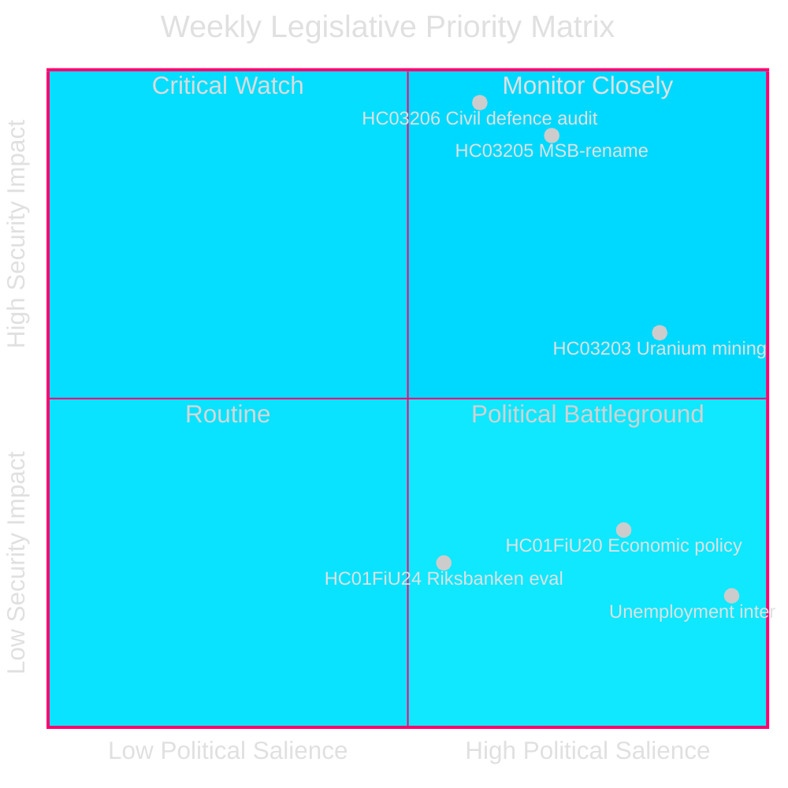
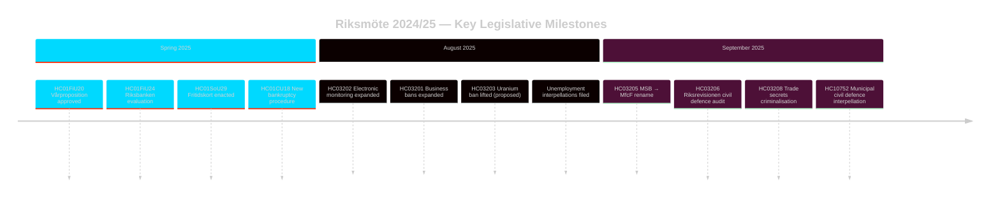

# El Sprint Legislativo de Seguridad de Suecia: Reforma de la Defensa Civil, Minería de Uranio y Desempleo Creciente

**Autor**: James Pether Sörling
**ID de ejecución**: 24961123457
**Fecha**: 2026-04-26
**Clasificación**: PUBLIC — RGPD Art 9(2)(e)(g)
**Confianza**: HIGH [B2] — API de autoridad; documentos de proposición oficiales

---

## BLUF

Suecia cerró la Riksmöte 2024/25 con una agenda legislativa concentrada centrada en la seguridad: el gobierno Kristersson renombró MSB como «Myndigheten för civilt försvar» (HC03205), presentó al Riksdag la primera auditoría de gobernanza de la defensa civil de la Riksrevision (HC03206) y propuso la derogación de la prohibición de la minería de uranio (HC03203), todo dentro de un único sprint en septiembre de 2025. Estas acciones señalan un cambio decisivo del mantenimiento del estado de bienestar a las inversiones en seguridad dura. La presión parlamentaria de la oposición se centra en el persistentemente alto desempleo de Suecia (~500.000 personas), que amenaza la credibilidad de la coalición gobernante respecto a su objetivo declarado de «línea de trabajo».

## Decisiones Apoyadas por este Informe de Inteligencia

1. **Partes interesadas en la política de seguridad sueca**: Evaluar si el renombrado MSB→MfcF representa una reforma sustancial de agencia o un rebranding cosmético; el informe de la Riksrevision (HC03206) proporciona la base de auditoría.
2. **Analistas de política energética**: Evaluar las implicaciones regulatorias, políticas y de relaciones nórdicas de la minería de uranio tras HC03203.
3. **Vigilancia del mercado laboral**: Seguir si la retórica de la línea de trabajo del gobierno produce resultados medibles ante un desempleo del 8,5 % (interpelaciones HC10744–HC10746).
4. **Analistas de finanzas/política monetaria**: Contextualizar la evaluación FiU de la política monetaria del Riksbank 2024 (HC01FiU24) y las orientaciones económicas de primavera (HC01FiU20) frente a las previsiones del FMI.

## Lectura de 60 Segundos

- 🛡️ **Reforma de la defensa civil**: MSB renombrado Myndigheten för civilt försvar (prop HC03205); la auditoría de la Riksrevision revela brechas de gobernanza (HC03206); coordinación municipal de la defensa civil señalada como insuficiente (interpelación HC10752).
- ⚛️ **Prohibición de minería de uranio derogada**: La prop HC03203 deroga la prohibición de 30 años; SD y M apoyan, V/MP/S fuertemente en contra; ningún depósito de uranio conocido en forma lista para producción.
- 👔 **Expansión penal**: Criminalización ampliada de secretos comerciales (HC03208), prohibiciones empresariales extendidas (HC03201), vigilancia electrónica para penas de prisión (HC03202).
- 📉 **Crisis de desempleo**: 500.000+ desempleados; desempleo juvenil y de discapacitados en niveles máximos de la UE; la coalición gobernante es interpelada en las tres dimensiones (HC10744–HC10746).
- 💰 **Vårproposition aprobado**: Orientaciones económicas adoptadas (HC01FiU20) con perspectivas de crecimiento rebajadas; APL recapitalizado con 700 millones de SEK para la seguridad del suministro farmacéutico (HC01FiU33).
- ⚖️ **Política monetaria del Riksbank**: La evaluación FiU (HC01FiU24) considera la conducción de la política monetaria adecuada a pesar de recortes de tipos más lentos que los óptimos; expectativas de inflación ancladas.

## Activador Clave del Futuro

**Prueba de capacidad de defensa civil (72 horas)**: La primera sesión parlamentaria completa bajo el nuevo mandato MfcF determinará si el renombrado de la agencia conduce a una verdadera acumulación de capacidades. Seguir la respuesta del Consejero de Estado Bohlin al Riksdag sobre la preparación municipal (respuesta a la interpelación HC10752 vencida).

## Indicadores Clave — Próximos 7 Días

| Indicador | Horizonte | Dirección de señal |
|-----------|---------|-----------------|
| Presentación parlamentaria MfcF | 72 h | Capacidad vs. cosmética |
| Consulta minería de uranio | 1 semana | Reacciones de socios nórdicos |
| Estadísticas de desempleo (SCB AKU Q2) | 1 semana | Presión coalición gobernante |
| Audiencia de seguimiento FiU Riksbank | 1 semana | Credibilidad monetaria |

---

style HC03205 fill:#ff006e,stroke:#00d9ff
style HC03206 fill:#ff006e,stroke:#00d9ff
style HC03203 fill:#ffbe0b,stroke:#0a0e27

<!-- source-sha: e799f2cf3c9c7f3ec4f6e9c9b91e6ad40f91af79 -->
