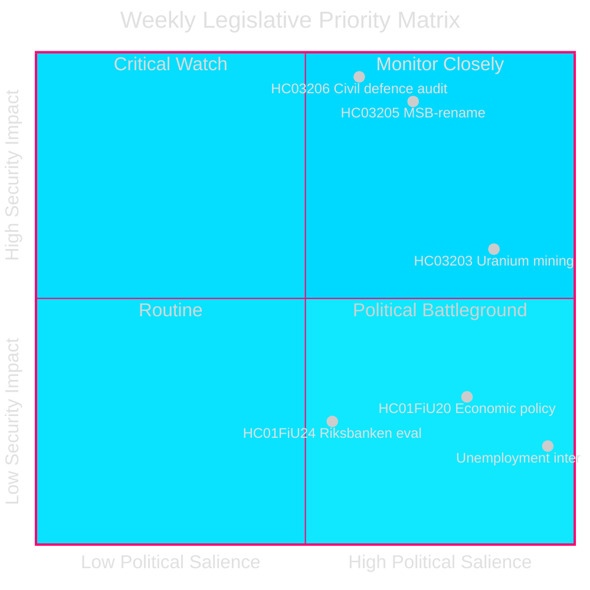
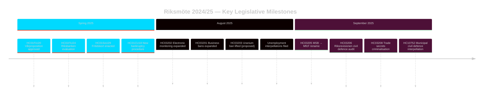

# Ruotsin Turvallisuuspainotteinen Lainsäädäntösprint: Siviilipuolustuksen Uudistus, Uraanikaivostoiminta ja Kasvava Työttömyys

**Tekijä**: James Pether Sörling
**Tunnus**: 24961123457
**Päivämäärä**: 2026-04-26
**Luokittelu**: PUBLIC — GDPR Art 9(2)(e)(g)
**Luottamus**: HIGH [B2] — Viranomaisen API; viralliset propositioniasiakirjat

---

## BLUF

Ruotsi päätti riksmöte 2024/25:n tiivistetyllä turvallisuuspainotteisella lainsäädäntöohjelmalla: Kristersson-hallitus nimesi MSB:n uudelleen nimellä "Myndigheten för civilt försvar" (HC03205), esitti Riksrevisionin ensimmäisen siviilipuolustuksen hallintoauditoinnin parlamentille (HC03206) ja ehdotti uraanikaivostoiminnan kiellon poistamista (HC03203) — kaikki yhden syyskuun 2025 sprintin aikana. Nämä toimet merkitsevät ratkaisevaa siirtymää hyvinvointivaltion ylläpidosta kovaan turvallisuusinvestointiin. Opposition parlamentaarinen paine keskittyy Ruotsin jatkuvaan korkeaan työttömyyteen (~500 000 henkilöä), joka uhkaa hallituskoalition uskottavuutta suhteessa sen omaan julistettuun "työlinja"-tavoitteeseen.

## Päätökset, Joita Tiedustelutieto Tukee

1. **Ruotsin turvallisuuspolitiikan** sidosryhmät: Arvioi, edustako MSB→MfcF-uudelleennimeäminen merkittävää virastouudistusta vai kosmeettista uudelleenbrändäystä; Riksrevisionin raportti (HC03206) tarjoaa auditoinnin perustan.
2. **Energiapolitiikan** analyytikot: Arvioi uraanikaivostoiminnan sääntely-, poliittiset ja Pohjoismaiset suhdeoimplikaatiot HC03203:n jälkeen.
3. **Työmarkkinaseuranta**: Seuraa, tuottaako hallituksen työlinjaretorikka mitattavia tuloksia 8,5 %:n työttömyyden taustaa vasten (interpellaatiot HC10744–HC10746).
4. **Finanssi-/rahapolitiikan** analyytikot: Kontekstualisoi FiU:n arviointi Riksbankenin rahapolitiikasta 2024 (HC01FiU24) ja kevään taloudelliset suuntaviivat (HC01FiU20) suhteessa IMF:n ennusteisiin.

## 60 Sekunnin Katsaus

- 🛡️ **Siviilipuolustuksen uudistus**: MSB nimetty uudelleen nimellä Myndigheten för civilt försvar (prop HC03205); Riksrevisionin auditointi paljastaa hallintopuutteet (HC03206); kunnallinen siviilipuolustuskoordinaatio merkitty riittämättömäksi (interpellaatio HC10752).
- ⚛️ **Uraanikaivostoiminnan kielto poistettu**: Prop HC03203 poistaa 30-vuotisen kiellon; SD ja M tukevat, V/MP/S voimakkaasti vastaan; ei tunnettuja uraaniesiintymiä tuotantovalmiissa muodossa.
- 👔 **Rikosoikeudellinen laajentuminen**: Laajennettu liikesalaisuuksien kriminalisointi (HC03208), laajennetut liiketoimintakiellot (HC03201), sähköinen valvonta vankilatuomioille (HC03202).
- 📉 **Työttömyyskriisi**: 500 000+ työtöntä; nuoriso- ja vammaistyöttömyys EU:n korkeimmalla tasolla; hallituskoalitiota interpelloidaan kaikilla kolmella ulottuvuudella (HC10744–HC10746).
- 💰 **Vårproposition hyväksytty**: Taloudelliset suuntaviivat hyväksytty (HC01FiU20) lasketuin kasvunäkymin; APL rekapitalisoitu SEK 700M lääkkeiden toimitusturvallisuuden vuoksi (HC01FiU33).
- ⚖️ **Riksbankenin rahapolitiikka**: FiU:n arviointi (HC01FiU24) löytää rahapolitiikan toteutuksen riittäväksi hitaammista-kuin-optimaalisista koronlaskuista huolimatta; inflaatio-odotukset ankkuroituneet.

## Tärkein Tulevaisuuslaukaisin

**Siviilipuolustuksen kapasiteettitesti (72 tuntia)**: Ensimmäinen täysi parlamenttisessio uuden MfcF-mandaatin alla ratkaisee, johtaako virastonimen vaihtuminen todelliseen kapasiteetin kasvuun. Seuraa valtioneuvoston jäsen Bohlinin vastausta Riksdagenille kunnallisesta valmiudesta (vastaus interpellaatioon HC10752 erääntyy).

## Avainilmaisimet — Seuraavat 7 Päivää

| Ilmaisin | Horisontti | Signaalin suunta |
|-----------|---------|-----------------|
| MfcF:n parlamenttiesitys | 72 h | Kapasiteetti vs. kosmetiikka |
| Uraanikaivostoiminnan konsultaatio | 1 viikko | Pohjoismaiset kumppanireaktiot |
| Työttömyystilasto (SCB AKU Q2) | 1 viikko | Hallituskoalition paine |
| FiU Riksbankenin seurantakuuleminen | 1 viikko | Rahapolitiikan uskottavuus |

---

style HC03205 fill:#ff006e,stroke:#00d9ff
style HC03206 fill:#ff006e,stroke:#00d9ff
style HC03203 fill:#ffbe0b,stroke:#0a0e27

<!-- source-sha: e799f2cf3c9c7f3ec4f6e9c9b91e6ad40f91af79 -->
