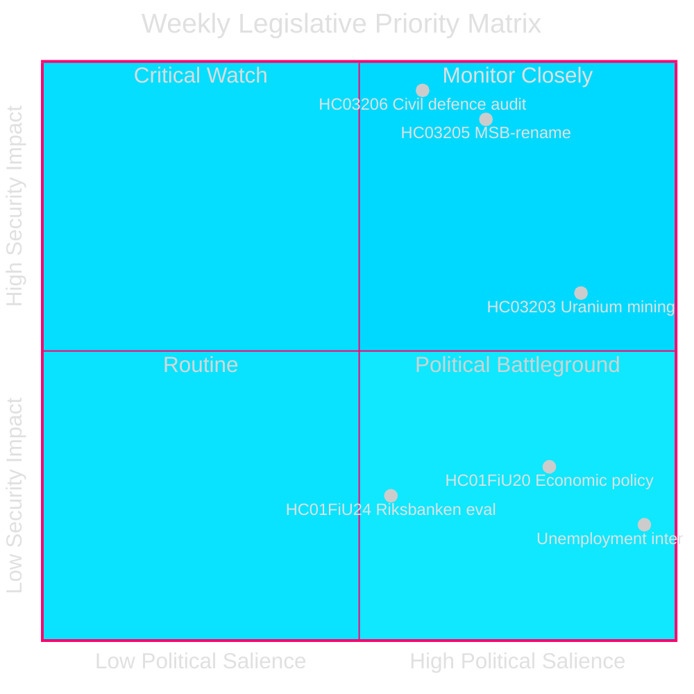
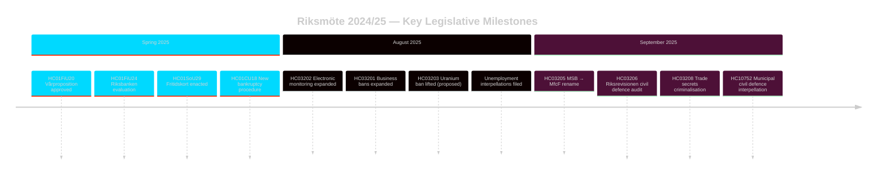

# Le Sprint Législatif Sécuritaire de la Suède : Réforme de la Défense Civile, Mine d'Uranium et Chômage Croissant

**Auteur** : James Pether Sörling
**Identifiant** : 24961123457
**Date** : 2026-04-26
**Classification** : PUBLIC — RGPD Art 9(2)(e)(g)
**Confiance** : HIGH [B2] — API d'autorité ; documents de proposition officiels

---

## BLUF

La Suède a conclu la Riksmöte 2024/25 avec un programme législatif axé sur la sécurité : le gouvernement Kristersson a renommé MSB en « Myndigheten för civilt försvar » (HC03205), présenté au Riksdag le premier audit de gouvernance de la défense civile par la Riksrevision (HC03206) et proposé la levée de l'interdiction de l'exploitation minière d'uranium (HC03203) — le tout lors d'un seul sprint en septembre 2025. Ces actions signalent un changement décisif de l'entretien de l'État-providence vers des investissements de sécurité durs. La pression parlementaire de l'opposition se concentre sur le chômage élevé persistant de la Suède (~500 000 personnes), qui menace la crédibilité de la coalition gouvernementale par rapport à son objectif déclaré de « ligne de travail ».

## Décisions Soutenues par ce Renseignement

1. **Parties prenantes de la politique de sécurité suédoise** : Évaluer si le renommage MSB→MfcF représente une réforme substantielle d'agence ou un rebranding cosmétique ; le rapport de la Riksrevision (HC03206) fournit la base d'audit.
2. **Analystes de la politique énergétique** : Évaluer les implications réglementaires, politiques et des relations nordiques de l'exploitation d'uranium après HC03203.
3. **Surveillance du marché du travail** : Suivre si la rhétorique de la ligne de travail du gouvernement produit des résultats mesurables face à un chômage de 8,5 % (interpellations HC10744–HC10746).
4. **Analystes finances/politique monétaire** : Contextualiser l'évaluation par FiU de la politique monétaire de la Riksbank 2024 (HC01FiU24) et les orientations économiques du printemps (HC01FiU20) par rapport aux prévisions du FMI.

## Lecture en 60 Secondes

- 🛡️ **Réforme de la défense civile** : MSB renommé Myndigheten för civilt försvar (prop HC03205) ; l'audit de la Riksrevision révèle des lacunes de gouvernance (HC03206) ; la coordination communale de la défense civile signalée comme insuffisante (interpellation HC10752).
- ⚛️ **Interdiction de l'exploitation d'uranium levée** : La prop HC03203 lève l'interdiction de 30 ans ; SD et M soutiennent, V/MP/S fortement opposés ; aucun gisement d'uranium connu en état de production.
- 👔 **Expansion pénale** : Criminalisation étendue des secrets commerciaux (HC03208), interdictions professionnelles élargies (HC03201), surveillance électronique pour les peines d'emprisonnement (HC03202).
- 📉 **Crise du chômage** : 500 000+ chômeurs ; chômage des jeunes et des personnes handicapées aux niveaux les plus élevés de l'UE ; la coalition gouvernementale est interpellée sur les trois dimensions (HC10744–HC10746).
- 💰 **Vårproposition approuvée** : Orientations économiques adoptées (HC01FiU20) avec des perspectives de croissance abaissées ; APL recapitalisé de 700 millions SEK pour la sécurité d'approvisionnement pharmaceutique (HC01FiU33).
- ⚖️ **Politique monétaire de la Riksbank** : L'évaluation FiU (HC01FiU24) juge la conduite de la politique monétaire adéquate malgré des baisses de taux plus lentes qu'optimales ; anticipations d'inflation ancrées.

## Déclencheur Futur Clé

**Test de capacité de la défense civile (72 heures)** : La première session parlementaire complète sous le nouveau mandat MfcF déterminera si le renommage de l'agence conduit à une véritable montée en capacité. Suivre la réponse du ministre d'État Bohlin au Riksdag sur la préparation municipale (réponse à l'interpellation HC10752 à échéance).

## Indicateurs Clés — 7 Prochains Jours

| Indicateur | Horizon | Direction du signal |
|-----------|---------|-----------------|
| Présentation parlementaire MfcF | 72 h | Capacité vs. cosmétique |
| Consultation exploitation d'uranium | 1 semaine | Réactions des partenaires nordiques |
| Statistiques chômage (SCB AKU Q2) | 1 semaine | Pression coalition gouvernementale |
| Audition de suivi FiU Riksbank | 1 semaine | Crédibilité monétaire |

---

style HC03205 fill:#ff006e,stroke:#00d9ff
style HC03206 fill:#ff006e,stroke:#00d9ff
style HC03203 fill:#ffbe0b,stroke:#0a0e27

<!-- source-sha: e799f2cf3c9c7f3ec4f6e9c9b91e6ad40f91af79 -->
