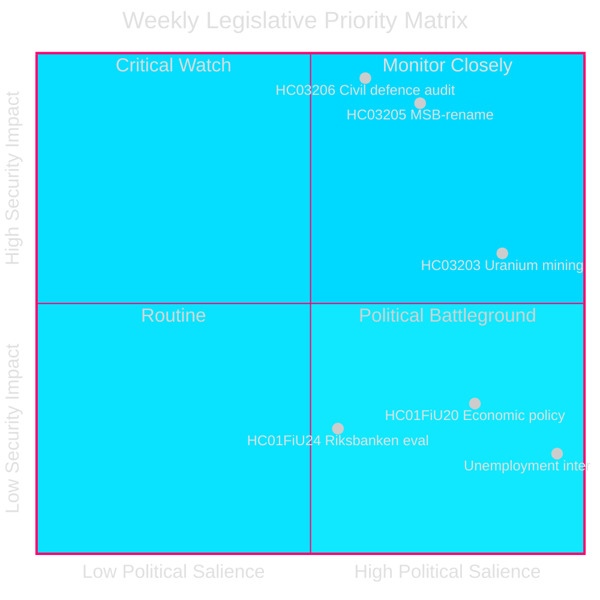
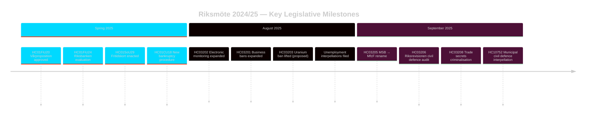

<!-- dir: rtl -->
---
title: "שבדיה — ספרינט חקיקה בטחוני: שיקום ההגנה האזרחית, כרייה גרעינית ועלייה באבטלה"
author: James Pether Sörling
date: 2026-04-26
classification: PUBLIC
confidence: HIGH [B2]
---

# שבדיה — ספרינט חקיקה בטחוני: שיקום ההגנה האזרחית, כרייה גרעינית ועלייה באבטלה

**מחבר**: James Pether Sörling
**מזהה ריצה**: 24961123457
**תאריך**: 2026-04-26
**סיווג**: PUBLIC — GDPR סעיף 9(2)(ה)(ו)
**רמת ביטחון**: HIGH [B2] — API רשמי; מסמכי הצעה רשמיים

---

## תקציר מנהלים

שבדיה סיימה את Riksmöte 2024/25 עם אג'נדה חקיקתית מרוכזת הממוקדת בביטחון: ממשלת Kristersson שינתה את שם MSB ל«Myndigheten för civilt försvar» (HC03205), הגישה לבית המחוקקים (Riksdag) את הביקורת הראשונה של Riksrevision על ממשל ההגנה האזרחית (HC03206), והציעה לבטל את האיסור על כרייה גרעינית (HC03203) — הכל במהלך ספרינט בודד בספטמבר 2025. צעדים אלה מסמנים מעבר מכריע מתחזוקת מדינת הרווחה להשקעות ביטחון קשות. הלחץ הפרלמנטרי של האופוזיציה מתמקד בשיעור האבטלה הגבוה המתמשך של שבדיה (~500,000 אנשים), המאיים על אמינות הקואליציה השלטת ביחס למטרתה המוצהרת של «קו העבודה».

## החלטות הנתמכות על ידי מידע מודיעיני זה

1. **בעלי עניין במדיניות ביטחון שבדית**: להעריך האם שינוי השם MSB→MfcF מייצג רפורמה מהותית בסוכנות או מיתוג-מחדש קוסמטי; דוח Riksrevision (HC03206) מספק בסיס הביקורת.
2. **אנליסטים של מדיניות אנרגיה**: להעריך את ההשלכות הרגולטוריות, הפוליטיות והיחסים הנורדיים של כריית יורניום לאחר HC03203.
3. **ניטור שוק העבודה**: לעקוב האם הרטוריקה של ממשלת קו העבודה מניבה תוצאות מדידות מול אבטלה של 8.5% (שאילתות HC10744–HC10746).
4. **אנליסטים של פיננסים/מדיניות מוניטרית**: להקשיר את הערכת FiU של המדיניות המוניטרית של Riksbank ל-2024 (HC01FiU24) ואת קווי ההנחיה הכלכליים לאביב (HC01FiU20) לחזאיות קרן המטבע הבינלאומית.

## קריאה של 60 שניות

- 🛡️ **שיקום ההגנה האזרחית**: MSB שונה שמו ל-Myndigheten för civilt försvar (הצעה HC03205); ביקורת Riksrevision חושפת פערים בממשל (HC03206); תיאום הגנה אזרחית עירוני סומן כבלתי מספיק (שאילתה HC10752).
- ⚛️ **ביטול איסור כרייה גרעינית**: הצעה HC03203 מבטלת את האיסור בן 30 השנה; SD ו-M תומכים, V/MP/S מתנגדים בחריפות; אין מרבצי אורניום ידועים בצורה מוכנה לייצור.
- 👔 **התרחבות פלילית**: הרחבת פלילת סודות מסחריים (HC03208), איסורי עסקים מורחבים (HC03201), מעקב אלקטרוני לעונשי מאסר (HC03202).
- 📉 **משבר האבטלה**: 500,000+ מובטלים; אבטלת נוער ונכים ברמות גבוהות באיחוד האירופי; הקואליציה השלטת נדרשת לשאלות בשלוש הממדים (HC10744–HC10746).
- 💰 **Vårproposition אושר**: קווי הנחיה כלכליים אומצו (HC01FiU20) עם תחזיות צמיחה מוקטנות; APL עוּדן מחדש ב-700 מיליון כרון שבדי לאבטחת אספקה תרופתית (HC01FiU33).
- ⚖️ **מדיניות מוניטרית של Riksbank**: הערכת FiU (HC01FiU24) מוצאת את ביצוע המדיניות המוניטרית מספיק למרות הפחתות ריבית איטיות מהאופטימלי; ציפיות אינפלציה מעוגנות.

## מפעיל עתידי מרכזי

**מבחן כשירות הגנה אזרחית (72 שעות)**: המושב הפרלמנטרי המלא הראשון תחת המנדט החדש של MfcF יקבע האם שינוי שם הסוכנות מוביל לבניית כשירות אמיתית. עקוב אחר תשובת שר המדינה Bohlin לבית המחוקקים (Riksdag) בנושא מוכנות עירונית (תשובה לשאילתה HC10752 פגה).

## מדדים מרכזיים — 7 הימים הבאים

| מדד | אופק | כיוון האות |
|-----------|---------|-----------------|
| הצגה פרלמנטרית של MfcF | 72 שעות | כשירות לעומת קוסמטיקה |
| היוועצות כרייה גרעינית | שבוע | תגובות שותפים נורדיים |
| סטטיסטיקת אבטלה (SCB AKU Q2) | שבוע | לחץ על הקואליציה השלטת |
| דיון המשך של FiU Riksbank | שבוע | אמינות מוניטרית |

---

style HC03205 fill:#ff006e,stroke:#00d9ff
style HC03206 fill:#ff006e,stroke:#00d9ff
style HC03203 fill:#ffbe0b,stroke:#0a0e27

<!-- source-sha: e799f2cf3c9c7f3ec4f6e9c9b91e6ad40f91af79 -->
