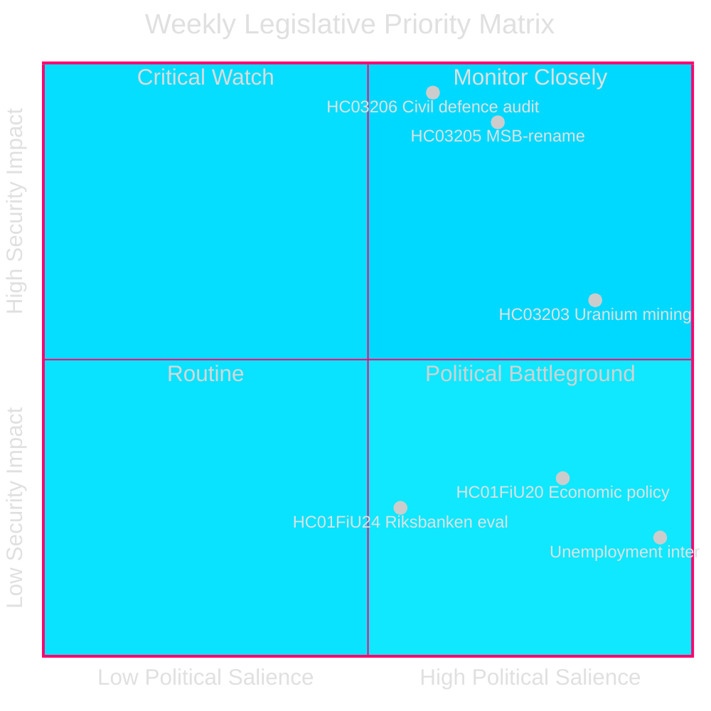
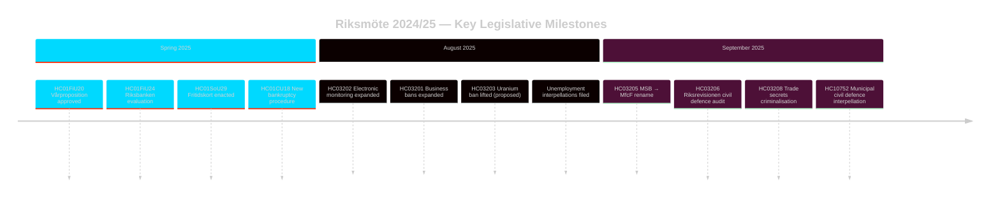

# スウェーデンの安全保障重視の立法スプリント：市民防衛再編、ウラン採掘、失業率上昇

**著者**: James Pether Sörling
**実行ID**: 24961123457
**日付**: 2026-04-26
**分類**: PUBLIC — GDPR 第9条(2)(e)(g)
**信頼度**: HIGH [B2] — 行政機関API；公式提案文書

---

## 概要

スウェーデンはRiksmöte 2024/25を安全保障重視の集中的な立法アジェンダで締めくくった。Kristersson政権はMSBを「Myndigheten för civilt försvar」（HC03205）に改名し、市民防衛ガバナンスに関するRiksrevisionの初の監査をRiksdagに提出し（HC03206）、ウラン採掘禁止の撤廃を提案した（HC03203）— いずれも2025年9月の一つのスプリント内で実施された。これらの措置は福祉国家の維持からハードな安全保障投資への決定的な転換を示している。野党の議会圧力はスウェーデンの持続的に高い失業率（約50万人）に集中しており、政権連立の「雇用路線」という宣言目標への信頼性を脅かしている。

## この情報が支援する意思決定

1. **スウェーデンの安全保障政策**関係者：MSB→MfcF改名が実質的な機関改革なのか見かけ上の再ブランディングなのかを評価する。Riksrevision報告書（HC03206）が監査基盤を提供する。
2. **エネルギー政策**アナリスト：HC03203後のウラン採掘の規制・政治・北欧関係への影響を評価する。
3. **労働市場監視**：政府の雇用路線レトリックが失業率8.5%の中で測定可能な成果を生み出しているかを追跡する（質問HC10744–HC10746）。
4. **金融・金融政策**アナリスト：FiUの2024年Riksbankの金融政策評価（HC01FiU24）と春の経済指針（HC01FiU20）をIMF予測と照らし合わせて文脈化する。

## 60秒解説

- 🛡️ **市民防衛再編**：MSBをMyndigheten för civilt försvarに改名（提案HC03205）；Riksrevision監査がガバナンスの欠陥を露わにする（HC03206）；市民防衛の地方調整が不十分と指摘（質問HC10752）。
- ⚛️ **ウラン採掘禁止撤廃**：提案HC03203は30年間の禁止を撤廃；SDとMが支持、V/MP/Sは強く反対；生産準備の整ったウラン鉱床は確認されていない。
- 👔 **刑事法拡大**：営業秘密の犯罪化を拡大（HC03208）、営業禁止の拡大（HC03201）、懲役刑への電子監視（HC03202）。
- 📉 **失業危機**：失業者50万人以上；若年・障害者失業率はEUで最高水準；政権連立は三つの次元すべてで質問を受ける（HC10744–HC10746）。
- 💰 **Vårproposition承認**：経済指針が採択（HC01FiU20）し成長見通しが引き下げられた；APLが医薬品供給安全のため7億SEKで再資本化（HC01FiU33）。
- ⚖️ **Riksbankの金融政策**：FiU評価（HC01FiU24）は最適より遅い利下げにもかかわらず金融政策の実施は適切と判断；インフレ期待は安定。

## 最重要な将来のトリガー

**市民防衛能力テスト（72時間）**：新MfcF委任の下での最初の完全な議会会議が機関改名から実際の能力構築につながるかを決定する。地方の準備に関するBohlin国務大臣のRiksdagへの回答を追跡（質問HC10752への回答期日が到来）。

## 主要指標 — 今後7日間

| 指標 | 期間 | シグナル方向 |
|-----------|---------|-----------------|
| MfcF議会発表 | 72時間 | 能力対見かけ |
| ウラン採掘協議 | 1週間 | 北欧パートナーの反応 |
| 失業統計（SCB AKU Q2） | 1週間 | 政権連立への圧力 |
| FiU Riksbankフォローアップ公聴会 | 1週間 | 金融信頼性 |

---

style HC03205 fill:#ff006e,stroke:#00d9ff
style HC03206 fill:#ff006e,stroke:#00d9ff
style HC03203 fill:#ffbe0b,stroke:#0a0e27

<!-- source-sha: e799f2cf3c9c7f3ec4f6e9c9b91e6ad40f91af79 -->
