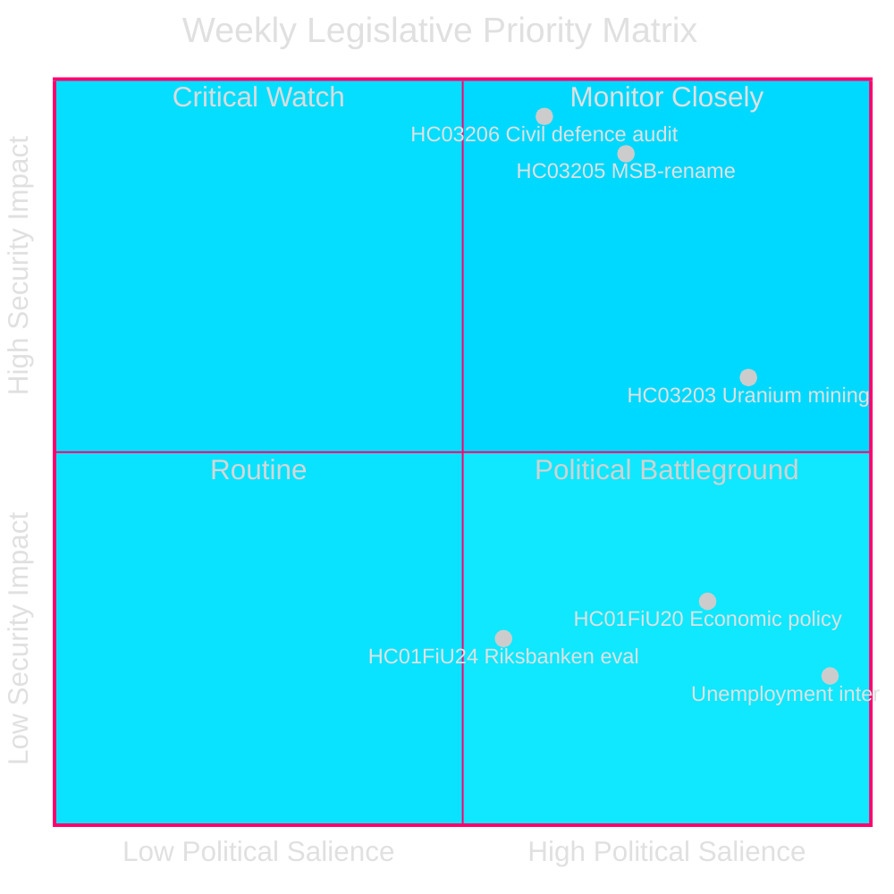
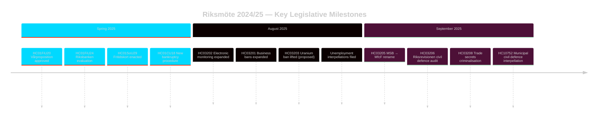

# 스웨덴의 안보 중심 입법 스프린트: 민방위 재편, 우라늄 채굴, 실업률 상승

**저자**: James Pether Sörling
**실행 ID**: 24961123457
**날짜**: 2026-04-26
**분류**: PUBLIC — GDPR 제9조(2)(e)(g)
**신뢰도**: HIGH [B2] — 행정기관 API; 공식 제안 문서

---

## 요약

스웨덴은 안보 중심의 집중적인 입법 의제로 Riksmöte 2024/25를 마무리했다. Kristersson 정권은 MSB를 «Myndigheten för civilt försvar»(HC03205)로 개명하고, Riksdag에 Riksrevision의 최초 민방위 거버넌스 감사를 제출했으며(HC03206), 우라늄 채굴 금지 해제를 제안했다(HC03203) — 모두 2025년 9월 한 번의 스프린트 내에서 이루어졌다. 이러한 조치들은 복지국가 유지에서 강성 안보 투자로의 결정적인 전환을 의미한다. 야당의 의회 압력은 스웨덴의 지속적으로 높은 실업률(~50만 명)에 집중되어 있으며, 이는 집권 연립의 자신들이 선언한 «노동 노선» 목표에 대한 신뢰성을 위협하고 있다.

## 이 정보가 지원하는 의사결정

1. **스웨덴 안보 정책** 이해관계자: MSB→MfcF 개명이 실질적인 기관 개혁인지 표면적인 리브랜딩인지 평가. Riksrevision 보고서(HC03206)가 감사 기반을 제공.
2. **에너지 정책** 분석가: HC03203 이후 우라늄 채굴의 규제적, 정치적, 북유럽 관계 함의를 평가.
3. **노동시장 모니터링**: 정부의 노동 노선 수사학이 8.5% 실업률 배경 속에서 측정 가능한 성과를 내는지 추적(질의 HC10744–HC10746).
4. **재정/통화 정책** 분석가: FiU의 2024 Riksbank 통화정책 평가(HC01FiU24)와 봄 경제 지침(HC01FiU20)을 IMF 전망치와 맥락화.

## 60초 요약

- 🛡️ **민방위 재편**: MSB를 Myndigheten för civilt försvar로 개명(제안 HC03205); Riksrevision 감사에서 거버넌스 격차 드러남(HC03206); 지방 민방위 조정 부족으로 표시(질의 HC10752).
- ⚛️ **우라늄 채굴 금지 해제**: 제안 HC03203으로 30년 금지 해제; SD와 M 지지, V/MP/S 강력 반대; 생산 준비된 우라늄 매장지 없음.
- 👔 **형사 확장**: 영업 비밀 범죄화 확대(HC03208), 영업 금지 확대(HC03201), 징역형 전자 감시(HC03202).
- 📉 **실업 위기**: 50만명 이상 실업; 청년·장애인 실업 EU 최고 수준; 집권 연립 세 차원 모두에서 질의받음(HC10744–HC10746).
- 💰 **Vårproposition 승인**: 경제 지침 채택(HC01FiU20) 성장 전망 하향 조정; APL 의약품 공급 안보를 위해 7억 SEK 재자본화(HC01FiU33).
- ⚖️ **Riksbank 통화정책**: FiU 평가(HC01FiU24)에서 최적보다 느린 금리 인하에도 불구하고 통화정책 수행이 적절하다고 판단; 인플레이션 기대치 고정.

## 핵심 미래 트리거

**민방위 역량 테스트 (72시간)**: 새 MfcF 위임 하에서 첫 완전한 의회 회기가 기관명 변경이 실질적인 역량 구축으로 이어지는지 결정할 것이다. Riksdag에 지방 준비 태세에 대한 Bohlin 국무장관의 답변 추적(질의 HC10752에 대한 답변 만료).

## 핵심 지표 — 향후 7일

| 지표 | 기간 | 신호 방향 |
|-----------|---------|-----------------|
| MfcF 의회 발표 | 72시간 | 역량 대 형식 |
| 우라늄 채굴 협의 | 1주 | 북유럽 파트너 반응 |
| 실업 통계 (SCB AKU Q2) | 1주 | 집권 연립 압박 |
| FiU Riksbank 후속 청문회 | 1주 | 통화 신뢰성 |

---

style HC03205 fill:#ff006e,stroke:#00d9ff
style HC03206 fill:#ff006e,stroke:#00d9ff
style HC03203 fill:#ffbe0b,stroke:#0a0e27

<!-- source-sha: e799f2cf3c9c7f3ec4f6e9c9b91e6ad40f91af79 -->
