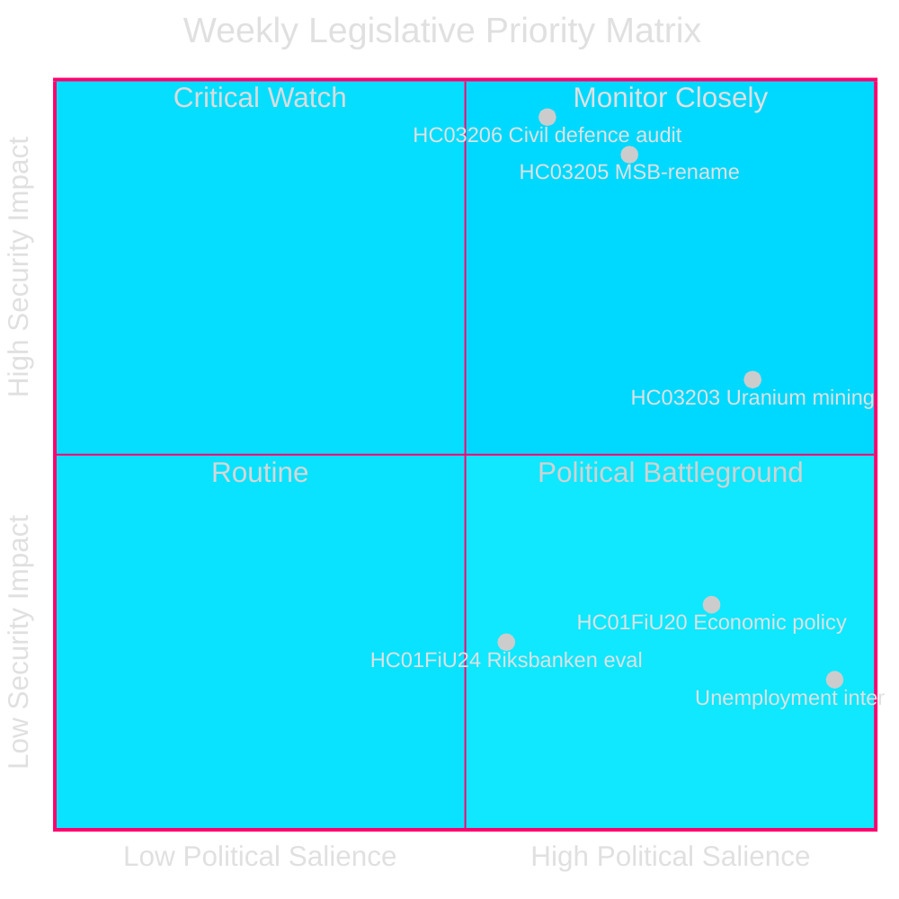
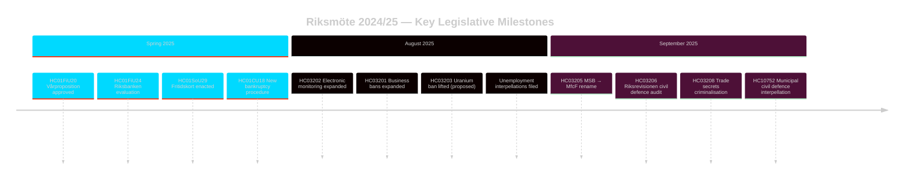

# Zweden's Veiligheidsgericht Wetgevingssprint: Herbouw Civiele Defensie, Uraniumwinning en Stijgende Werkloosheid

**Auteur**: James Pether Sörling
**Run-ID**: 24961123457
**Datum**: 2026-04-26
**Classificatie**: PUBLIC — AVG Art 9(2)(e)(g)
**Vertrouwen**: HIGH [B2] — Overheids-API; officiële propositiedocumenten

---

## BLUF

Zweden sloot de Riksmöte 2024/25 af met een geconcentreerde veiligheidsgericht wetgevingsagenda: de regering-Kristersson hernoemde MSB naar «Myndigheten för civilt försvar» (HC03205), legde de eerste Riksrevision civiele defensie-governanceaudit voor aan de Riksdag (HC03206) en stelde de opheffing van het verbod op uraniumwinning voor (HC03203) — alles binnen één sprint in september 2025. Deze acties signaleren een beslissende verschuiving van het onderhoud van de verzorgingsstaat naar harde veiligheidsinvesteringen. De parlementaire druk van de oppositie richt zich op Zwedens aanhoudend hoge werkloosheid (~500.000 personen), die de geloofwaardigheid van de regeringscoalitie bedreigt ten aanzien van haar verklaarde «arbeidslijn»-doelstelling.

## Beslissingen die deze Inlichtingen Ondersteunen

1. **Zweedse veiligheidsbeleid**-belanghebbenden: Beoordeel of de hernoeming MSB→MfcF een substantiële agentschapshervorm of cosmetische rebranding vertegenwoordigt; het Riksrevision-rapport (HC03206) levert de auditbasis.
2. **Energiebeleid**-analisten: Beoordeel de regelgevende, politieke en Noordse relatie-implicaties van uraniumwinning na HC03203.
3. **Arbeidsmarktmonitoring**: Volg of de arbeidslijn-retoriek van de regering meetbare resultaten oplevert bij een werkloosheid van 8,5 % (interpellaties HC10744–HC10746).
4. **Financiën/monetair beleid**-analisten: Contextualiseer FiU's evaluatie van het monetair beleid van de Riksbank 2024 (HC01FiU24) en de economische lentelijnen (HC01FiU20) ten opzichte van IMF-prognoses.

## 60-Seconden Lezing

- 🛡️ **Herbouw civiele defensie**: MSB hernoemd Myndigheten för civilt försvar (prop HC03205); Riksrevision-audit onthult governance-lacunes (HC03206); gemeentelijke civiele defensiecoördinatie aangemerkt als onvoldoende (interpellatie HC10752).
- ⚛️ **Verbod op uraniumwinning opgeheven**: Prop HC03203 heft het 30-jarige verbod op; SD en M steunen, V/MP/S sterk tegen; geen bekende uraniumvondsten in productiegerede vorm.
- 👔 **Strafrechtelijke uitbreiding**: Uitgebreide criminalisering van handelsgeheimen (HC03208), uitgebreide beroepsverboden (HC03201), elektronisch toezicht voor gevangenisstraffen (HC03202).
- 📉 **Werkloosheidscrisis**: 500.000+ werklozen; jeugd- en arbeidsongeschiktheidswerkloosheid op EU-hoge niveaus; de regeringscoalitie wordt op alle drie dimensies geïnterpelleerd (HC10744–HC10746).
- 💰 **Vårproposition goedgekeurd**: Economische richtlijnen aangenomen (HC01FiU20) met verlaagde groeivooruitzichten; APL geherkapitaliseerd met SEK 700M voor geneesmiddelenleveringszekerheid (HC01FiU33).
- ⚖️ **Monetair beleid Riksbank**: FiU-evaluatie (HC01FiU24) vindt de uitvoering van het monetair beleid ondanks langzamere-dan-optimale renteverlagingen toereikend; inflatieverwachtingen verankerd.

## Belangrijkste Toekomstige Trigger

**Civiele defensie capaciteitstest (72 uur)**: De eerste volledige parlementszitting onder het nieuwe MfcF-mandaat zal bepalen of de hernoeming van het agentschap leidt tot echte capaciteitsopbouw. Volg het antwoord van Staatssecretaris Bohlin aan de Riksdag over gemeentelijke paraatheid (antwoord op interpellatie HC10752 vervallen).

## Kerngegevens — Komende 7 Dagen

| Indicator | Horizon | Signaalrichting |
|-----------|---------|-----------------|
| MfcF parlementaire presentatie | 72 h | Capaciteit vs. cosmetica |
| Uraniumwinning consultatie | 1 week | Noordse partnerreacties |
| Werkloosheidsstatistiek (SCB AKU Q2) | 1 week | Druk regeringscoalitie |
| FiU Riksbank vervolghoorzitting | 1 week | Monetaire geloofwaardigheid |

---

style HC03205 fill:#ff006e,stroke:#00d9ff
style HC03206 fill:#ff006e,stroke:#00d9ff
style HC03203 fill:#ffbe0b,stroke:#0a0e27

<!-- source-sha: e799f2cf3c9c7f3ec4f6e9c9b91e6ad40f91af79 -->
