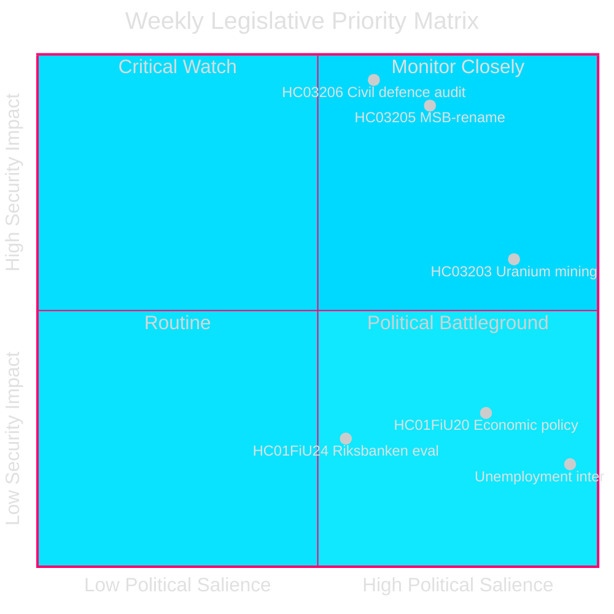
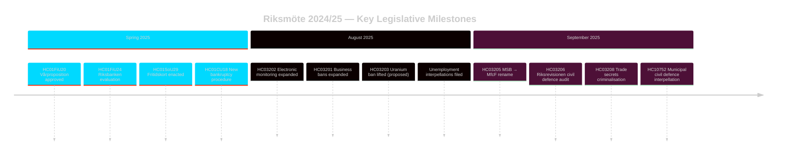

# Sveriges Sikkerhetsfokuserte Lovgivningssprint: Sivilforsvarets Ombygging, Uranbrytning og Stigende Arbeidsledighet

**Forfatter**: James Pether Sörling
**Løpenummer**: 24961123457
**Dato**: 2026-04-26
**Klassifikasjon**: PUBLIC — GDPR Art 9(2)(e)(g)
**Konfidens**: HIGH [B2] — Myndighets-API; offisielle proposisjonsdokumenter

---

## BLUF

Sverige avsluttet riksmöte 2024/25 med en konsentrert sikkerhetsfokusert lovgivningsagenda: Kristersson-regjeringen omdøpte MSB til "Myndigheten för civilt försvar" (HC03205), fremla den første Riksrevisjonens sivile forsvarsrevisjon for Riksdagen (HC03206) og foreslo å oppheve forbudet mot uranbrytning (HC03203) — alt innenfor en enkelt sprint i september 2025. Disse tiltakene signaliserer et avgjørende skifte fra velferdsstatens vedlikehold til investeringer i hard sikkerhet. Opposisjonens parlamentariske press sentrerer seg om Sveriges vedvarende høye arbeidsledighet (~500.000 personer), som truer den styrende koalisionens troverdighet knyttet til dens erklærte "arbeidslinje"-mål.

## Beslutninger Dette Grunnlaget Støtter

1. **Svenske sikkerhetspolitiske** interessenter: Vurder om MSB→MfcF-omdøpingen representerer substantiell etatsreform eller kosmetisk ommerkevare; Riksrevisjonens rapport (HC03206) gir revisjonsbasisen.
2. **Energipolitiske** analytikere: Vurder uranbrytningens regulatoriske, politiske og nordiske relasjonsimplikasjoner etter HC03203.
3. **Arbeidsmarkedsovervåkere**: Følg om regjeringens arbeidslinjeretorikk gir målbare resultater mot en bakgrunn av 8,5 % arbeidsledighet (interpellasjonene HC10744–HC10746).
4. **Finans-/pengepolitiske** analytikere: Kontekstualisér FiUs evaluering av Riksbankens pengepolitikk 2024 (HC01FiU24) og vårens økonomiske retningslinjer (HC01FiU20) mot IMFs prognoser.

## 60-Sekunders Lesning

- 🛡️ **Sivilforsvarets ombygging**: MSB omdøpt til Myndigheten för civilt försvar (prop HC03205); Riksrevisjonens revisjon avslører styringsgap (HC03206); kommunal sivilforsvarkoordinering flagget som utilstrekkelig (interpellasjon HC10752).
- ⚛️ **Uranbrytningsforbud opphevet**: Prop HC03203 opphever 30-årsforbudet; SD og M støtter, V/MP/S sterkt imot; ingen kjente uranforekomster i produksjonsklar form.
- 👔 **Strafferettslig ekspansjon**: Utvidet kriminalisering av forretningshemmeligheter (HC03208), utvidede næringsforbud (HC03201), elektronisk overvåkning for fengselsstraffer (HC03202).
- 📉 **Arbeidsledighetskrise**: 500.000+ arbeidsledige; ungdoms- og funksjonshemmingsarbeidsledighet på EU-høye nivåer; den styrende koalisjonen interpelleres på alle tre dimensjoner (HC10744–HC10746).
- 💰 **Vårproposisjon godkjent**: Økonomiske retningslinjer vedtatt (HC01FiU20) med nedjustert vekstutsikt; APL rekapitalisert SEK 700M for legemiddelforsyningssikkerhet (HC01FiU33).
- ⚖️ **Riksbankens pengepolitikk**: FiU-evaluering (HC01FiU24) finner pengepolitikkens gjennomføring tilstrekkelig til tross for langsommere-enn-optimale rentekutt; inflasjonsforventninger forankret.

## Viktigste Fremtidstrigger

**Sivilforsvarets kapasitetstest (72 timer)**: Den første fullstendige parlamentssesjonen under det nye MfcF-mandatet vil avgjøre om etatsnavnendringen gir faktisk kapasitetsoppbygging. Følg statsråd Bohlins svar til Riksdagen om kommunal beredskap (svar på interpellasjon HC10752 forfaller).

## Nøkkelindikatorer — Neste 7 Dager

| Indikator | Horisont | Signalretning |
|-----------|---------|-----------------|
| MfcF parlamentspresentasjon | 72 t | Kapasitet vs. kosmetikk |
| Uranbrytning konsultasjon | 1 uke | Nordiske partnerreaksjoner |
| Arbeidsledighetstatistikk (SCB AKU Q2) | 1 uke | Styrende koalisjonspress |
| FiU Riksbankens oppfølgingshøring | 1 uke | Monetær troverdighet |

---

style HC03205 fill:#ff006e,stroke:#00d9ff
style HC03206 fill:#ff006e,stroke:#00d9ff
style HC03203 fill:#ffbe0b,stroke:#0a0e27

<!-- source-sha: e799f2cf3c9c7f3ec4f6e9c9b91e6ad40f91af79 -->
