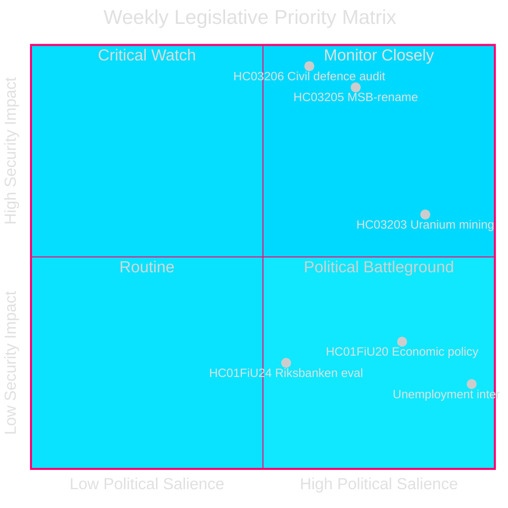
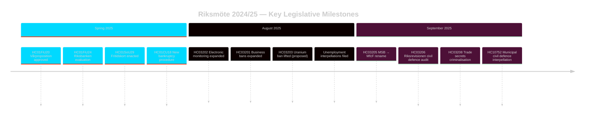

# Sveriges Säkerhetsfokuserade Lagstiftningssprint: Civil Försvarsöversyn, Uranvändning och Stigande Arbetslöshet

**Författare**: James Pether Sörling
**Löpnummer**: 24961123457
**Datum**: 2026-04-26
**Klassificering**: PUBLIC — GDPR Art 9(2)(e)(g)
**Konfidens**: HIGH [B2] — Myndighetens API; officiella propositionsdokument

---

## BLUF

Sverige avslutade riksmöte 2024/25 med en koncentrerad säkerhets-fokuserad lagstiftningsagenda: Kristersson-regeringen bytte namn på MSB till "Myndigheten för civilt försvar" (HC03205), lämnade den första Riksrevisionens granskning av civilt försvar till riksdagen (HC03206) och föreslog att hävd förbudet mot uranbrytning (HC03203) — allt under en enda sprint i september 2025. Dessa åtgärder signalerar en avgörande förskjutning från välfärdsstatens underhåll till hård säkerhetsinvestering. Oppositionens parlamentariska tryck fokuserar på Sveriges ihållande höga arbetslöshet (~500 000 personer), som hotar den styrande koalitionens trovärdighet gällande det egna deklarerade "arbetslinjen"-målet.

## Beslut Som Underlaget Stödjer

1. **Svenska säkerhetspolitiska** intressenter: Utvärdera huruvida namnbytet MSB→MfcF representerar substantiell myndighetsreform eller kosmetisk omprofilering; Riksrevisionens rapport (HC03206) ger granskningsbasen.
2. **Energipolitiska** analytiker: Bedöm uranbrytningens regulatoriska, politiska och nordiska relationsimplikationer efter HC03203.
3. **Arbetsmarknadsövervakare**: Följ om regeringens arbetslinjeretorlik ger mätbara resultat mot bakgrunden av 8,5 % arbetslöshet (interpellationerna HC10744–HC10746).
4. **Finans-/monetärpolitiska** analytiker: Kontextualisera FiU:s utvärdering av Riksbankens penningpolitik 2024 (HC01FiU24) och vårens ekonomiska riktlinjer (HC01FiU20) mot IMF:s projektioner.

## 60-Sekunders Läsning

- 🛡️ **Civil försvarsöversyn**: MSB byter namn till Myndigheten för civilt försvar (prop HC03205); Riksrevisionens granskning blottlägger styrningsluckor (HC03206); kommunal civilförsvarsamordning flaggas som otillräcklig (interpellation HC10752).
- ⚛️ **Uranbrytningsförbudet hävs**: Prop HC03203 lyfter 30-årsförbudet; SD och M stöder, V/MP/S starkt emot; inga kända uranförekomster i produktionsklart skick.
- 👔 **Straffrättslig expansion**: Utökad kriminalisering av företagshemligheter (HC03208), utökade näringsförbud (HC03201), elektronisk fotboja för fängelsestraff (HC03202).
- 📉 **Arbetslöshetskris**: 500 000+ arbetslösa; ungdoms- och funktionsnedsättningsarbetslöshet på EU-höga nivåer; den styrande koalitionen interpelleras på alla tre dimensioner (HC10744–HC10746).
- 💰 **Vårpropositionen godkänd**: Ekonomiska riktlinjer antagna (HC01FiU20) med nedgradering av tillväxtutsikterna; APL rekapitaliserades SEK 700M för läkemedelsförsörjningssäkerhet (HC01FiU33).
- ⚖️ **Riksbankens penningpolitik**: FiU:s utvärdering (HC01FiU24) finner penningpolitikens genomförande adekvat trots långsammare-än-optimala räntesänkningar; inflationsförväntningar förankrade.

## Viktigaste Framåttrigger

**Civilförsvarets kapacitetstest (72 timmar)**: Den första fullständiga riksdagssessionen under det nya MfcF-mandatet avgör om namnbytet omsätts i faktisk kapacitetsuppbyggnad. Följ statsrådet Bohlins svar till riksdagen om kommunal beredskap (svar på interpellation HC10752 förfaller).

## Nyckelindikatorer — Kommande 7 Dagar

| Indikator | Horisont | Signalriktning |
|-----------|---------|-----------------|
| MfcF:s parlamentspresentation | 72 h | Förmåga vs. kosmetik |
| Uranbrytningens samråd | 1 vecka | Nordiska partnerreaktioner |
| Arbetslöshetsstatistik (SCB AKU Q2) | 1 vecka | Styrande koalitionstryck |
| FiU Riksbankens uppföljningshearing | 1 vecka | Monetär trovärdighet |

---

style HC03205 fill:#ff006e,stroke:#00d9ff
style HC03206 fill:#ff006e,stroke:#00d9ff
style HC03203 fill:#ffbe0b,stroke:#0a0e27

<!-- source-sha: e799f2cf3c9c7f3ec4f6e9c9b91e6ad40f91af79 -->
