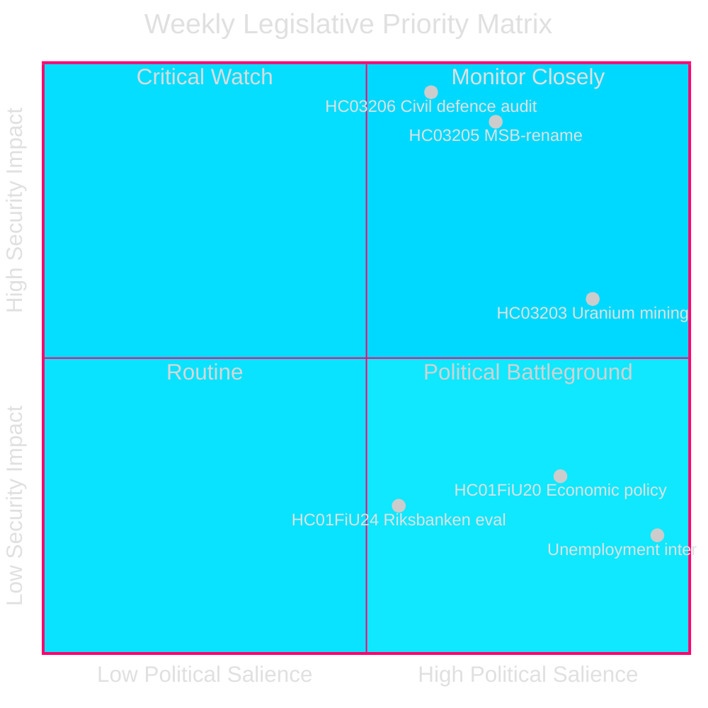
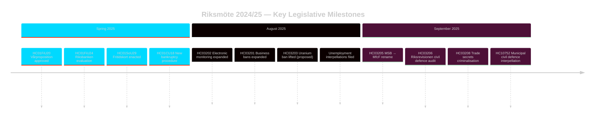

# 瑞典安全聚焦立法冲刺：民防重组、铀矿开采与失业率上升

**作者**: James Pether Sörling
**运行编号**: 24961123457
**日期**: 2026-04-26
**分类**: PUBLIC — GDPR 第9条(2)(e)(g)
**置信度**: HIGH [B2] — 政府机构API；官方提案文件

---

## 执行摘要

瑞典以集中的安全聚焦立法议程结束了Riksmöte 2024/25：Kristersson政府将MSB更名为«Myndigheten för civilt försvar»（HC03205），向Riksdag提交了Riksrevision首次民防治理审计（HC03206），并提议废除铀矿开采禁令（HC03203）——所有这些均在2025年9月的单一冲刺内完成。这些举措标志着从福利国家维护到硬安全投资的决定性转变。反对派的议会压力集中于瑞典持续高企的失业率（约50万人），这威胁到执政联盟就其宣称的"工作路线"目标的可信度。

## 本情报支持的决策

1. **瑞典安全政策**利益相关者：评估MSB→MfcF更名是否代表实质性机构改革或表面重塑；Riksrevision报告（HC03206）提供审计基础。
2. **能源政策**分析师：评估HC03203后铀矿开采的监管、政治及北欧关系影响。
3. **劳动力市场监控**：追踪政府工作路线修辞是否在8.5%失业率背景下产生可量化成果（质询HC10744–HC10746）。
4. **财政/货币政策**分析师：将FiU对2024年Riksbank货币政策的评估（HC01FiU24）和春季经济指导方针（HC01FiU20）与IMF预测进行背景关联。

## 60秒阅读

- 🛡️ **民防重组**：MSB更名为Myndigheten för civilt försvar（提案HC03205）；Riksrevision审计揭示治理缺口（HC03206）；地方民防协调被标记为不足（质询HC10752）。
- ⚛️ **铀矿开采禁令废除**：提案HC03203废除30年禁令；SD与M支持，V/MP/S强烈反对；无已知可投入生产的铀矿藏。
- 👔 **刑事扩展**：扩大商业秘密犯罪化（HC03208）、扩展营业禁令（HC03201）、监禁刑罚的电子监控（HC03202）。
- 📉 **失业危机**：逾50万人失业；青年及残障人士失业率处于欧盟最高水平；执政联盟在三个维度上均受到质询（HC10744–HC10746）。
- 💰 **Vårproposition获批**：经济指导方针通过（HC01FiU20），增长预测下调；APL为药品供应安全重新资本化7亿瑞典克朗（HC01FiU33）。
- ⚖️ **Riksbank货币政策**：FiU评估（HC01FiU24）认为尽管利率下调速度慢于最优，货币政策实施仍属充分；通胀预期稳定。

## 最重要的未来触发因素

**民防能力测试（72小时）**：首次在新MfcF任务下召开的完整议会会议将决定机构更名是否带来实质能力建设。跟踪Bohlin国务大臣向Riksdag就地方备灾情况的回复（质询HC10752的回复期限届满）。

## 关键指标 — 未来7天

| 指标 | 时限 | 信号方向 |
|-----------|---------|-----------------|
| MfcF议会报告 | 72小时 | 能力对比表面 |
| 铀矿开采磋商 | 1周 | 北欧伙伴反应 |
| 失业统计（SCB AKU Q2） | 1周 | 执政联盟压力 |
| FiU Riksbank后续听证 | 1周 | 货币可信度 |

---

style HC03205 fill:#ff006e,stroke:#00d9ff
style HC03206 fill:#ff006e,stroke:#00d9ff
style HC03203 fill:#ffbe0b,stroke:#0a0e27

<!-- source-sha: e799f2cf3c9c7f3ec4f6e9c9b91e6ad40f91af79 -->
