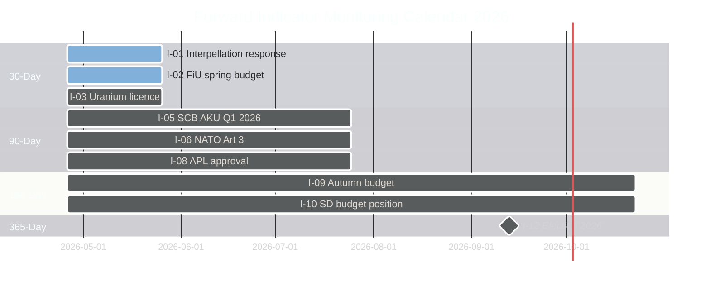

# Forward Indicators — Weekly Review 2026-04-26

**Author**: James Pether Sörling | **Framework**: PIR-driven indicator monitoring

---

## Indicator Summary

This register tracks 12 leading indicators across 4 time horizons, providing early warning for the four primary intelligence requirements identified in intelligence-assessment.md.

---

## Horizon 1: 30 Days (May 2026)

| # | Indicator | Current status | Watch threshold | PIR link |
|---|-----------|---------------|----------------|---------|
| I-01 | **Government response to HC10744–HC10746 interpellations** | Pending | Response published addressing structural vs. cyclical distinction | PIR-2 |
| I-02 | **Riksdag FiU spring supplementary budget** | Draft in committee | Includes MfcF capability funding ≥ SEK 1bn | PIR-1 |
| I-03 | **HC03203 uranium — first mining exploration licence application** | Not filed | Any application submitted to SGU | PIR-4 |
| I-04 | **EU Commission preliminary assessment of HC03203** | Not initiated | Commission letter or formal inquiry | PIR-4 |

**Monitoring method**: Riksdag dokument API search; Jordbruksverket/SGU announcements; EU Commission DG GROW publications.

---

## Horizon 2: 90 Days (July 2026)

| # | Indicator | Current status | Watch threshold | PIR link |
|---|-----------|---------------|----------------|---------|
| I-05 | **SCB AKU Q1 2026 unemployment rate** | Not published | Rate above 9% = risk escalation; below 8% = S2/S1 divergence | PIR-2 |
| I-06 | **NATO Article 3 self-assessment submission** | Not published | Swedish submission acknowledges Article 3 compliance gap | PIR-1 |
| I-07 | **MfcF first annual report** | Not published | Report acknowledges coordination gaps (HC10752 issue) | PIR-1 |
| I-08 | **APL acquisition (HC01FiU33) regulatory approval** | Pending | EU State Aid clearance received | PIR-3 |

**Monitoring method**: SCB AKU quarterly releases; MfcF website; NATO Joint Press Release; Energimarknadsinspektionen database.

---

## Horizon 3: 180 Days (October 2026)

| # | Indicator | Current status | Watch threshold | PIR-link |
|---|-----------|---------------|----------------|---------|
| I-09 | **2027 budget framework (autumn 2026 budget bill)** | Not tabled | Includes MfcF capability investment ≥ SEK 2bn | PIR-1 |
| I-10 | **SD public position on autumn budget** | No public statement | SD signals refusal to support budget | PIR-5 |
| I-11 | **S confidence motion tabling** | No motion tabled | S+V+MP table confidence motion | PIR-5 |

**Monitoring method**: Government.se budget documentation; SD party congress statements; Riksdag motion calendar.

---

## Horizon 4: 365 Days (April 2027 / Post-Election 2026)

| # | Indicator | Current status | Watch threshold | PIR link |
|---|-----------|---------------|----------------|---------|
| I-12 | **2026 election result and government formation** | Election not held | S-led or Tidö-led government formed; mandate for policy reversal on uranium/civil defence | All PIRs |

---

## Indicator Status Dashboard

| Indicator | Horizon | Status | Trend |
|-----------|---------|--------|-------|
| I-01 Interpellation response | 30d | Pending | 🟡 |
| I-02 FiU spring budget | 30d | In committee | 🟡 |
| I-03 Uranium licence application | 30d | Not filed | 🟢 (no action = good) |
| I-04 EU Commission assessment | 30d | Not initiated | 🟢 |
| I-05 SCB AKU Q1 2026 | 90d | Not published | 🟡 |
| I-06 NATO Article 3 | 90d | Not published | 🔴 (gap known) |
| I-07 MfcF annual report | 90d | Not published | 🟡 |
| I-08 APL regulatory approval | 90d | Pending | 🟡 |
| I-09 Autumn budget | 180d | Not tabled | 🟡 |
| I-10 SD budget position | 180d | No statement | 🟡 |
| I-11 Confidence motion | 180d | No motion | 🟢 |
| I-12 Election result | 365d | Election pending | 🟡 |

**Legend**: 🔴 Escalating risk | 🟡 Monitor | 🟢 Current baseline holds

---

