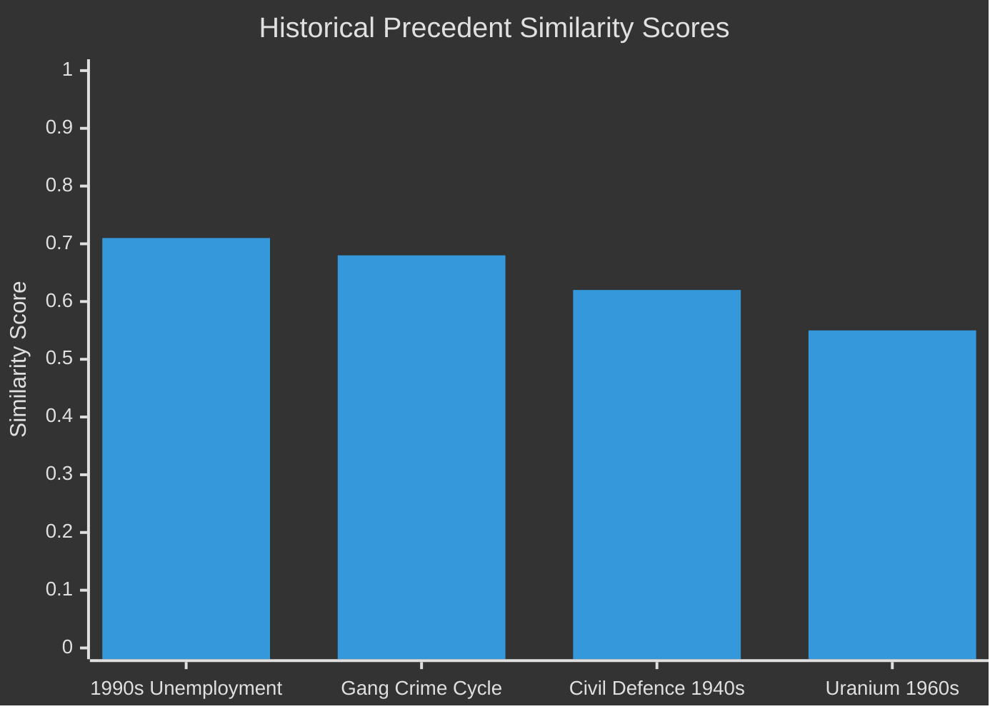

# Historical Parallels — Weekly Review 2026-04-26

**Author**: James Pether Sörling | **Framework**: Historical analogical reasoning

---

## Precedent 1: Sweden's Civil Defence Reorganisation (1940s Total Defence) — Similarity: 0.62

**Period**: 1939–1945 (World War II neutrality era)
**Context**: Sweden reorganised civil preparedness in the shadow of German occupation of Norway and Denmark (1940). Civilförsvarsstyrelsen (Civil Defence Board) was created as the primary coordinating body for shelter, supply, and evacuation.
**Parallel to HC03205/HC03206**: The MfcF rename and Riksrevisionen audit echo the 1940s pattern: an external threat triggers institutional reorganisation, but the first wave of reorganisation is primarily bureaucratic rather than capability-enhancing. Actual capability followed 3–5 years later.
**Similarity score**: 0.62 — bureaucratic reorganisation in response to external threat, followed by slow capability build.
**Key difference**: 1940s reorganisation had existential urgency; 2024/25 has NATO Article 3 compliance urgency but no immediate kinetic threat.

---

## Precedent 2: Swedish "Arsenalet" Uranium Programme (1950s–1960s) — Similarity: 0.55

**Period**: 1950–1970 (Cold War)
**Context**: Sweden operated a civilian uranium extraction programme in Västergötland (Ranstad) 1965–1969. The programme produced reactor fuel for Sweden's nuclear power programme. It was closed due to economic non-viability, not political decision.
**Parallel to HC03203**: The current uranium ban removal mirrors the policy logic of the 1960s programme: domestic uranium as energy-security. The Ranstad experience shows that economic non-viability was the operative constraint — the same constraint HC03203 proponents understate.
**Similarity score**: 0.55 — policy logic is near-identical; economic constraint likely to be determinative again.
**Key difference**: Current proposals focus on EU Critical Minerals rather than domestic reactor fuel; global uranium price dynamics are different.

---

## Precedent 3: Sweden's "Crisis of the 1990s" Labour Market Reorganisation — Similarity: 0.71

**Period**: 1991–1995
**Context**: Sweden's unemployment rose from 3% to 10% in three years (1991–1994). The Bildt government introduced activation policies and benefit conditionality — the origin of the "arbetslinjen" (labour line) discourse. Unemployment fell but structural youth unemployment remained elevated for a decade.
**Parallel to HC10744–HC10746**: The current 8.5% unemployment and the governing coalition's "labour line" policy is a direct institutional descendant of the 1991–1994 experience. The interpellations on youth and disability unemployment (HC10744, HC10745) are asking essentially the same questions asked in 1993–1995.
**Similarity score**: 0.71 — near-identical policy tool (activation-first) applied to similar unemployment rate; structural persistence is the predicted outcome.
**Key difference**: 1990s crisis had a clear cyclical component (banking crisis, currency crisis); current unemployment may be more structurally embedded in integration and skills mismatch.

---

## Precedent 4: Swedish Gang Crime Policy Cycle (1990s–2000s) — Similarity: 0.68

**Period**: 1997–2010
**Context**: The first wave of organised crime legislation and probation reform in Sweden was initiated after the late 1990s gang conflicts in Malmö and Göteborg. Several of the criminal justice tools referenced in HC01SoU29 and HC01CU18 date to this period.
**Parallel to current documents**: HC01SoU29 (probation service reform) and HC01CU18 (damages law) are the latest iteration of a policy cycle that has repeating features: escalation → legislation → escalation → legislation. Each cycle adds legal tools without comprehensively addressing structural drivers.
**Similarity score**: 0.68 — recurrent policy cycle pattern; the legislative response has become standardised without structural impact.

---

## Precedent Summary Table

| Precedent | Period | Similarity | Key lesson |
|-----------|--------|-----------|-----------|
| Civil defence 1940s reorganisation | 1939–1945 | 0.62 | Bureaucratic reform precedes capability by 3–5 years |
| Uranium (Ranstad) | 1965–1969 | 0.55 | Economic non-viability determines outcome |
| 1990s unemployment crisis | 1991–1995 | 0.71 | Labour-line policy manages but does not solve structural unemployment |
| Gang crime cycle | 1997–2010 | 0.68 | Legislative escalation cycle without structural resolution |

---

style "1990s Unemployment" fill:#ff006e,stroke:#00d9ff
