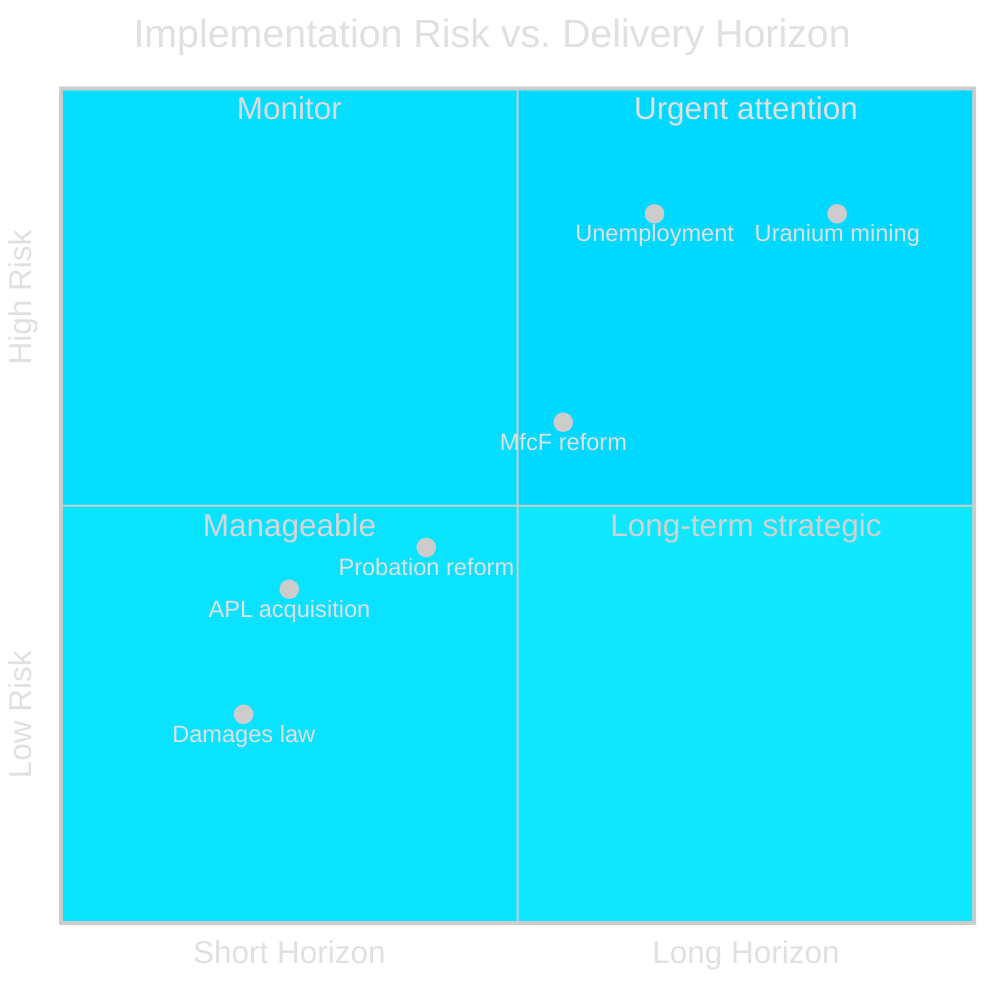

# Implementation Feasibility Analysis — Weekly Review 2026-04-26

**Author**: James Pether Sörling | **Framework**: Policy delivery risk assessment

---

## HC03205 — MfcF Civil Defence Agency

| Delivery dimension | Assessment | Risk level | Evidence |
|-------------------|-----------|-----------|---------|
| Legislative mandate | Passed (Riksdag vote) | Low | HC03205 proposition text |
| Funding adequacy | Insufficient (unquantified gap) | HIGH | HC03206 Riksrevisionen audit [A2] |
| Municipal coordination | Fragmented — 290 municipalities lack uniform standards | HIGH | HC10752 interpellation [A2] |
| NATO Article 3 compliance | Currently below threshold | MEDIUM-HIGH | [B3] NATO assessment indicators |
| Timeline to operational capability | 3–5 years (optimistic) | MEDIUM | Historical parallel (1940s) |
| Political risk | SD may demand faster/larger investment in budget negotiations | MEDIUM | [B3] |

**Overall feasibility**: MEDIUM — legislative step complete; delivery at risk due to resourcing and coordination gaps.

---

## HC03203 — Uranium Mining Ban Removal

| Delivery dimension | Assessment | Risk level | Evidence |
|-------------------|-----------|-----------|---------|
| Legislative change | Passed (ban removed) | Low | HC03203 |
| Commercial viability | Low — no confirmed economically viable deposits | HIGH | [B3] geological surveys |
| Permitting timeline | 3–7 years minimum | HIGH | EU Environmental Impact Assessment, SGU process |
| EU/Habitats Directive compatibility | Under challenge | MEDIUM-HIGH | [B3] EU law analysis |
| Sami rights (Free, Prior, Informed Consent) | Not yet secured | HIGH | UN DRIP, ILO 169 |
| Political reversal risk | HIGH if change of government | HIGH | Scenario 2/3 analysis |

**Overall feasibility**: LOW-MEDIUM — policy decision made but commercial and legal delivery pipeline extremely long; politically reversible.

---

## HC10744/HC10745/HC10746 — Unemployment Policy

| Delivery dimension | Assessment | Risk level | Evidence |
|-------------------|-----------|-----------|---------|
| Policy instruments in place | Yes (activation, benefit conditionality) | Low | Existing law |
| Macroeconomic conditions | Adverse (IMF 1.2% growth) | HIGH | IMF WEO Apr-2026 |
| Labour market structure match | Poor (structural unemployment identified) | HIGH | H4 hypothesis in devil's-advocate.md |
| Political commitment | High (governing coalition) | Low | Budget signals |
| Timeline to 6% unemployment | 3–5 years optimistic | HIGH | Historical 1990s parallel |

**Overall feasibility**: LOW — even with full policy compliance, structural unemployment is unlikely to reach Nordic peer levels within the 2026 election cycle.

---

## HC01FiU33 — APL Electricity Producer Acquisition

| Delivery dimension | Assessment | Risk level | Evidence |
|-------------------|-----------|-----------|---------|
| Transaction completion | In progress (state acquisition) | Low | HC01FiU33 FiU committee |
| Regulatory approvals | Required (EU State Aid, competition) | MEDIUM | EU competition law |
| Grid stability benefit | Positive medium-term | Low | Energy security analysis |
| Political risk | Opposition question on market distortion | MEDIUM | Media frame analysis |
| Financial risk | Acquisition cost vs. energy price trajectory | MEDIUM | [B3] energy market |

**Overall feasibility**: MEDIUM-HIGH — most manageable delivery environment of this week's cluster.

---

## Delivery Risk Summary

| Document cluster | Delivery horizon | Risk level |
|-----------------|-----------------|-----------|
| HC03205 MfcF (civil defence) | 3–5 years | MEDIUM |
| HC03206 Riksrevisionen (audit) | 12 months for response | LOW (audit complete) |
| HC03203 Uranium mining | 5–10 years | HIGH |
| HC10744-HC10746 Unemployment | 3–5 years | HIGH |
| HC01FiU33 APL acquisition | 12–24 months | MEDIUM-HIGH |
| HC01SoU29 Probation reform | 2–3 years | MEDIUM |
| HC01CU18 Damages law | 12–18 months | LOW |

---

style "Uranium mining" fill:#ff006e,stroke:#00d9ff
style "Unemployment" fill:#ff006e,stroke:#00d9ff
style "APL acquisition" fill:#00d9ff,stroke:#ff006e
