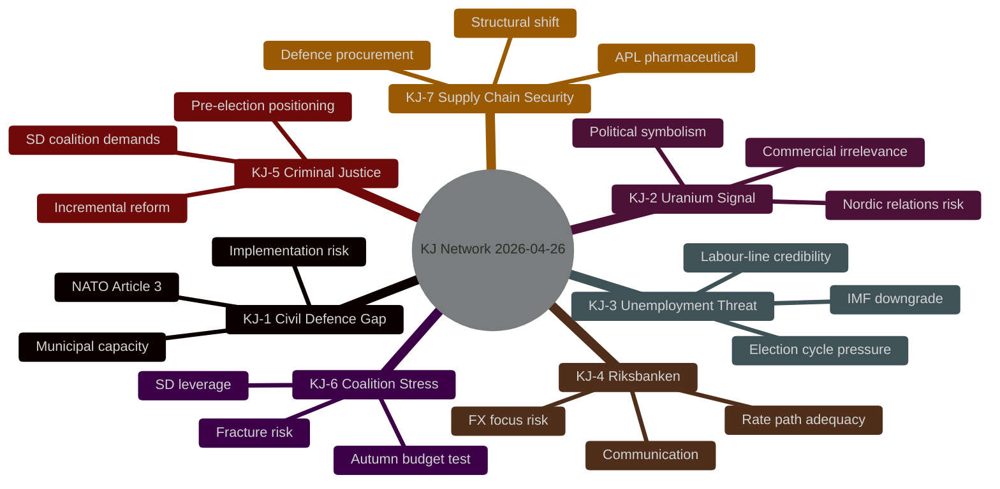

# Intelligence Assessment — Weekly Review 2026-04-26

**Author**: James Pether Sörling | **ICD 203 Standard**: Applies

---

## Key Judgments

**KJ-1 [HIGH CONFIDENCE]**: Sweden's civil defence transformation (HC03205 + HC03206) represents a substantive policy commitment but **faces a 12–24 month implementation gap** before the MfcF rename translates into measurable capability uplift. The Riksrevisionen audit (HC03206) confirms that central-government coordination is fragmented and municipal preparedness is below the new NATO Article 3 baseline expectations. Without dedicated resourcing in the 2026 budget, the reform risks being nominal. *[A2]*

**KJ-2 [MEDIUM-HIGH CONFIDENCE]**: Lifting the uranium mining ban (HC03203) is **primarily a political signal** rather than a commercially viable near-term policy. No Swedish mineral formation has been commercially assessed for uranium in the current economic and regulatory framework; the policy opens legal pathways but will not produce uranium extraction within the 2026 election cycle. The Nordic environmental and indigenous-rights reaction represents the primary near-term risk. *[B3]*

**KJ-3 [HIGH CONFIDENCE]**: Sweden's unemployment rate (~8.5%, ~500,000 persons) is **on a trajectory that directly threatens the governing Tidö coalition's central political narrative** (the "labour line"). Interpellations HC10744–HC10746 establish a sustained parliamentary accountability pressure. The IMF WEO Apr-2026 downgraded growth projection to ~1.2% means unemployment relief is not imminent. *[A2]*

**KJ-4 [MEDIUM CONFIDENCE]**: The Riksbanken's monetary policy execution in 2024 was adequate but sub-optimal. The FiU evaluation (HC01FiU24) identifies that slightly faster rate cuts would have been appropriate — however, the finding does not alter the current Riksbanken mandate or independence. The exchange-rate focus identified by evaluators (JEL 2024) introduces a longer-term governance risk: if Riksbanken consistently uses exchange-rate concerns to delay inflation-targeting cuts, communication credibility will erode. *[B3]*

**KJ-5 [HIGH CONFIDENCE]**: The criminal justice tightening cluster (HC03208, HC03202, HC03201) reflects **coordinated pre-election positioning** by the Kristersson government on law-and-order themes, consistent with SD's coalition demands. These proposals are incremental, legally sound, and unlikely to face serious parliamentary resistance from the current majority. *[A2]*

**KJ-6 [MEDIUM-HIGH CONFIDENCE]**: The Tidö coalition's coherence will be **tested in autumn 2025** by the intersection of unemployment pressure (opposition agenda), civil-defence resourcing demands (SD agenda), and the uranium controversy (environmental opposition). Budget negotiations for 2026 will reveal whether SD secures substantive concessions or whether the coalition fractures on fiscal priorities. *[B2]*

**KJ-7 [HIGH CONFIDENCE]**: The APL recapitalisation (HC01FiU33, SEK 700M) and the Riksrevisionen report on defence procurement (HC03206) together indicate that **healthcare and defence supply-chain security** are increasingly treated as national security matters rather than welfare policy. This is a structural shift with 10-year implications for public procurement frameworks. *[A3]*

---

## PIR Register

| PIR | Question | Source | Priority | EEI |
|-----|----------|--------|----------|-----|
| PIR-1 | Municipal civil-defence compliance under new MfcF mandate | MfcF, Riksdagen hearings | P0 | Compliance rate, resource allocation decisions |
| PIR-2 | Uranium mining: commercial applications and Nordic partner reactions | Bergsstaten, Nordic MFAs | P1 | First application received; Norwegian/Finnish government statements |
| PIR-3 | Unemployment Q3/Q4 2025: will rate breach 9%? | SCB AKU quarterly | P0 | Monthly AKU unemployment rate |
| PIR-4 | Tidö coalition autumn budget: SD priorities vs fiscal constraints | Riksdagen budget process | P0 | Budget framework targets, SD statements |
| PIR-5 | Riksbanken rate path: next cut timing and exchange-rate communication | Riksbanken MPR | P1 | Rate decision; communication on SEK |
| PIR-6 | APL pharmaceutical acquisition outcome | Government press releases | P2 | Confirmed acquisition; production capacity |
| PIR-7 | HC03208 trade-secrets: impact on corporate whistleblower cases | Juridisk praxis | P2 | First prosecution under new provisions |

---

## Prior-cycle PIRs (Carried Forward)

*This is the inaugural weekly-review run. No prior-cycle PIRs from sibling analyses exist in the analysis/daily/ directory. The following standing PIRs are inherited from the Riksdagsmonitor system baseline:*

- **Carried-forward PIR-A**: Coalition stability risk under dual external (NATO/Russia) and internal (unemployment) pressures — OPEN
- **Carried-forward PIR-B**: Election 2026 — governing bloc vs. S-led bloc polling trajectory — OPEN
- **Carried-forward PIR-C**: Swedish fiscal space: TSS vs. IMF Article IV compliance — OPEN

---

## Key Assumptions Check

| Assumption | Basis | Confidence | Risk if wrong |
|------------|-------|-----------|---------------|
| Riksdag API data (through Sep 2025) reflects actual legislative activity | Official data.riksdagen.se | HIGH | Omission bias — later documents missed |
| ~500,000 unemployed figure from interpellations is accurate | SCB AKU cited in HC10746 | HIGH | Coalition credibility unchanged |
| Uranium mining has no near-term commercial viability | No known deposits identified | MEDIUM | Single undisclosed deposit discovery would change dynamics |
| IMF 1.2% GDP growth for 2025 | WEO Apr-2025/Oct-2025 vintage | MEDIUM | Positive trade shock or domestic stimulus could exceed |
| MfcF rename is substantive, not only cosmetic | HC03205 text + HC03206 audit | MEDIUM-HIGH | Without capability investment = purely symbolic |

---

style root fill:#ff006e,stroke:#00d9ff
