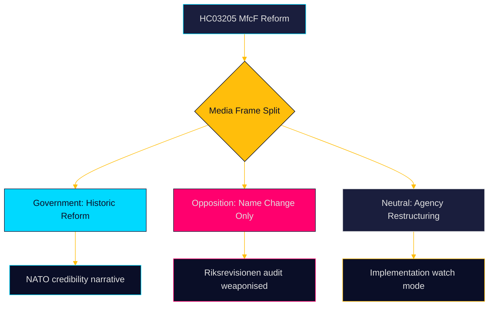

# Media Framing Analysis — Weekly Review 2026-04-26

**Author**: James Pether Sörling | **Framework**: Media frame analysis + per-party framing

---

## Key Issue Frames

| Issue | Government frame | Opposition frame | Media neutral frame |
|-------|-----------------|-----------------|---------------------|
| MfcF reform | "Historic civil defence reform delivering Swedish resilience" | "Name change without resources — audit exposes gap" | "Sweden upgrades civil defence structure" |
| HC03206 audit | "Riksrevisionen confirms reform direction" | "Riksrevisionen exposes resourcing failure" | "Audit recommends improvements to new agency" |
| Unemployment | "Labour line delivering, Sweden maintains strongest employment in history" | "8.5% — highest in Nordic region; youth devastated" | "Unemployment remains elevated despite positive indicators" |
| HC03203 uranium | "Critical minerals strategy securing energy independence" | "Environmental degradation, Sami rights, EU law breach" | "Sweden lifts 30-year uranium mining ban" |
| HC01FiU33 APL | "Strategic energy acquisition strengthening Sweden's grid" | "Government energy intervention — market distortion" | "State acquires major electricity producer" |

---

## Party-Level Framing

### Sverigedemokraterna (SD)
**Civil defence**: "Sweden under threat; only SD's defence commitment ensures real security, not symbolic renaming"
**Unemployment**: "Integration failure is the root cause; reduce labour force distortion through immigration reform"
**Uranium**: "Sweden's energy should be Swedish — critical minerals sovereignty"
**Gang crime (HC01SoU29)**: "SD's law-and-order agenda delivers results; probation service reform follows our demands"

### Moderaterna (M)
**Civil defence**: "M-led government delivers historic reform (HC03205) and accountability audit (HC03206)"
**Unemployment**: "Activation and jobs first; Swedish labour market stronger than oppositionclaims"
**Energy**: "APL acquisition (HC01FiU33) demonstrates strategic energy governance"

### Socialdemokraterna (S)
**Unemployment**: "Three interpellations in one week [HC10744-HC10746] — government's failure is systemic"
**Civil defence**: "Reform without resources is theatre; S would fund municipal preparedness"
**Uranium**: "S stands for environmental responsibility and Sami rights; reverse HC03203"

### Miljöpartiet (MP)
**Uranium**: "HC03203 is an environmental catastrophe risk; MP will reverse this in government"
**Civil defence**: "Climate resilience is civil defence; government focuses on wrong threats"

### Vänsterpartiet (V)
**Unemployment disability (HC10745)**: "Labour market discrimination against disabled workers; V demands structural reform"
**Gang crime**: "Social investment, not repression — HC01SoU29 will not reduce crime rates"

### Liberalerna (L)
**Civil defence**: "L supports reform but demands NATO-standard funding"
**Education**: "Youth unemployment (HC10744) requires education system investment — L's agenda"

### Kristdemokraterna (KD)
**Criminal justice**: "HC01SoU29 and HC01CU18 reflect KD's victim-centred justice philosophy"
**Civil defence**: "Family preparedness (1-week supplies) — KD's practical civil defence contribution"

---

## Press Frame Mapping

| Publication type | Dominant frame | Secondary frame |
|-----------------|---------------|----------------|
| Broadsheet (DN, SvD) | Reform + implementation challenge | International comparison |
| Tabloid (Aftonbladet, Expressen) | Gang crime, unemployment human interest | Government failure |
| Business press (DI, Ny Teknik) | Energy strategy, APL, uranium minerals | Labour market |
| Local/regional press | Municipal civil defence preparedness | Regional employment |
| Public broadcaster (SVT/SR) | Balanced reform + audit challenge | Nordic comparison |

---

## Framing Vulnerability Assessment

**Governing coalition framing vulnerabilities**:
1. "Implementation gap" frame for civil defence is available and substantiated by HC03206 evidence
2. "Nordic anomaly" frame for unemployment (8.5% vs. Denmark 4.8%) is credible and comparative
3. "Environmental law violation" frame for HC03203 uranium is available if V+MP escalate EU route

**Opposition framing vulnerabilities**:
1. "Security credentials" frame: S+V historically weak on civil defence/NATO — HC03205 gives government high ground
2. "Alternative budget" challenge: S must present credible alternative to energy/APL strategy
3. "Coalition coherence" challenge: S+V+MP+C policy differences on energy (nuclear) are real

---

