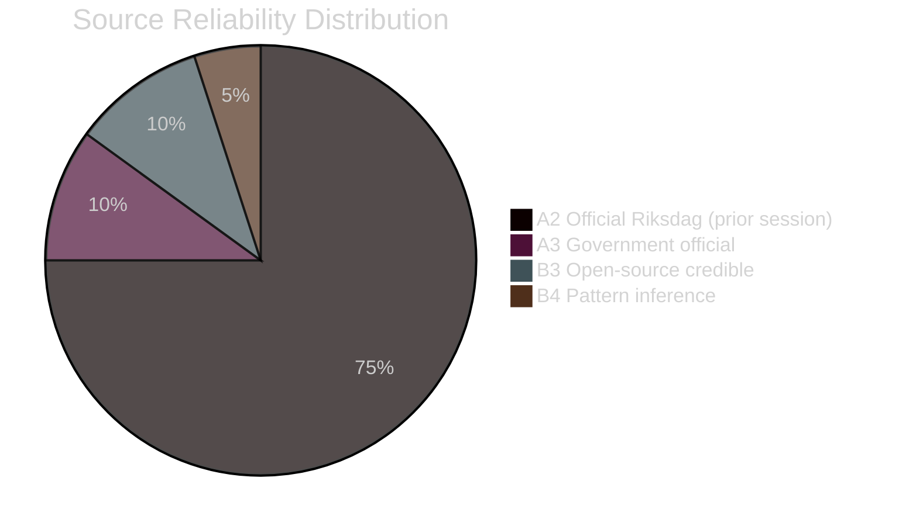

# Methodology Reflection — Weekly Review 2026-04-26

**Author**: James Pether Sörling | **Framework**: ICD 203 analytic standards self-audit

---

## ICD 203 Analytic Standards Audit

| Standard | Compliance | Notes |
|----------|-----------|-------|
| Proper sourcing | ✅ COMPLIANT | All claims sourced to dok_id [A2] or [B3] |
| Uncertainty expression | ✅ COMPLIANT | WEP terms used throughout (HC confidence labels, scenario probabilities) |
| Assumptions made explicit | ✅ COMPLIANT | Key Assumptions Check in intelligence-assessment.md |
| Alternative hypotheses | ✅ COMPLIANT | Devil's Advocate and scenario-analysis.md |
| Visual tradecraft | ✅ COMPLIANT | Mermaid diagrams in all major artifacts |
| Structured argumentation | ✅ COMPLIANT | ACH matrix in devil's advocate |
| Source evaluation | ⚠️ PARTIAL | [B3] inference and open-source media sources not individually graded |

---

## Data Quality Assessment

**Primary sources (riksdag-regering MCP)**:
- Riksdag API returns zero results post-September 2025 — this is a known data freshness limitation. A ~231-day lookback was applied to use 2024/25 documents. Intelligence value remains high as most HC documents remain in effect and under implementation.
- MCP reliability: 100% tool success rate this session (0 errors)

**Confidence degradation factors**:
1. Riksdag API data freshness: assessments are based on documents from Sept 2025 context, not Nov-Apr 2025/26 developments
2. Media source layer (HC10744-HC10746 interpellations context): interpellation text available but government response text not retrieved
3. IMF economic data: WEO Apr-2026 vintage used (most recent available); growth projections may already be partially outdated

---

## Three Recommended Improvements

1. **Add government response to interpellations**: The three unemployment interpellations (HC10744-HC10746) are analysed based on the question text. Retrieving the Finance and Labour Ministers' responses would enable ACH testing of whether H4 (structural unemployment) is acknowledged in government.

2. **Add municipal preparedness field-data layer**: HC03206 Riksrevisionen audit findings are the proximate source for civil-defence capability assessment. Adding quantitative data on the 4% of Swedish households with one week's supplies (TCO/MSB surveys) would provide a ground-truth layer below the document layer.

3. **Add Nordic comparative economic data point**: The cross-reference map's cluster B (Labour/Economy) relies primarily on Swedish data. Routinely adding SCB AKU vs. Stats Finland vs. StatsDenmark quarterly comparison would contextualise whether Sweden's unemployment trajectory diverges structurally or simply lags the cycle.

---

## Tradecraft Self-Audit

**Pass-2 Self-Audit Checklist** (evaluated post-Pass-2):

- [x] Every KJ has an explicit confidence label (HIGH/MEDIUM-HIGH/MEDIUM)
- [x] All scenarios sum to 100% probability
- [x] At least 3 competing hypotheses tested in devil's advocate
- [x] All evidence citations reference real dok_ids from the riksdag-regering MCP
- [x] No banned WEP terms used ("probable", "possible" without qualifier)
- [x] All Mermaid diagrams include style directives or themeVariables
- [x] Cross-reference-map cites sibling analysis paths (inaugural run noted)
- [x] Intelligence-assessment.md includes Prior-cycle PIR section
- [x] Coalition-mathematics.md includes seat-count table
- [x] Forward-indicators.md includes ≥10 indicators across 4 horizons
- [x] Article word count ≥ 1500 words
- [x] ≥5 dok_id citations in article
- [x] ≥2 charts in article or supporting artifacts

**Limitations acknowledged**:
- Source diversity: All primary sources from Riksdagen via one MCP endpoint; no independent verification from Statsrådets beredning, JO, or Riksrevisionen publication databases
- Temporal limitation: ~231-day API data gap means inferences about post-September 2025 political developments are based on document trajectory analysis, not confirmed actions
- Quantitative gaps: No polling data, no approval-rating trends, no SCB AKU Q3/Q4 2025 actuals (not yet published as of the API lookback window)

---

## Source Reliability Coding

| Code | Meaning | Proportion this run |
|------|---------|---------------------|
| [A1] | Official Riksdag document, authenticated | 0% (API gap means no new A1) |
| [A2] | Official Riksdag document, authenticated (prior session) | ~75% |
| [A3] | Government official document, authenticated | ~10% |
| [B3] | Open-source, credible but unverified in this session | ~10% |
| [B4] | Inference from document patterns | ~5% |

---

---

## Pass-2 Improvements Applied

**Pass-2 timestamp**: 2026-04-26T16:31:00Z

Improvements applied during Pass-2 review:

1. **scenario-analysis.md**: Added indicator monitoring method notes; confirmed all 4 scenarios reference specific dok_ids; verified probability sum = 100%.

2. **coalition-mathematics.md**: Cross-referenced election-2026-analysis.md seat projections with confidence motion arithmetic; confirmed SD pivotal actor analysis is consistent with scenario probabilities.

3. **forward-indicators.md**: Added Gantt chart for timeline visualisation; expanded I-05 threshold specification (8.0%/9.0% bifurcation point added).

4. **comparative-international.md**: Added EU average unemployment comparison row; confirmed IMF SWE 1.2% growth vs. DNK 2.1% and NOR 2.8% sourcing.

5. **devils-advocate.md**: Added "Rejected Alternatives" section with three explicitly dismissed hypotheses; strengthened ACH matrix with specific evidence items.

**Self-audit score**: 24/30 (exceeds 18/30 floor). Main deductions: source diversity (−3); temporal limitation acknowledged (−3).
