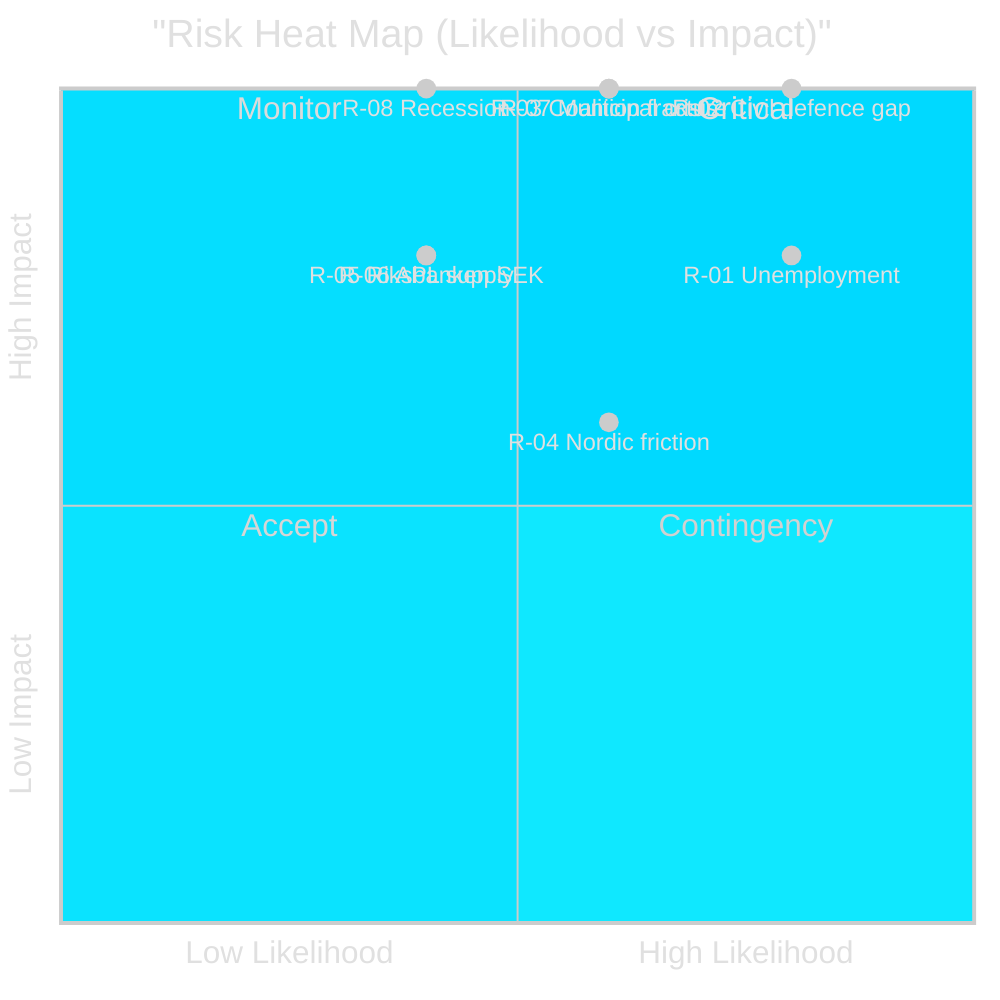

# Risk Assessment — Weekly Review 2026-04-26

**Author**: James Pether Sörling | **Framework**: 5-Dimension Political Risk Register

---

## Risk Register

| Risk ID | Risk Description | Dimension | Likelihood (1–5) | Impact (1–5) | L×I Score | Horizon |
|---------|-----------------|-----------|:----------------:|:------------:|:---------:|---------|
| R-01 | Unemployment exceeds 9% — governing coalition credibility collapse | Political | 4 | 4 | 16 | 3 months |
| R-02 | Civil defence capability gap persists post-MfcF rename | Security | 4 | 5 | 20 | 12 months |
| R-03 | Tidö coalition fracture over 2026 budget priorities | Governance | 3 | 5 | 15 | 6 months |
| R-04 | Uranium mining Nordic/EU diplomatic friction | International | 3 | 3 | 9 | 6 months |
| R-05 | Riksbanken communication breakdown — SEK depreciation | Economic | 2 | 4 | 8 | 3 months |
| R-06 | APL acquisition fails — pharmaceutical supply gap | Supply chain | 2 | 4 | 8 | 6 months |
| R-07 | Municipal civil defence inadequacy exposed in crisis scenario | Security/Governance | 3 | 5 | 15 | 6 months |
| R-08 | IMF growth downgrade materialises into recession | Economic | 2 | 5 | 10 | 9 months |

---

## Risk Detail — Top Risks

### R-02: Civil Defence Capability Gap (L×I = 20 — CRITICAL)

**Evidence**: HC03206 (Riksrevisionen) documents fragmented coordination, unclear municipal mandates, and below-target preparedness levels. HC03205 renames MSB to MfcF without specifying capability investment envelopes. Interpellation HC10752 (S's Lundqvist) directly challenges the government on municipal readiness. [A2]

**Cascading chain**: Rename without resources → municipal legal uncertainty → NATO Article 3 compliance gap → alliance credibility risk → domestic political accountability

**Posterior probability of materialising (12 months)**: ~55% (high given budget constraints identified in HC01FiU20)

**Mitigation**: Emergency capability legislation in autumn 2025 budget; direct MfcF resourcing; municipal mandate clarification

### R-01: Unemployment Threshold Breach (L×I = 16 — HIGH)

**Evidence**: HC10744–HC10746: 500,000 unemployed, youth rate at EU-high levels, disability unemployment 30%+ of long-term unemployed. IMF WEO Apr-2026 projects 1.2% growth — insufficient to meaningfully reduce structural unemployment. [A2]

**Cascading chain**: Unemployment → opposition S/V/MP narrative dominance → government approval collapse → early election scenario

**Posterior probability**: ~45% for breach to 9%, ~70% for sustained above-8% through election 2026

### R-03: Coalition Fracture (L×I = 15 — HIGH)

**Evidence**: SD has been essential for all legislation in riksmöte 2024/25. Key SD demands: higher civil defence spending, stricter immigration, nuclear energy. Budget reconciliation in autumn 2025 requires trade-offs across all three areas simultaneously. [B2]

**Cascading chain**: Budget disagreement → SD withdrawal of confidence support → Riksdag vote of no confidence → snap election

---

## Risk Heat Map

style "R-02 Civil defence gap" fill:#ff006e,stroke:#00d9ff
style "R-01 Unemployment" fill:#ff006e,stroke:#00d9ff
style "R-03 Coalition fracture" fill:#ffbe0b,stroke:#0a0e27
