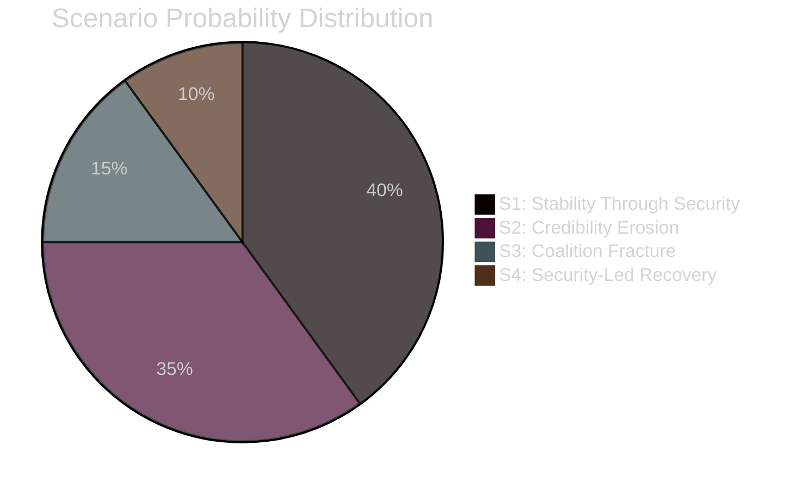

# Scenario Analysis — Weekly Review 2026-04-26

**Author**: James Pether Sörling | **Framework**: ACH-informed scenario development

---

## Scenario Framework

Based on the two key driving uncertainties identified this week:
1. **Civil defence resourcing** (will the 2026 budget include substantive MfcF capability investment?)
2. **Unemployment trajectory** (will the rate fall below 8% or exceed 9% by election 2026?)

---

## Scenario 1: Stability Through Security (Probability: 40%)

**Description**: The Tidö coalition successfully navigates autumn 2025 budget negotiations, securing SD agreement on a substantive civil-defence investment package. Unemployment stabilises at ~8.5% — not improving dramatically, but not worsening. The government enters the 2026 election with a credible security narrative (HC03205/HC03206 implementation visible) and defends the labour-line with marginal positive employment figures.

**Leading indicators**:
- 2026 budget includes MfcF capability investment ≥ SEK 2bn
- SCB AKU Q3 2025 shows ≤ 8.5% unemployment
- NATO Article 3 self-assessment: Sweden meets baseline thresholds
- SD supports budget without major public dispute

**Probability basis**: Government has institutional advantage, SD has strong incentive to maintain coalition (opposition would be S-led), fiscal space allows some civil defence spending.

**Implications**: Tidö coalition wins 2026 election with reduced majority; civil defence remains central campaign narrative.

---

## Scenario 2: Credibility Erosion (Probability: 35%)

**Description**: Unemployment remains persistently above 8.5%, the civil-defence implementation gap becomes politically visible (failed municipal preparedness test or NATO criticism), and the uranium controversy creates sustained opposition mobilisation. Government approval ratings decline significantly but the coalition holds — S cannot assemble a majority for a confidence motion.

**Leading indicators**:
- SCB AKU Q3 2025 ≥ 8.8% unemployment
- NATO partners express concern about Article 3 compliance
- Riksdag hearing on HC03205/HC03206 exposes resourcing gap
- HC03203 uranium sparks environmental protests

**Probability basis**: Current data (HC10744-HC10746 interpellations, IMF 1.2% growth projection) points toward this scenario; the question is whether the coalition holds.

**Implications**: Close 2026 election; S+MP+V potentially able to form a government; no snap election.

---

## Scenario 3: Coalition Fracture and Snap Election (Probability: 15%)

**Description**: Autumn 2025 budget negotiations fail to satisfy SD's security-spending demands. SD signals it will not support the 2026 budget, forcing either early dissolution or a minority budget. Opposition files a confidence motion.

**Leading indicators**:
- SD publicly demands civil-defence spending above government offer
- Budget framework rejected in initial Riksdag vote (October 2025)
- S tables confidence motion with V+MP co-signatories
- Riksdag arithmetic: SD + opposition = majority against government

**Probability basis**: SD has strong leverage but historically prefers governing-adjacent position to snap elections; snap election risks SD losing seats. Coalition fracture requires SD to believe opposition outcome is worse than the current trajectory — not yet met.

**Implications**: Snap election H1 2026 or late 2025; S-led bloc most likely winner; SD policy agenda substantially reversed.

---

## Scenario 4: Security-Led Recovery (Probability: 10%)

**Description**: The civil-defence investment programme (HC03205/HC03206 implementation) unexpectedly catalyses industrial investment and employment in defence and dual-use sectors. APL acquisition (HC01FiU33) marks the start of a broader supply-chain repatriation trend. Unemployment falls toward 7.5% by election 2026 driven partly by defence/security sector growth.

**Leading indicators**:
- MfcF capability contracts ≥ SEK 10bn announced H1 2026
- Employment in defence and dual-use sectors +20,000 jobs Q4 2025
- SCB AKU Q4 2025 ≤ 7.8%
- IMF revises SWE growth upward to ≥ 2%

**Probability basis**: Unlikely in the 12-month horizon given procurement timelines, but possible in 3-year horizon.

---

## Scenario Probability Summary

| Scenario | Probability | Key trigger |
|----------|------------|-------------|
| 1: Stability Through Security | 40% | Budget secures MfcF investment |
| 2: Credibility Erosion | 35% | Unemployment + implementation gap, coalition holds |
| 3: Coalition Fracture | 15% | SD withdraws support on budget |
| 4: Security-Led Recovery | 10% | Defence spending drives employment |
| **Total** | **100%** | |

---

style "S3: Coalition Fracture" fill:#ff006e,stroke:#00d9ff
style "S1: Stability Through Security" fill:#00d9ff,stroke:#ff006e
