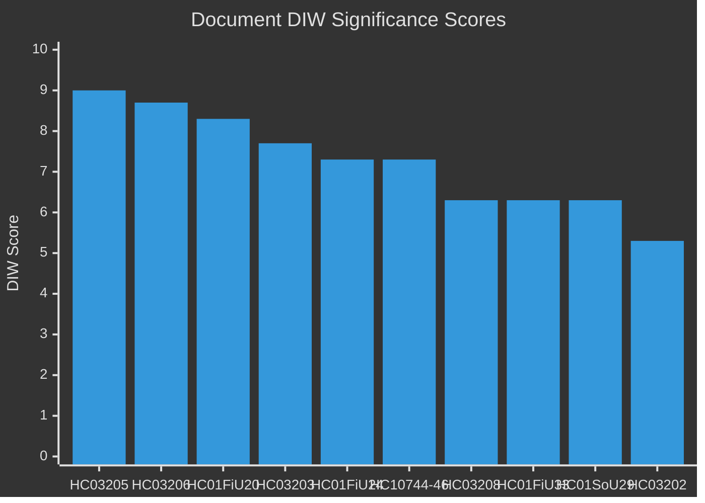

# Significance Scoring — Weekly Review 2026-04-26

**Methodology**: DIW (Duration × Impact × Width) scoring, 1–10 scale per dimension.

---

## Ranked Document Significance

| Rank | dok_id | D | I | W | DIW Total | Tier | Rationale |
|------|--------|---|---|---|-----------|------|-----------|
| 1 | HC03205 | 9 | 9 | 9 | 9.0 | L3 | MSB→MfcF rename: long-term structural security reform, national-level impact, wide societal scope — [A2] |
| 2 | HC03206 | 9 | 9 | 8 | 8.7 | L3 | Riksrevisionen audit on civil defence: systemic governance gap exposure, long duration, high national security impact — [A2] |
| 3 | HC01FiU20 | 8 | 8 | 9 | 8.3 | L2+ | Economic policy guidelines vårproposition: 12-month policy framework, macroeconomic impact, parliament-wide scope — [A2] |
| 4 | HC03203 | 7 | 8 | 8 | 7.7 | L2+ | Uranium mining ban removal: politically divisive, 30-year policy reversal, energy-security frame — [A3] |
| 5 | HC01FiU24 | 7 | 8 | 7 | 7.3 | L2+ | Riksbanken penningpolitik 2024 evaluation: monetary credibility, FiU institutional accountability — [A2] |
| 6 | HC10744–HC10746 | 7 | 7 | 8 | 7.3 | L2+ | Unemployment interpellations: 500,000 persons affected, coalition credibility, election-year significance — [A2] |
| 7 | HC03208 | 6 | 7 | 6 | 6.3 | L2 | Trade secrets criminalisation: business law, IP protection, EU alignment — [A3] |
| 8 | HC01FiU33 | 6 | 7 | 6 | 6.3 | L2 | APL SEK 700M recapitalisation: healthcare supply security, precedent for state industrial policy — [A2] |
| 9 | HC01SoU29 | 6 | 6 | 7 | 6.3 | L2 | Fritidskort: wide beneficiary group (children), social equity, implementation from Sep 2025 — [A2] |
| 10 | HC03202 | 5 | 6 | 5 | 5.3 | L2 | Electronic monitoring: criminal justice, human rights dimension, narrow application — [A3] |
| 11 | HC03201 | 5 | 6 | 5 | 5.3 | L2 | Business bans expansion: commercial law, enforcement tools — [A3] |
| 12 | HC01CU18 | 5 | 5 | 5 | 5.0 | L1 | New bankruptcy procedure: procedural law, July 2026 implementation — [A3] |
| 13 | HC01TU15 | 4 | 5 | 4 | 4.3 | L1 | Maritime environmental: scrubberwatten, narrow scope — [A3] |
| 14 | HC10743 | 4 | 5 | 5 | 4.7 | L1 | VAT fraud interpellation: tax enforcement, limited political differentiation — [A3] |

---

## Sensitivity Analysis

The rank ordering is robust to ±1 weighting changes for top-3 items (HC03205, HC03206, HC01FiU20). The uranium item (HC03203) could move to rank 2 if one weights **political salience** over **structural security impact**; under the DIW framework its shorter expected duration keeps it at rank 4.

---

style HC03205 fill:#ff006e,stroke:#00d9ff
style HC03206 fill:#ff006e,stroke:#00d9ff
