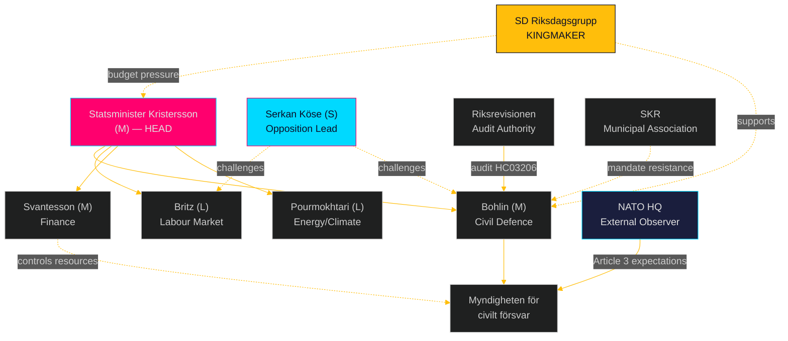

# Stakeholder Perspectives — Weekly Review 2026-04-26

**Author**: James Pether Sörling | **Framework**: 6-Lens Stakeholder Matrix

---

## Stakeholder Matrix

| Stakeholder | Role | Position on Civil Defence | Position on Uranium | Position on Unemployment | Influence Level |
|-------------|------|--------------------------|--------------------|-----------------------|----------------|
| Statsminister Ulf Kristersson (M) | Head of government | Champion (HC03205) [A2] | Support [A2] | Defensive, labour-line rhetoric | CRITICAL |
| Statsrådet Carl-Oskar Bohlin (M) | Civil defence minister | Primary architect HC03205+HC03206 [A2] | Aligned with government | N/A | HIGH |
| Arbetsmarknadsminister Johan Britz (L) | Labour market minister | Indirect (capacity) | Neutral | Defensive — interpellated HC10744-HC10746 [A2] | HIGH |
| Finansminister Elisabeth Svantesson (M) | Finance minister | Resource arbiter | Supportive | Constrained by fiscal rules | HIGH |
| Romina Pourmokhtari (L) | Climate/industry minister | N/A | Sponsor of HC03203 [A2] | N/A | MEDIUM-HIGH |
| SD Riksdagsgrupp | Governing-bloc kingmaker | Strong support; demands resources [B2] | Support (nuclear alignment) | Secondary priority | CRITICAL |
| Serkan Köse (S) | Opposition MP | Challenger via HC10752 proxy | Opposed | Lead interpellant HC10744-HC10746 [A2] | MEDIUM |
| Patrik Lundqvist (S) | Opposition MP | Direct challenger HC10752 [A2] | Neutral | Indirect | MEDIUM |
| V+MP Parliamentary groups | Opposition bloc | Critics of underfunding | Strongly opposed HC03203 [A3] | Supportive of more spending | MEDIUM |
| SKR (Sveriges Kommuner och Regioner) | Municipal association | Concerned about unfunded mandates | Neutral | Employment-related welfare costs | HIGH |
| Myndigheten för civilt försvar (MfcF) | Newly renamed agency | Institutional owner HC03205 | N/A | N/A | HIGH |
| Riksrevisionen | Audit authority | Audit owner HC03206 [A2] | N/A | N/A | HIGH |
| Riksbanken | Monetary authority | Indirect (capacity spending) | N/A | Labour market stability target | HIGH |
| NATO HQ Brussels | International actor | Close observer of HC03205/HC03206 | Interested (energy security) | N/A | HIGH |
| Norwegian/Finnish governments | Nordic partners | Supportive of civil defence | Critical of uranium [B3] | N/A | MEDIUM |

---

## Influence Network Analysis

style PM fill:#ff006e
style SD fill:#ffbe0b

## Key Stakeholder Positions — Named Actors

**Carl-Oskar Bohlin (M)**: The single most consequential minister for this weekly review. HC03205 (MfcF) + HC03206 (forwarding Riksrevisionen audit) are both his department's productions. Bohlin has established himself as the principal architect of Sweden's civil defence transformation, building personal political capital on the security agenda. His interpellation response to Lundqvist (HC10752) will set the tone for government credibility on implementation. [A2]

**Serkan Köse (S)**: Filed three unemployment interpellations on a single day (HC10744, HC10745, HC10746) targeting Arbetsmarknadsminister Britz — a coordinated opposition accountability offensive. This pattern is characteristic of S's pre-election positioning: making unemployment personally attributable to a named minister. [A2]

**Romina Pourmokhtari (L)**: Sponsoring the uranium ban removal (HC03203) under "Klimat- och näringslivsdepartementet" — an unusual pairing of a pro-climate title with pro-nuclear mining liberalisation. This reflects L's pragmatic nuclear-energy alignment and will face environmental scrutiny. [A2]
