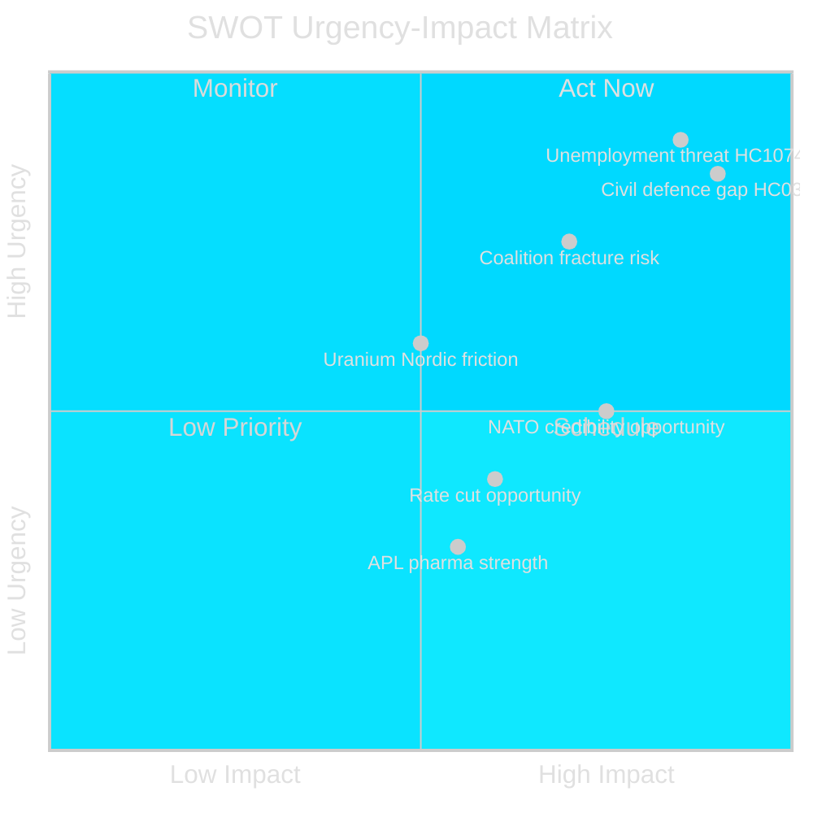

# SWOT Analysis — Weekly Review 2026-04-26

**Author**: James Pether Sörling | **Framework**: Political-SWOT with TOWS matrix

---

## SWOT Matrix

### Strengths

| Strength | Evidence | Admiralty |
|----------|----------|-----------|
| Coherent security-first agenda | HC03205 (MfcF) + HC03206 (Riksrevisionen audit submitted) as simultaneous propositions — government shows reform ownership | [A2] |
| Fiscal space maintained | HC01FiU20: spring guidelines approve budget framework; IMF (WEO Apr-2026, GGXWDG_NGDP) Sweden ~35% debt/GDP — among lowest in EU | [A2] |
| Monetary policy credibility | HC01FiU24 FiU evaluation: inflation expectations anchored at 2%; KPIF averaged 1.9% in 2024 | [A2] |
| Incremental criminal justice reforms passing | HC03208, HC03202, HC03201 — majority support in Tidö coalition; demonstrates governing competence | [A3] |
| APL supply security investment | HC01FiU33 SEK 700M — positions Sweden as self-reliant on critical pharmaceuticals; NATO supply chain alignment | [A2] |

### Weaknesses

| Weakness | Evidence | Admiralty |
|----------|----------|-----------|
| Civil defence implementation gap | HC03206 (Riksrevisionen): central coordination fragmented; municipal mandates unclear — [A2] |
| Unemployment persistently high | HC10744–HC10746: ~8.5% (~500,000 persons), youth unemployment EU-high; contradicts governing coalition's "labour line" | [A2] |
| Uranium ban removal: commercially premature | HC03203: no known economically viable Swedish uranium deposits; policy signals values, not outcomes — [B3] |
| MSB rename without substantive capability plan | HC03205: rename requires follow-on capability legislation; risk of cosmetic reform | [B2] |
| Riksbanken rate caution identified | HC01FiU24: evaluators note sub-optimal rate-cut timing in 2024; FX focus introduces opacity in communication | [B3] |

### Opportunities

| Opportunity | Evidence | Admiralty |
|-------------|----------|-----------|
| NATO Article 3 credibility boost | HC03205 + HC03206 as first civil-defence governance audit submitted to Riksdag: NATO partners will note concrete reform steps — [A3] |
| Energy independence narrative | HC03203 uranium ban removal links to nuclear expansion roadmap; synergy with Forsmark expansion discussion | [B3] |
| Election 2026 law-and-order mandate | HC03208, HC03202, HC03201 — criminal justice cluster positions government favourably with core right-of-centre electorate before 2026 | [A3] |
| Pharmaceutical supply chain leadership | HC01FiU33 APL acquisition positions Sweden as EU reference for national pharmaceutical resilience | [B3] |
| Rate cuts supporting recovery | HC01FiU24 context: Riksbanken can cut further in H2 2025; lower rates could stimulate labour market | [B3] |

### Threats

| Threat | Evidence | Admiralty |
|--------|----------|-----------|
| Unemployment breach of 9% threshold | HC10744–HC10746 establish opposition parliamentary foothold; SCB AKU Q2 2025 outcome critical — [A2] |
| Nordic diplomatic friction on uranium | HC03203: Norway and Finland may raise concerns; EU nature protection directives intersect with mining permits — [B2] |
| Civil defence resource gap | HC03206 + HC10752: without new budget allocations, MfcF risks being a renamed, under-resourced agency — [A3] |
| Coalition fracture: SD demands | SD leverage on both civil defence and uranium; any budget rebalancing in autumn 2025 could expose disagreements — [B2] |
| IMF growth downgrade | HC01FiU20 context + IMF WEO Apr-2026 ~1.2% GDP growth — slow recovery limits fiscal headroom for new security spending — [A3] |

---

## TOWS Matrix

| | **Strengths** | **Weaknesses** |
|---|---|---|
| **Opportunities** | **SO**: Use fiscal space + NATO alignment to fund MfcF capability uplift; position uranium liberalisation as energy-security investment | **WO**: Address civil defence gap via emergency capacity legislation before NATO Article 3 audit; couple unemployment policy with recovery spending |
| **Threats** | **ST**: Use criminal justice momentum to maintain coalition discipline ahead of budget; leverage monetary credibility to weather unemployment pressure | **WT**: Unemployment + coalition fracture + civil defence gap = triple simultaneous political vulnerability; requires trade-off sequencing between security spending and labour market stimulus |

---

## Cross-SWOT Patterns

- **Civil defence** appears in Strengths (agenda coherence) AND Weaknesses (implementation gap) AND Threats (resource gap) — confirming it as the most complex policy file of the week
- **Unemployment** appears in Weaknesses AND Threats — structural problem, not cyclical; policy response constrained by fiscal rules

---

style "Civil defence gap HC03206" fill:#ff006e,stroke:#00d9ff
style "Unemployment threat HC10746" fill:#ff006e,stroke:#00d9ff
