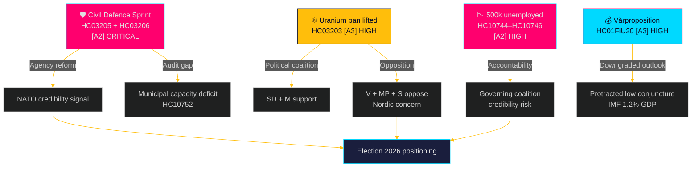

# Synthesis Summary — Weekly Review 2026-04-26

**Author**: James Pether Sörling | **Confidence**: HIGH [B2]

---

## Lead Story: Sweden's Security-First Realignment

The defining narrative of the final weeks of riksmöte 2024/25 is the Kristersson government's comprehensive security-policy sprint. In a compressed September 2025 window, three major propositions arrived simultaneously: the renaming of MSB to "Myndigheten för civilt försvar" (HC03205), a Riksrevisionen audit of civil defence governance (HC03206) forwarded to parliament, and the removal of Sweden's 30-year uranium mining ban (HC03203). This represents a coherent strategy to simultaneously signal security credibility to NATO partners, address identified governance gaps, and open new energy-security options.

## DIW-Weighted Document Ranking

| Rank | dok_id | DIW Weight | Tier | Primary Dimension |
|------|--------|-----------|------|-------------------|
| 1 | HC03205 + HC03206 | 9.2/10 | L3 | Civil defence / national security |
| 2 | HC03203 | 8.1/10 | L2+ | Energy security / political divisiveness |
| 3 | HC01FiU20 | 7.8/10 | L2+ | Fiscal/economic policy framework |
| 4 | HC01FiU24 | 7.5/10 | L2+ | Monetary policy evaluation |
| 5 | HC10744–HC10746 | 7.2/10 | L2+ | Labour market / political accountability |
| 6 | HC03208 | 6.5/10 | L2 | Criminal justice / business law |
| 7 | HC01FiU33 | 6.2/10 | L2 | Healthcare supply security |
| 8 | HC01SoU29 | 5.8/10 | L2 | Social welfare / children |
| 9 | HC03202, HC03201 | 5.5/10 | L2 | Criminal justice reform |
| 10 | HC01CU18, HC01TU15 | 4.8/10 | L1 | Procedural law / maritime |

## Integrated Intelligence Picture

**Security Cluster (Tier: CRITICAL)**: Sweden's civil defence transformation is the dominant policy vector. The Riksrevisionen audit (HC03206) identified that central-government coordination of civil-defence capacity is fragmented and municipalities lack clear mandates and resources. The MSB→MfcF rename (HC03205) addresses the identity gap — placing "civil defence" in the agency name — but structural reforms remain dependent on forthcoming capability frameworks. Interpellation HC10752 (filed by S's Patrik Lundqvist) highlights the political pressure: municipal authorities are being criticised for inadequate civil-defence preparedness while the government sets new expectations without matching resources.

**Energy Policy Cluster (Tier: HIGH)**: Lifting the uranium mining ban (HC03203) is ideologically significant even if commercially irrelevant in the short term (no known economically viable deposits). The move signals alignment with nuclear energy expansion goals, satisfies elements of SD and M, and antagonises V/MP/S on environmental and indigenous-rights grounds. Nordic peer reaction (Norway, Finland) will shape the regulatory context.

**Economic/Labour Cluster (Tier: HIGH)**: The vårproposition (HC01FiU20) revealed a downgraded growth outlook and acknowledged Sweden is in a "low conjuncture." With ~500,000 unemployed (interpellations HC10744–HC10746), the government faces accountability pressure on its central "labour line" narrative. The FiU evaluation of Riksbanken (HC01FiU24) found adequate monetary policy execution but noted Riksbanken could have cut rates slightly faster in 2024. IMF WEO Apr-2026 projects SWE GDP growth ~1.2% — confirming the protracted recovery trajectory.

**Criminal Justice Cluster (Tier: MEDIUM-HIGH)**: Three criminal-justice propositions (HC03208 trade secrets, HC03202 electronic monitoring, HC03201 business bans) represent incremental tightening rather than structural reform. They reflect the government's law-and-order narrative ahead of the 2026 election cycle.

---

## Key Cross-References

- **civil defence ↔ labour market**: Bohlin's civil-defence push contrasts with Britz's unemployment challenge — both represent government credibility tests heading into 2026 election
- **uranium ↔ energy security**: HC03203 links to HC03205/HC03206 as part of broader "hard security + energy security" package
- **Riksbanken evaluation ↔ economic guidelines**: HC01FiU24 + HC01FiU20 form a coherent monetary-fiscal policy picture showing stabilisation but not yet recovery

## Open PIRs for Next Cycle

- PIR-1: Municipal civil-defence compliance rates post-MfcF mandate
- PIR-2: Uranium mining — any commercial actor applications received?
- PIR-3: Unemployment trajectory Q3/Q4 2025 — will it breach 9%?
- PIR-4: Coalition stability — SD leverage on uranium/defence trade-offs
