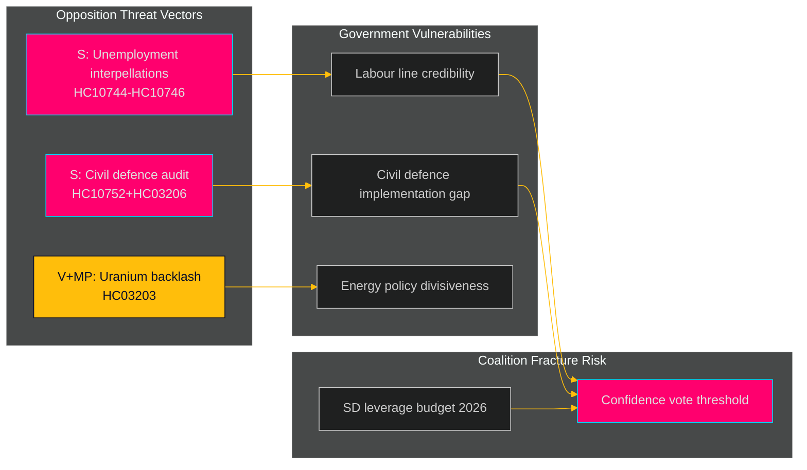

# Threat Analysis — Weekly Review 2026-04-26

**Author**: James Pether Sörling | **Framework**: Political Threat Taxonomy + TTP mapping

---

## Threat Actors

| Actor | Category | Intent | Capability | Primary Targets |
|-------|----------|--------|-----------|-----------------|
| S (Socialdemokraterna) | Opposition party | Replace Tidö government | HIGH — former governing party, strong networks | Unemployment narrative HC10744-HC10746 |
| V (Vänsterpartiet) | Opposition party | Policy reversal on uranium/nuclear | MEDIUM — issue mobilisation | HC03203 uranium; environmental coalition |
| MP (Miljöpartiet) | Opposition party | Environmental agenda | MEDIUM — re-entered Riksdag question | HC03203 uranium; nuclear energy opposition |
| SD (Sverigedemokraterna) | Coalition partner / veto player | Maximise security and immigration gains | HIGH — budget leverage | Civil defence resourcing; coalition fracture |
| Municipal Sweden (SKR) | Implementation actor | Avoid unfunded mandates | MEDIUM — political pressure | HC03205/HC03206 municipal mandates |
| Nordic partners (Norway, Finland) | International actors | Maintain Nordic environmental standards | MEDIUM — diplomatic channels | HC03203 uranium environmental norms |

---

## Attack Tree — Political Destabilisation Scenario

```
Goal: Remove Tidö government before 2026 election
Vector 1: Unemployment accountability (S primary)
  - File interpellations → force minister responses (HC10744-HC10746 EXECUTED)
  - Build narrative: labour line has failed
  - Confidence motion trigger (requires V+MP support)
Vector 2: Civil defence failure exposure (S+V+MP)
  - Use HC03206 Riksrevisionen audit to expose governance gaps
  - HC10752 Lundqvist → Bohlin exchange (EXECUTED)
  - Security-lite reform narrative
Vector 3: Uranium backlash (V+MP+S)
  - Environmental litigation against HC03203
  - Nordic coalition-building Norway Finland
  - EU nature protection challenge
```

---

## TTP Mapping (Parliamentary Domain)

| TTP ID | Technique | Tactic | Actor | Evidence |
|--------|-----------|--------|-------|---------|
| PP-T001 | Interpellation cascade | Accountability | S (Serkan Köse) | HC10744, HC10745, HC10746 — 3 unemployment interpellations in 1 day [A2] |
| PP-T002 | Riksrevisionen audit deployment | Legitimacy erosion | Opposition coalition | HC03206 submitted; triggers committee scrutiny [A2] |
| PP-T003 | Issue bundling (security + unemployment) | Coalition pressure | S+V | Simultaneous challenge on security (HC10752) and economic (HC10743-HC10746) dimensions [B3] |
| PP-T004 | Nordic diplomatic mobilisation | External pressure | V+MP | HC03203 uranium — expected bilateral approaches to Norway/Finland [B3] |
| PP-T005 | Municipal veto threat | Implementation blockage | SKR | HC03205 mandate without resources — municipal non-compliance risk [B3] |

---

## Escalation Sequence — Confidence Motion Scenario

1. **Reconnaissance**: Opposition files interpellations, maps vulnerabilities (HC10744-HC10746) [A2]
2. **Exploitation**: Unemployment exceeds 9%; civil defence failure becomes visible
3. **Escalation**: S tables motion of no confidence
4. **Execution**: V + MP support required (currently uncertain); SD decides not to support government
5. **Impact**: Snap election triggered

**Current escalation status**: Stages 1-2 active. Stage 3 probability: ~25% before 2026 election. Stage 4 conditional probability: ~20%.

---



style Opposition fill:#1a1e3d,stroke:#ff006e
style Government fill:#1a1e3d,stroke:#ffbe0b
style Coalition fill:#1a1e3d,stroke:#00d9ff
