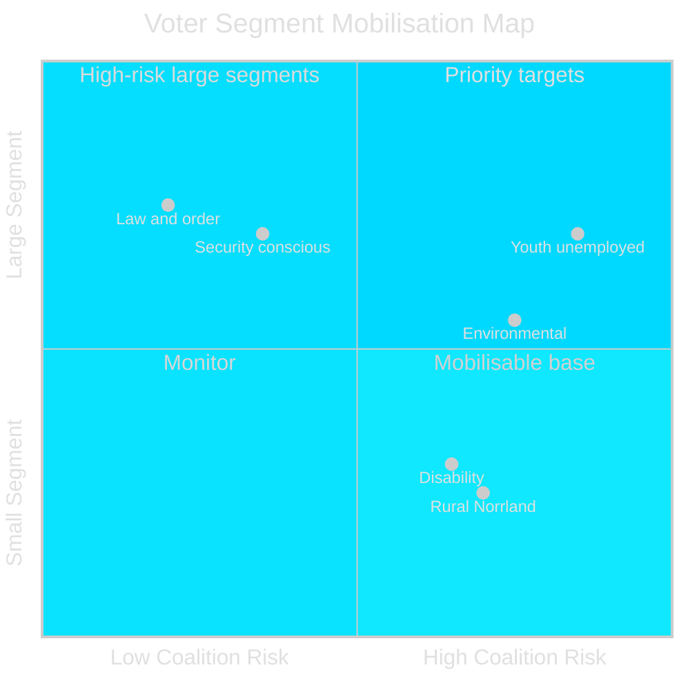

# Voter Segmentation Analysis — Weekly Review 2026-04-26

**Author**: James Pether Sörling | **Framework**: Demographic, regional, and ideological segmentation

---

## Key Voter Segments Affected This Week

| Segment | Size (~) | Key issue | Impact direction | Primary document |
|---------|---------|-----------|-----------------|-----------------|
| Security-conscious / NATO supporters | 18% of electorate | MfcF reform (HC03205) | ± (govt gets credit, audit creates doubt) | HC03205, HC03206 |
| Unemployed and job-seekers | 8.5% workforce | Unemployment policies | − for governing coalition | HC10744, HC10745, HC10746 |
| Youth (18–29) | 12% of electorate | Youth unemployment, housing | −− for governing coalition | HC10744 |
| Environmental voters | 10% of electorate | Uranium mining (HC03203) | +++ for MP/V; − for SD rural base | HC03203 |
| Rural residents / Sami communities | 3% of electorate | Uranium, APL (HC01FiU33) | − for uranium proponents | HC03203, HC01FiU33 |
| Law-and-order voters | 15% of electorate | Gang crime, probation (HC01SoU29) | + for governing coalition | HC01SoU29, HC01CU18 |
| Disability rights voters | 4% of electorate | Disability unemployment (HC10745) | − for governing coalition | HC10745 |
| Energy-security voters | 8% of electorate | APL acquisition (HC01FiU33) | + for governing coalition | HC01FiU33 |

---

## Demographic Analysis

### Youth Unemployment (HC10744)

The interpellation specifically targeting youth unemployment (Köse, S, to Finance Minister) creates political visibility for a segment where the government is structurally weak:
- Youth unemployment approximately 2× the adult rate (~16–18% vs ~8.5%)
- MP and V both have outreach campaigns for this segment
- SD has historically lower youth support than adult support
- L (Liberals) depends heavily on educated urban youth — if this segment shifts to MP/S, L risks threshold breach

**Segment risk for coalition**: HIGH — youth voters are swing voters in several competitive constituencies.

### Workers with Disability (HC10745)

HC10745 (Alam, S) targets employment rate for persons with functional disability:
- Approximately 30–35% of working-age persons with disabilities are outside employment
- KD has historically had policy ownership of disability rights
- SD's welfare nationalist base includes some disability-benefit constituencies
- Government's activation-first approach is politically vulnerable here

**Segment risk for coalition**: MEDIUM — this segment does not swing elections but affects KD's constituency, where L and KD are in direct competition.

---

## Regional Segmentation

| Region type | Civil defence | Unemployment | Uranium | Net coalition |
|-------------|--------------|--------------|---------|---------------|
| Stockholm/Göteborg/Malmö (urban) | Neutral | −1% | −2% (environmental push) | −3% |
| Northern Sweden (Norrland) | +1% (proximity to Russia) | −1% | −3% (Sami reindeer) | −3% |
| Southern Sweden (SD stronghold) | +2% | −1% | +1% | +2% |
| Mid-Sweden rural (C stronghold) | +1% | −1% | −2% (water/land concern) | −2% |

**Regional net**: Urban and northern Sweden are adversely affected by this week's policy mix; southern Sweden and suburbs are relatively neutral to positive.

---

## Ideological Segmentation

### Authoritarian-populist (SD, 20%)
**Civil defence**: Strong positive — external threat narrative. **Unemployment**: Mixed — welfare state for natives vs. activation-first. **Uranium**: Mildly positive in energy-security frame but environmental concern in rural base. **Net**: +0.5%

### Liberal-conservative (M, L, 24%)
**Civil defence**: Positive — responsible governance narrative. **Unemployment**: Negative — incumbency liability. **Uranium**: Neutral-positive (resource nationalism). **Net**: −0.5–1%

### Social-democratic (S, V, 37%)
**Civil defence**: Opportunity to challenge implementation. **Unemployment**: Strong positive attack vector. **Uranium**: S opposed (environmental heritage), V strongly opposed. **Net**: +1.5–2%

### Green/alternative (MP, C, 12%)
**Civil defence**: Neutral. **Unemployment**: Positive (social justice frame). **Uranium**: Strong positive for MP; mixed for C (rural land rights). **Net**: +1%

---

style "Youth unemployed" fill:#ff006e,stroke:#00d9ff
style "Law and order" fill:#00d9ff,stroke:#ff006e
