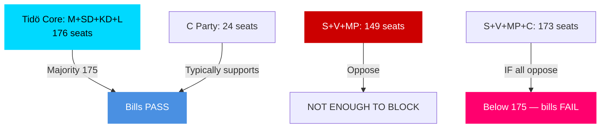

# Coalition Mathematics — Committee Reports 2026-04-27

**Author**: James Pether Sörling | **Date**: 2026-04-27

## Current Riksdag Seat Map (2025/26 Riksmöte)

| Party | Seats | Bloc |
|-------|-------|------|
| S (Socialdemokraterna) | 107 | Opposition |
| M (Moderaterna) | 68 | Tidö Government |
| SD (Sverigedemokraterna) | 73 | Tidö Government |
| C (Centerpartiet) | 24 | Tidö-adjacent |
| V (Vänsterpartiet) | 24 | Opposition |
| KD (Kristdemokraterna) | 19 | Tidö Government |
| MP (Miljöpartiet) | 18 | Opposition |
| L (Liberalerna) | 16 | Tidö Government |
| **Total** | **349** | Majority: 175 |

**Tidö core (M+SD+KD+L)**: 176 seats — one above majority  
**With C support**: up to 200 seats  
**Opposition (S+V+MP)**: 149 seats

## Pivotal Vote Analysis

| Vote Scenario | Seats | Outcome |
|---------------|-------|---------|
| Tidö core only (M+SD+KD+L) | 176 | PASSES (majority 175) |
| Tidö + C | 200 | PASSES by wide margin |
| S+V+MP oppose | 149 | Not sufficient to block |
| S+V+MP+C oppose | 173 | FAILS majority (needs 175+) — critical scenario |

**Key finding**: If C were to JOIN S+V+MP against any Tidö measure, the measure would fail. This is the structural significance of C's weapons-law reservation — even though C only reserved, not voted against, the scenario of C defection is the ONLY credible blocking mechanism.

## Sainte-Laguë Electoral Scenarios

If centre-left (S+V+MP+C) government forms post-2026 election at current polling:
- **Bloc threshold**: S+V+MP = 149 seats; need C (24) to reach 173 — still below majority
- **Require**: C + additional swing parties or weak majority
- **Assessment**: Current polling suggests competitive election; neither bloc has clear majority

## Vote Distribution Table

| Party | HD01FiU48 (expected) | HD01JuU10 (expected) |
|-------|---------------------|---------------------|
| M | Ja | Ja |
| SD | Ja | Ja |
| KD | Ja | Ja |
| L | Ja | Ja |
| C | Ja | Ja (main) / Nej (semi-auto provision) |
| S | Nej/Abstår | Nej (points 2,3) |
| V | Nej | Nej (points 2,3,4) |
| MP | Nej | Nej |

## Mermaid: Coalition Arithmetic

