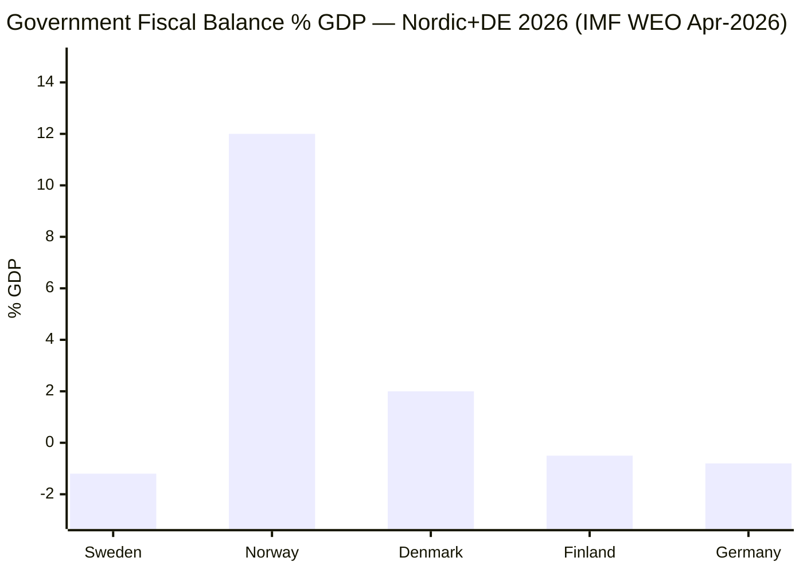

# Comparative International Analysis — Committee Reports 2026-04-27

**Author**: James Pether Sörling | **Date**: 2026-04-27

## Comparator Set

**Comparator set**: Norway, Denmark, Finland, Germany, Netherlands — Nordic peers + major EU member states relevant to weapons law and fiscal stimulus

## Outside-In Analysis

### HD01FiU48: Fuel Tax Cut and Energy Relief — Nordic/EU Context

**Norway**: Norway provides energy subsidies through a household electricity support scheme since 2021 (strøm­støtte­ordning), covering 90% of electricity price above 70 øre/kWh. Norway's petroleum revenues allow fiscal space Sweden lacks (Norway's sovereign wealth fund ~$1.7T). Sweden's approach is more targeted and limited.

**Denmark**: Denmark reduced energy taxes temporarily during 2022–2023 energy crisis but has since reversed, now prioritising green tax reform. Danish comparison suggests Sweden may face similar reversal pressure when energy prices stabilise.

**Germany**: Germany implemented a fuel-price brake (Tankrabatt) in 2022, widely criticised as ineffective and fiscally costly. The German experience suggests population energy subsidies can be regressive and environmentally counterproductive — a relevant cautionary parallel for HD01FiU48.

**IMF WEO Apr-2026 context**: Nordic countries average general government balance of approximately 0.5% GDP surplus (Norway excluded given oil revenues). Sweden at projected -1.2% GDP is the outlier — the extra budget adds minor further stimulus at an already below-average fiscal position.

### HD01JuU10: New Weapons Law — EU Comparative

**Finland**: Finland implemented EU Directive 2021/555 in 2023; experienced administrative backlog in weapons licensing (Poliisihallitus reported 18-month delays). Sweden (Polismyndigheten) should plan for similar capacity constraints.

**Netherlands**: Dutch weapons law reform in 2021 included semi-automatic restrictions similar to HD01JuU10. Hunting organisations challenged partial exemptions in Dutch courts — potential legal precedent for C's reservation.

**Germany**: German Waffengesetz amended 2020 to implement EU directive; semi-automatic rifle restrictions triggered significant hunting community protest in Bavaria, similar to C's reservation concern.

## Comparator Table

| Jurisdiction | Energy Relief (2026) | Weapons Law Reform | Fiscal Balance (IMF WEO Apr-2026) |
|-------------|---------------------|-------------------|----------------------------------|
| Sweden | HD01FiU48 — fuel tax + electricity support | HD01JuU10 — major overhaul | ~-1.2% GDP |
| Norway | Ongoing electricity subsidy scheme | Completed 2022 | +12% GDP (oil revenues) |
| Denmark | Post-crisis reversal | Aligned EU 2021/555 | ~+2% GDP |
| Finland | No 2026 measure | Implemented 2023 | ~-0.5% GDP |
| Germany | No 2026 measure | Waffengesetz 2020 | ~-0.8% GDP |

## Mermaid: Comparative Fiscal Position

