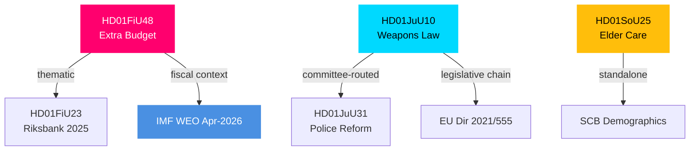

# Cross-Reference Map — Committee Reports 2026-04-27

**Author**: James Pether Sörling | **Date**: 2026-04-27

## Policy Clusters

### Cluster A: Fiscal / Energy Policy

| dok_id | Role | Relationship |
|--------|------|-------------|
| HD01FiU48 | Primary | Extra budget 2026 — fuel tax + energy support |
| HD01FiU23 | Context | Riksbank oversight — monetary context for fiscal expansion |

**Cross-reference type**: `thematic` — fiscal and monetary policy interaction; FiU48 expansive fiscal while Riksbank maintained contractionary stance through 2025

### Cluster B: Justice / Security Legislation

| dok_id | Role | Relationship |
|--------|------|-------------|
| HD01JuU10 | Primary | New Weapons Law (EU 2021/555) |
| HD01JuU31 | Context | Riksrevisionens rapport on Police Reform 2015 — implementation capacity context |

**Cross-reference type**: `committee-routed` — both through JuU; police implementation capacity relevant to weapons registry success

### Cluster C: Social Policy

| dok_id | Role | Relationship |
|--------|------|-------------|
| HD01SoU25 | Primary | Elder care and carer support |

**Cross-reference type**: standalone; no direct linkage to other April 2026 betänkanden

## Legislative Chain: Weapons Law

- **EU Directive 2021/555** (2021) → **Prop. 2025/26** (government bill, JuU referral) → **HD01JuU10 Betänkande** (2026-04-24) → **Chamber vote (pending)** → **Entry into force (~2027)**

## Coordinated Filing Patterns

- V+MP coordinated filing of reservations on both HD01FiU48 and HD01JuU10 suggests joint opposition communications strategy
- S, V, MP all filed on HD01JuU10 (different points) — thematic coordination on transition rules and licensing

## Sibling Folder Cross-References (Tier-C Context)

- See `analysis/daily/2026-04-27/week-ahead/` (if generated) for upcoming chamber vote scheduling
- See `analysis/daily/2026-04-27/motions/` (if generated) for opposition motions addressing same topics

## Mermaid: Cross-Reference Network

