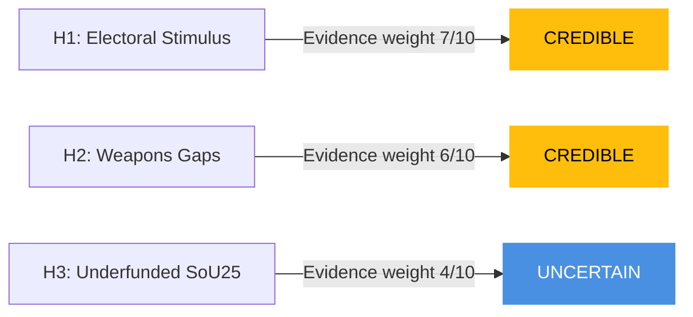

# Devil's Advocate Analysis — Committee Reports 2026-04-27

**Author**: James Pether Sörling | **Date**: 2026-04-27

## ACH Matrix — Competing Hypotheses

### Hypothesis H1: Extra Budget is Pure Electoral Stimulus with No Economic Justification (Dominant narrative)

**Evidence FOR**: Fuel tax cut reverses established green-tax trajectory; timed 5 months before election; V+MP filed reservations citing environmental grounds; IMF does not recommend further fiscal expansion for Sweden in WEO Apr-2026 context.

**Evidence AGAINST**: Global energy price volatility in 2025–2026 created genuine household pressure; Sweden's energy transition requires bridge financing; electricity grid constraints justify temporary support.

**ACH Score**: CREDIBLE — supported by timing evidence [B2] but not conclusive

### Hypothesis H2: Weapons Law is Political Compromise That Creates Enforcement Gaps

**Evidence FOR**: Centre Party reservation on semi-auto hunting specifically suggests political pressure diluted the law; four reservation groups indicate multiple compromises were made; Riksrevisionens rapport (HD01JuU31) on police reform suggests Polismyndigheten capacity is limited.

**Evidence AGAINST**: The JuU majority analysis (structure confirmed from HD01JuU10 document) indicates the committee found the law meets EU 2021/555 requirements; Legal Council (Lagrådet) typically scrutinises such legislation before committee stage.

**ACH Score**: CREDIBLE — enforcement gap risk is real given police capacity evidence [B2]

### Hypothesis H3: SoU25 Elder-Care Provisions are Underfunded Promises

**Evidence FOR**: Municipal funding for elder care is consistently under pressure (SALAR/SKR annual survey); SoU25 metadata only retrieved — full financial impact unclear; Sweden has structural gap between demand and supply of home care services.

**Evidence AGAINST**: The betänkande exists (dok_id HD01SoU25) and passed with broad support — suggests cross-party validation of funding adequacy.

**ACH Score**: UNCERTAIN — requires full text review of financial impact assessment [C2]

## Red-Team Challenge

**Challenge to dominant narrative (H1)**:
The analyst's inclination to frame HD01FiU48 as purely electoral is contested by the legitimate economic argument that Swedish households with oil heating face genuine hardship from energy price volatility. A Red Team would argue the measure is rational welfare policy that happens to have electoral timing.

**Challenge to H2**:
Even with reservations from four party groups, the JuU majority reflects a considered balancing act between EU compliance, public safety, and rural traditional rights. The existence of reservations is itself a sign of democratic health, not necessarily policy weakness.

## Rejected Alternatives

- **"Riksdag is rubber-stamping government proposals"** — REJECTED: Multiple reservations and committee scrutiny of all four documents demonstrate independent legislative review
- **"Sweden is isolated in EU on energy policy"** — REJECTED: Multiple EU member states have similar household energy relief measures in 2025–2026

## Mermaid: ACH Confidence

