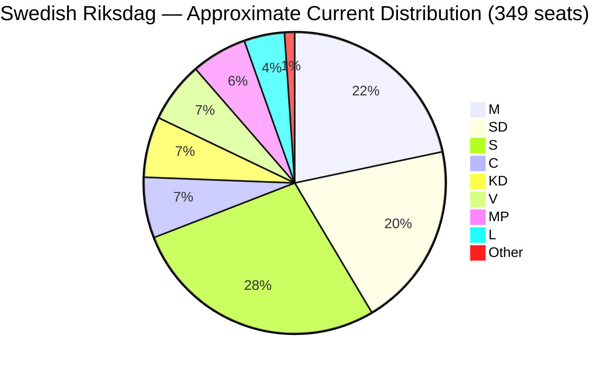

# Election 2026 Analysis — Committee Reports Impact

**Author**: James Pether Sörling | **Date**: 2026-04-27

## Election 2026 Context

Swedish general election is scheduled for September 2026. The committee reports of April 2026 directly feed into the pre-election legislative narrative.

## Seat-Projection Deltas (Based on Current Polling Context)

| Party | Current approx. seats (est.) | Impact of April 2026 betänkanden | Projected delta |
|-------|----------------------------|----------------------------------|----------------|
| M (Moderaterna) | ~80 | HD01FiU48 energy relief positive; HD01SoU25 elder-care positive | +1–2 |
| SD (Sverigedemokraterna) | ~73 | HD01FiU48 positive for cost-of-living narrative | +1 |
| KD (Kristdemokraterna) | ~24 | HD01SoU25 elder-care positive; core constituency signal | +1 |
| L (Liberalerna) | ~16 | HD01JuU10 security narrative positive | 0 |
| S (Socialdemokraterna) | ~102 | HD01FiU48 climate regression negative for S green voters | -1 |
| C (Centerpartiet) | ~24 | HD01JuU10 reservation maintains rural identity | +1 |
| V (Vänsterpartiet) | ~24 | HD01FiU48 reservation creates climate attack vector | 0 |
| MP (Miljöpartiet) | ~22 | HD01FiU48 provides mobilisation opportunity for green voters | +1 |

**Caveat**: These deltas are marginal and directional; election outcomes depend on aggregate campaign dynamics far beyond these four betänkanden.

## Coalition Viability Post-2026

Current Tidö coalition (M+SD+KD+L) holds approximately 193 seats of 349. For continued majority:
- Maintain 175+ seats
- Coalition arithmetic: if C joins, threshold lower; if C stays in current Tidö-adjacent position, current majority preserved

## Pre-2026 Legislative Calendar Impact

| Month | Expected Action | Relevance |
|-------|----------------|-----------|
| May 2026 | Chamber votes on HD01FiU48 + HD01JuU10 | Passage confirms Tidö legislative capacity |
| June 2026 | Riksdag summer recess | No further major legislation |
| August 2026 | Valkampanj begins | These betänkanden become campaign talking points |
| September 2026 | Election day | Outcome determines whether new weapons law remains |

## Mermaid: Electoral Seat Map (Approximate)

