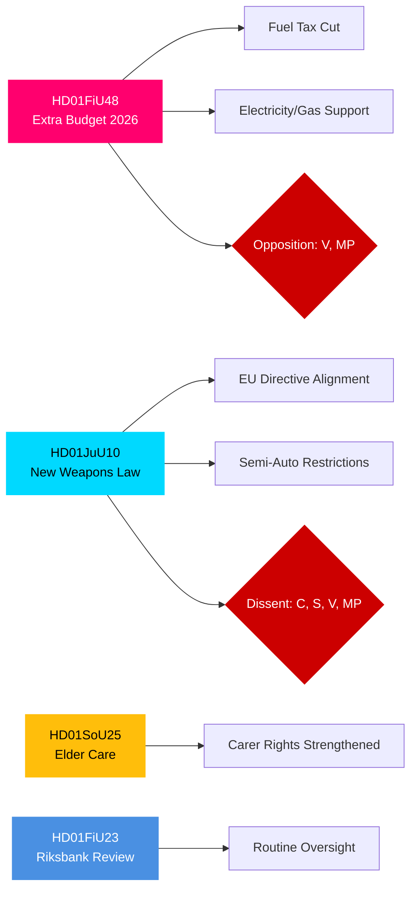

# Executive Brief — Swedish Parliamentary Committee Reports, 27 April 2026

**Author**: James Pether Sörling | **Classification**: PUBLIC | **Confidence**: HIGH | **Date**: 2026-04-27

## 🎯 BLUF

The Swedish Riksdag's committee reports dated 24 April 2026 present a triple legislative front of immediate fiscal, criminal-justice and social significance. The Finance Committee (FiU) recommends approving the government's supplementary budget cutting fuel taxes and introducing electricity/gas price support — a fiscally expansive measure backed by the Tidö coalition (M, SD, KD, L) but opposed by V and MP. The Justice Committee (JuU) advances Sweden's most comprehensive overhaul of firearms legislation in decades, implementing EU directive alignment and tightening licensing — with Centre Party dissenting on semi-automatic hunting weapons. The Social Affairs Committee (SoU) endorses strengthened elderly care provisions, extending carer-recognition rights. Taken together, these decisions signal cost-of-living policy activation, security tightening, and social contract maintenance heading toward the 2026 election.

## 🔑 Decisions This Brief Supports

1. **Fiscal risk assessment**: Should the supplementary budget's energy-relief measures be viewed as sustainable or as election-year stimulus creating medium-term consolidation risk?
2. **Rule of law tracking**: Does the new weapons law represent genuine security gain or a compromise that leaves gaps?
3. **Social contract monitoring**: Will the elder-care provisions shift support for the Tidö coalition among key demographic segments before September 2026?

## ⚡ 60-Second Intelligence Read

- **HD01FiU48** [B2]: Supplementary budget — fuel-tax cut + electricity/gas support. V and MP filed dissenting reservations. Estimated fiscal impulse: positive household income effect offset by climate-policy regression. FiU approved committee recommendation.
- **HD01JuU10** [B2]: New Weapons Law replacing 1996 legislation. Implements EU Directive 2021/555. Reservations from C (semi-auto hunting ban), S/V/MP (transition rules, 5-year permits, supervision). JuU majority approved.
- **HD01SoU25** [B2]: Elder care and carer-support strengthening. Broadly cross-party support with minor reservations.
- **HD01FiU23** [B3]: Riksbank operations review 2025 — routine oversight, FiU broadly endorsed.

## 🔭 Top Forward Trigger

**Watch**: Chamber vote on HD01FiU48 (expected within 10 days). If V or MP proposals gain unexpected cross-Tidö support, it signals coalition instability ahead of the September 2026 election.

## Confidence Distribution

| Domain | Confidence | Basis |
|--------|-----------|-------|
| Fiscal measures | HIGH | FiU48 structure confirmed; reservations documented |
| Weapons law | HIGH | JuU10 structure + reservation parties confirmed |
| Elder care | MEDIUM | SoU25 metadata only; no full text retrieved |
| Riksbank oversight | MEDIUM | FiU23 metadata only |

## Mermaid: Key Legislative Clusters

