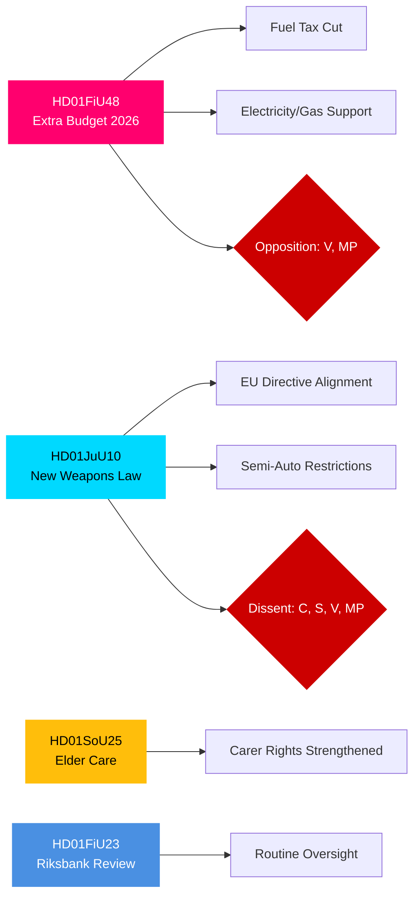

<!-- dir: rtl -->
# موجز تنفيذي — تقارير لجان الريكسداغ السويدي، 27 أبريل 2026

**المؤلف**: James Pether Sörling | **التصنيف**: PUBLIC | **درجة الثقة**: HIGH | **التاريخ**: 2026-04-27

## 🎯 BLUF

تُقدِّم تقارير لجان الريكسداغ المؤرَّخة في 24 أبريل 2026 ثلاثة محاور تشريعية ذات أهمية فورية على الصعيدين المالي والجنائي والاجتماعي. توصي لجنة المالية (FiU) بالموافقة على الميزانية التكميلية للحكومة التي تخفِّض ضريبة الوقود وتُقدِّم دعمًا لأسعار الكهرباء والغاز — وهو إجراء توسعي ماليًا تدعمه تحالف تيدو (M, SD, KD, L) لكن يعارضه حزبا V وMP. تُعزِّز لجنة العدل (JuU) أشمل إصلاح لتشريعات الأسلحة النارية منذ عقود، مُطبِّقةً التوافق مع التوجيه الأوروبي ومُشدِّدةً شروط الترخيص — مع معارضة حزب الوسط للأسلحة الصيدية شبه الآلية. تُقرُّ لجنة الشؤون الاجتماعية (SoU) أحكامًا مُعزَّزة لرعاية المسنِّين مع توسيع حقوق الاعتراف بمقدِّمي الرعاية. وتُشير هذه القرارات مجتمعةً إلى تفعيل سياسة تكاليف المعيشة، وتشديد الأمن، والحفاظ على العقد الاجتماعي في الاتجاه نحو انتخابات عام 2026.

## 🔑 القرارات التي يدعمها هذا الموجز

1. **تقييم المخاطر المالية**: هل ينبغي النظر إلى إجراءات تخفيف أعباء الطاقة في الميزانية التكميلية باعتبارها مستدامة أم محفِّزات انتخابية تُفضي إلى مخاطر توحيد على المدى المتوسط؟
2. **رصد سيادة القانون**: هل يمثِّل قانون الأسلحة الجديد مكسبًا أمنيًا حقيقيًا أم تسويةً تترك ثغرات؟
3. **رصد العقد الاجتماعي**: هل ستُعيد أحكام رعاية المسنِّين توزيع الدعم لتحالف تيدو بين الشرائح الديموغرافية الرئيسية قبل سبتمبر 2026؟

## ⚡ قراءة استخباراتية في 60 ثانية

- **HD01FiU48** [B2]: الميزانية التكميلية — خفض ضريبة الوقود + دعم أسعار الكهرباء والغاز. أودع حزبا V وMP تحفُّظات مخالِفة. الدفع المالي المُقدَّر: أثر إيجابي على دخل الأسرة يُقابله تراجع في السياسة المناخية. أقرَّت FiU توصية اللجنة.
- **HD01JuU10** [B2]: قانون أسلحة جديد يحلُّ محلَّ تشريع 1996. يُطبِّق التوجيه الأوروبي 2021/555. تحفُّظات من C (حظر الأسلحة الصيدية شبه الآلية)، وS/V/MP (قواعد انتقالية، تصاريح 5 سنوات، إشراف). وافقت أغلبية JuU.
- **HD01SoU25** [B2]: أحكام معزَّزة لرعاية المسنِّين ودعم مقدِّمي الرعاية. دعم واسع متعدِّد الأحزاب مع تحفُّظات طفيفة.
- **HD01FiU23** [B3]: مراجعة عمليات Riksbank عام 2025 — إشراف روتيني، وافقت FiU بشكل عام.

## 🔭 أبرز المُحرِّكات الاستشرافية

**مراقبة**: التصويت في الغرفة على HD01FiU48 (متوقَّع خلال 10 أيام). إذا نالت مقترحات V أو MP دعمًا مُفاجئًا من داخل تحالف تيدو، فهذا مؤشِّر على عدم استقرار الائتلاف قبيل انتخابات سبتمبر 2026.

## توزيع درجة الثقة

| المجال | درجة الثقة | الأساس |
|--------|-----------|--------|
| الإجراءات المالية | HIGH | هيكل FiU48 مؤكَّد؛ التحفُّظات موثَّقة |
| قانون الأسلحة | HIGH | هيكل JuU10 + أحزاب التحفُّظ مؤكَّدة |
| رعاية المسنِّين | MEDIUM | بيانات وصفية SoU25 فقط؛ لم يُسترجع النص الكامل |
| إشراف Riksbank | MEDIUM | بيانات وصفية FiU23 فقط |

## Mermaid: أبرز المجموعات التشريعية

<!-- source-sha: aaa1f5305a47d8833d5b335e4d7ccd94784487c6 -->
