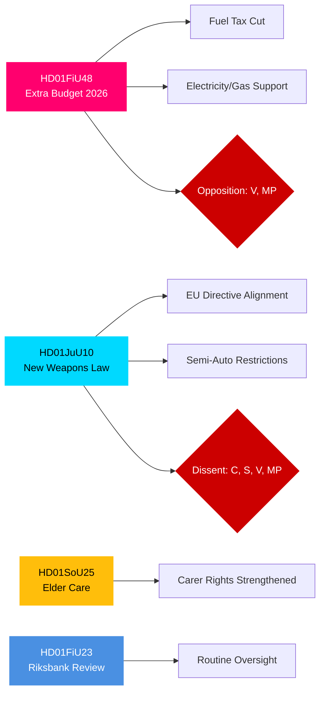

# Eksekutiv oversigt — Det svenske Riksdags udvalgsberetninger, 27. april 2026

**Forfatter**: James Pether Sörling | **Klassificering**: PUBLIC | **Konfidensgrad**: HIGH | **Dato**: 2026-04-27

## 🎯 BLUF

Riksdagens udvalgsberetninger dateret 24. april 2026 præsenterer tre lovgivningsfronter af umiddelbar fiskal, strafferetlig og social betydning. Finansudvalget (FiU) anbefaler godkendelse af regeringens tillægsbudget med sænket brændstofafgift og støtte til el- og gaspriser — en finansekspansiv foranstaltning støttet af Tidö-koalitionen (M, SD, KD, L), men modsat af V og MP. Justitsudvalget (JuU) fremmer den mest omfattende reform af våbenlovgivningen i årtier, implementerer EU-direktiv og stramning af licensregler — med Centerpartiet som dissidenter vedrørende halvautomatiske jagtrifler. Socialudvalget (SoU) godkender styrkede bestemmelser om ældrepleje med udvidede rettigheder for pårørendepassere. Tilsammen signalerer disse beslut aktivering af leveomkostningspolitik, skærpet sikkerhed og vedligeholdelse af den sociale kontrakt frem mod valget i 2026.

## 🔑 Beslutninger denne oversigt understøtter

1. **Fiskal risikovurdering**: Bør tillægsbudgettets energiafhjælpningsforanstaltninger ses som bæredygtige eller som valårsstimuli, der skaber konsolideringsrisiko på mellemlang sigt?
2. **Retsstatsovervågning**: Repræsenterer den nye våbenlov en reel sikkerhedsgevinst eller et kompromis, der efterlader huller?
3. **Social kontraktovervågning**: Vil ældreplejebestemmelserne forskyde støtten til Tidö-koalitionen blandt vigtige demografiske segmenter inden september 2026?

## ⚡ 60-sekunders efterretningslæsning

- **HD01FiU48** [B2]: Tillægsbudget — sænket brændstofafgift + støtte til el- og gaspriser. V og MP indgav afvigende forbehold. Estimeret fiskal impuls: positiv husholdningsindkomsteffekt modvejet af klimapolitisk tilbagegang. FiU godkendte udvalgets anbefaling.
- **HD01JuU10** [B2]: Ny våbenlov, der erstatter 1996-lovgivningen. Implementerer EU-direktiv 2021/555. Forbehold fra C (halvautomatisk jagtvåbenforbud), S/V/MP (overgangsregler, 5-årstilladelser, tilsyn). JuU-flertallet godkendte.
- **HD01SoU25** [B2]: Styrkede bestemmelser om ældrepleje og pårørendestøtte. Bred tværpartilig støtte med mindre forbehold.
- **HD01FiU23** [B3]: Gennemgang af Riksbankens drift 2025 — rutinemæssigt tilsyn, FiU godkendte overordnet.

## 🔭 Øverste fremadrettede udløser

**Følg med**: Afstemning i Kammeret om HD01FiU48 (forventet inden for 10 dage). Hvis V's eller MP's forslag uventet vinder støtte på tværs af Tidö, signalerer det koalitionsinstabilitet inden september 2026-valget.

## Konfidensfordeling

| Domæne | Konfidensgrad | Grundlag |
|--------|---------------|---------|
| Finansielle foranstaltninger | HIGH | FiU48-struktur bekræftet; forbehold dokumenteret |
| Våbenlovgivning | HIGH | JuU10-struktur + reservationspartier bekræftet |
| Ældrepleje | MEDIUM | Kun SoU25-metadata; ingen fuldtekst hentet |
| Riksbank-tilsyn | MEDIUM | Kun FiU23-metadata |

## Mermaid: Vigtige lovgivningsklynger

<!-- source-sha: aaa1f5305a47d8833d5b335e4d7ccd94784487c6 -->
