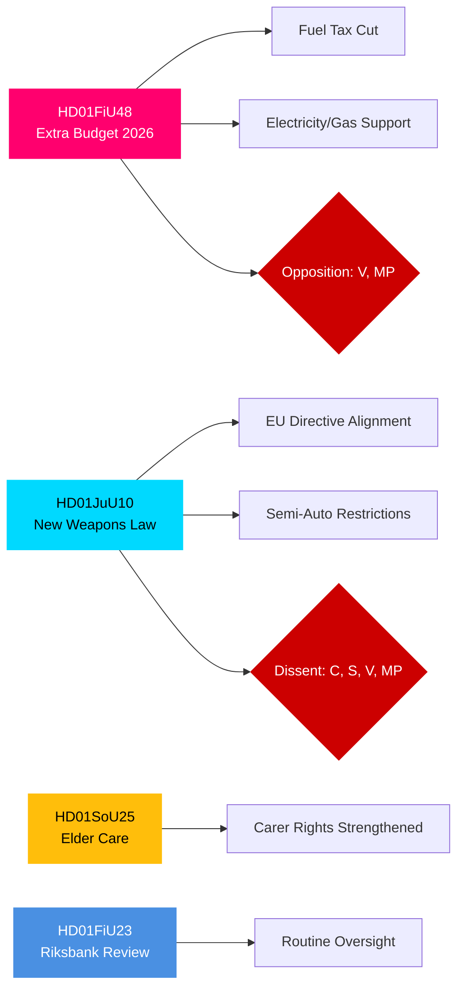

# Exekutivbericht — Ausschussberichte des schwedischen Riksdag, 27. April 2026

**Autor**: James Pether Sörling | **Klassifizierung**: PUBLIC | **Konfidenzgrad**: HIGH | **Datum**: 2026-04-27

## 🎯 BLUF

Die Ausschussberichte des Riksdag vom 24. April 2026 präsentieren drei legislative Fronten von unmittelbarer fiskalischer, strafrechtlicher und sozialer Bedeutung. Der Finanzausschuss (FiU) empfiehlt die Annahme des Nachtragshaushalts der Regierung mit gesenkter Kraftstoffsteuer und Stützung von Strom- und Gaspreisen — eine fiskalisch expansive Maßnahme, die von der Tidö-Koalition (M, SD, KD, L) unterstützt, von V und MP jedoch abgelehnt wird. Der Justizausschuss (JuU) befördert die umfassendste Reform des schwedischen Waffenrechts seit Jahrzehnten, setzt EU-Richtlinien um und verschärft Lizenzanforderungen — die Zentrumspartei stimmte bezüglich halbautomatischer Jagdwaffen dagegen. Der Sozialausschuss (SoU) billigt gestärkte Altenpflegevorschriften mit erweiterten Pflegenden-Anerkennungsrechten. Diese Entscheidungen signalisieren zusammen die Aktivierung von Lebenshaltungskostenpolitik, Sicherheitsverschärfung und Pflege des sozialen Kontrakts im Vorfeld der Wahl 2026.

## 🔑 Entscheidungen, die dieser Bericht unterstützt

1. **Fiskalische Risikoabschätzung**: Sollten die Energiehilfemaßnahmen des Nachtragshaushalts als nachhaltig oder als Wahljahrsstimulus mit mittelfristigem Konsolidierungsrisiko betrachtet werden?
2. **Rechtsstaatsverfolgung**: Stellt das neue Waffengesetz einen echten Sicherheitsgewinn dar oder einen Kompromiss, der Lücken hinterlässt?
3. **Wohlfahrtsvertrag-Monitoring**: Werden die Altenpflegevorschriften die Unterstützung für die Tidö-Koalition unter wichtigen demografischen Segmenten vor September 2026 verschieben?

## ⚡ 60-Sekunden-Nachrichtenüberblick

- **HD01FiU48** [B2]: Nachtragshaushalt — Kraftstoffsteuersenkung + Strom-/Gaspreisunterstützung. V und MP reichten abweichende Vorbehalte ein. Geschätzter fiskalischer Impuls: positiver Haushaltseinkommenseffekt, ausgeglichen durch klimapolitischen Rückschritt. FiU genehmigte Ausschussempfehlung.
- **HD01JuU10** [B2]: Neues Waffengesetz als Ersatz für die Gesetzgebung von 1996. Setzt EU-Richtlinie 2021/555 um. Vorbehalte von C (Verbot halbautomatischer Jagdwaffen), S/V/MP (Übergangsregeln, 5-Jahres-Genehmigungen, Aufsicht). JuU-Mehrheit stimmte zu.
- **HD01SoU25** [B2]: Gestärkte Altenpflege- und Pflegenden-Unterstützungsvorschriften. Breite fraktionsübergreifende Unterstützung mit geringfügigen Vorbehalten.
- **HD01FiU23** [B3]: Überprüfung des Riksbank-Betriebs 2025 — Routineaufsicht, FiU stimmte weitgehend zu.

## 🔭 Wichtigster Vorwärtsauslöser

**Beobachten**: Kammerabstimmung zu HD01FiU48 (innerhalb von 10 Tagen erwartet). Wenn V- oder MP-Vorschläge unerwartet koalitionsübergreifende Unterstützung innerhalb von Tidö erhalten, signalisiert dies Koalitionsinstabilität vor der Septemberwahl 2026.

## Konfidenzverteilung

| Bereich | Konfidenzgrad | Grundlage |
|---------|---------------|-----------|
| Fiskalische Maßnahmen | HIGH | FiU48-Struktur bestätigt; Vorbehalte dokumentiert |
| Waffenrecht | HIGH | JuU10-Struktur + Vorbehaltsparteien bestätigt |
| Altenpflege | MEDIUM | Nur SoU25-Metadaten; kein Volltext abgerufen |
| Riksbank-Aufsicht | MEDIUM | Nur FiU23-Metadaten |

## Mermaid: Wichtige Gesetzgebungscluster

<!-- source-sha: aaa1f5305a47d8833d5b335e4d7ccd94784487c6 -->
