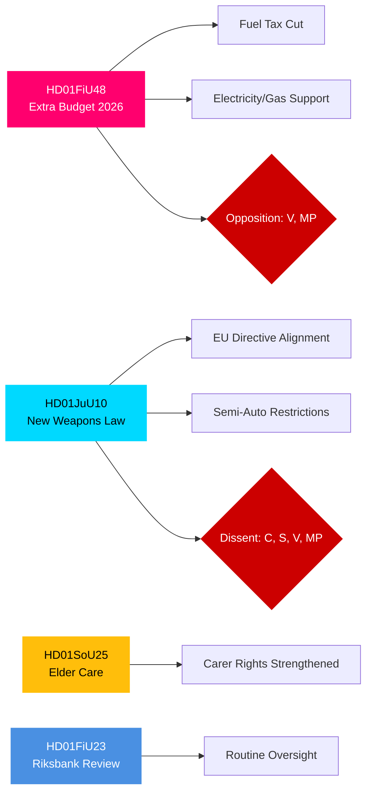

# Informe ejecutivo — Informes de comités del Riksdag sueco, 27 de abril de 2026

**Autor**: James Pether Sörling | **Clasificación**: PUBLIC | **Grado de confianza**: HIGH | **Fecha**: 2026-04-27

## 🎯 BLUF

Los informes de los comités del Riksdag con fecha 24 de abril de 2026 presentan tres frentes legislativos de inmediata importancia fiscal, penal y social. El Comité de Finanzas (FiU) recomienda aprobar el presupuesto suplementario del gobierno que reduce el impuesto sobre los combustibles e introduce apoyo a los precios de la electricidad y el gas — una medida fiscalmente expansiva respaldada por la coalición Tidö (M, SD, KD, L) pero opuesta por V y MP. El Comité de Justicia (JuU) promueve la revisión más completa de la legislación sobre armas de fuego en décadas, implementando la alineación con la directiva de la UE y endureciendo los requisitos de licencia — con el Partido del Centro disintiendo sobre las armas de caza semiautomáticas. El Comité de Asuntos Sociales (SoU) respalda disposiciones reforzadas sobre atención a personas mayores, ampliando los derechos de reconocimiento de los cuidadores. En conjunto, estas decisiones señalan la activación de una política de coste de la vida, el endurecimiento de la seguridad y el mantenimiento del contrato social de cara a las elecciones de 2026.

## 🔑 Decisiones que apoya este informe

1. **Evaluación del riesgo fiscal**: ¿Deben considerarse sostenibles las medidas de alivio energético del presupuesto suplementario o como un estímulo electoral que crea un riesgo de consolidación a medio plazo?
2. **Seguimiento del Estado de Derecho**: ¿Representa la nueva ley de armas una ganancia de seguridad real o un compromiso que deja lagunas?
3. **Monitorización del contrato social**: ¿Desplazarán las disposiciones sobre atención a personas mayores el apoyo a la coalición Tidö entre segmentos demográficos clave antes de septiembre de 2026?

## ⚡ Lectura de inteligencia en 60 segundos

- **HD01FiU48** [B2]: Presupuesto suplementario — reducción del impuesto sobre combustibles + apoyo a precios de electricidad/gas. V y MP presentaron reservas disidentes. Impulso fiscal estimado: efecto positivo en los ingresos de los hogares contrarrestado por la regresión de la política climática. FiU aprobó la recomendación del comité.
- **HD01JuU10** [B2]: Nueva Ley de Armas que reemplaza la legislación de 1996. Implementa la Directiva UE 2021/555. Reservas de C (prohibición de armas de caza semiautomáticas), S/V/MP (normas de transición, permisos de 5 años, supervisión). La mayoría de JuU aprobó.
- **HD01SoU25** [B2]: Disposiciones reforzadas de atención a personas mayores y apoyo a cuidadores. Amplio apoyo transversal con reservas menores.
- **HD01FiU23** [B3]: Revisión de las operaciones del Riksbank 2025 — supervisión rutinaria, FiU aprobó en general.

## 🔭 Principal desencadenante prospectivo

**A vigilar**: Votación de la Cámara sobre HD01FiU48 (prevista en 10 días). Si las propuestas de V o MP obtienen un apoyo inesperado dentro de Tidö, señala inestabilidad de la coalición de cara a las elecciones de septiembre de 2026.

## Distribución de confianza

| Dominio | Grado de confianza | Base |
|---------|-------------------|------|
| Medidas fiscales | HIGH | Estructura FiU48 confirmada; reservas documentadas |
| Ley de armas | HIGH | Estructura JuU10 + partidos de reserva confirmados |
| Atención a personas mayores | MEDIUM | Solo metadatos SoU25; no se recuperó texto completo |
| Supervisión del Riksbank | MEDIUM | Solo metadatos FiU23 |

## Mermaid: Principales grupos legislativos

<!-- source-sha: aaa1f5305a47d8833d5b335e4d7ccd94784487c6 -->
