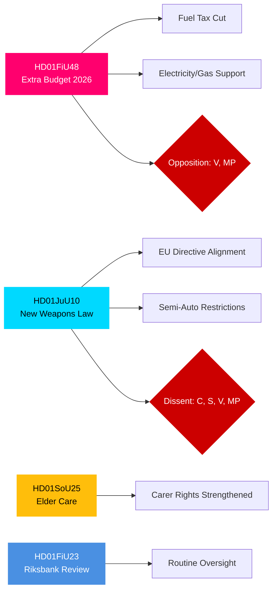

# Johdon yhteenveto — Ruotsin valtiopäivien valiokuntamietinnöt, 27. huhtikuuta 2026

**Kirjoittaja**: James Pether Sörling | **Luokitus**: PUBLIC | **Luotettavuusaste**: HIGH | **Päivämäärä**: 2026-04-27

## 🎯 BLUF

Riksdagenin valiokuntamietinnöt, päivätty 24. huhtikuuta 2026, esittävät kolme lainsäädäntörintamaa, joilla on välitöntä finanssi-, rikoslainsäädäntö- ja sosiaalista merkitystä. Valtiovarainvaliokunta (FiU) suosittelee hallituksen lisätalousarvion hyväksymistä polttoaineveron alennuksineen ja sähkö- ja kaasuhintatukea — taloudellisesti ekspansiivinen toimenpide, jota Tidö-koalitio (M, SD, KD, L) tukee, mutta V ja MP vastustavat. Lakivaliokunta (JuU) edistää Ruotsin kattavinta asela­insäädän­töuudistusta vuosikymmeniin toteuttaen EU-direktiivin mukaistamisen ja tiukentamalla lupavaatimuksia — Keskustapuolue esitti eriävän mielipiteen puoliautomaattisten metsästysaseiden osalta. Sosialivaliokunta (SoU) hyväksyy vahvistetut vanhustenhoitomääräykset laajentaen omaishoidon oikeuksia. Nämä päätökset yhdessä merkitsevät elinkustannuspolitiikan aktivointia, turvallisuuden tiukentamista ja sosiaalisen sopimuksen ylläpitoa kohti vuoden 2026 vaaleja.

## 🔑 Päätökset, joita tämä yhteenveto tukee

1. **Finansiriskiarvio**: Tulisiko lisätalousarvion energiahelpotustoimenpiteitä pitää kestävinä vai vaalikauden ärsykkeenä, joka luo keskipitkän aikavälin konsolidointiriskin?
2. **Oikeusvaltion seuranta**: Edustaako uusi asela­ki todellista turvallisuushyötyä vai kompromissia, joka jättää aukkoja?
3. **Sosiaalisen sopimuksen seuranta**: Siirtävätkö vanhustenhoitomääräykset tukea Tidö-koalitiolle keskeisten demografisten segmenttien keskuudessa ennen syyskuuta 2026?

## ⚡ 60 sekunnin tiedustelulukeminen

- **HD01FiU48** [B2]: Lisätalousarvio — polttoaineveron alennus + sähkö- ja kaasuhintatuki. V ja MP jättivät eriävät varaumat. Arvioitu finanssi-impulssi: positiivinen kotitalouksien tulovaikutus kompensoituu ilmastopolitiikan taantumisella. FiU hyväksyi valiokuntasuosituksen.
- **HD01JuU10** [B2]: Uusi asela­ki korvaa vuoden 1996 lainsäädännön. Toteuttaa EU-direktiivin 2021/555. Varaumat C:ltä (puoliautomaattinen metsästysasekielto), S/V/MP (siirtymäsäännöt, 5-vuoden luvat, valvonta). JuU:n enemmistö hyväksyi.
- **HD01SoU25** [B2]: Vahvistetut vanhustenhoito- ja omaishoidon tukimääräykset. Laaja puoluerajat ylittävä tuki pienin varauksin.
- **HD01FiU23** [B3]: Riksbankenin toiminnan tarkastelu 2025 — rutiininomainen valvonta, FiU hyväksyi pääosin.

## 🔭 Tärkein eteenpäin katsova laukaisija

**Seuraa**: Täysistuntoäänestys asiasta HD01FiU48 (odotetaan 10 päivän kuluessa). Jos V:n tai MP:n ehdotukset saavat odottamattomasti Tidö-koalition ristikkäistukea, se merkitsee koalition epävakautta ennen syyskuun 2026 vaaleja.

## Luotettavuusjakauma

| Toimiala | Luotettavuusaste | Perusta |
|----------|-----------------|---------|
| Finanssitoimenpiteet | HIGH | FiU48-rakenne vahvistettu; varaumat dokumentoitu |
| Asela­insäädäntö | HIGH | JuU10-rakenne + varauma­puolueet vahvistettu |
| Vanhustenhoito | MEDIUM | Vain SoU25-metadata; kokotekstiä ei haettu |
| Riksbank-valvonta | MEDIUM | Vain FiU23-metadata |

## Mermaid: Tärkeimmät lainsäädäntöklusterit

<!-- source-sha: aaa1f5305a47d8833d5b335e4d7ccd94784487c6 -->
